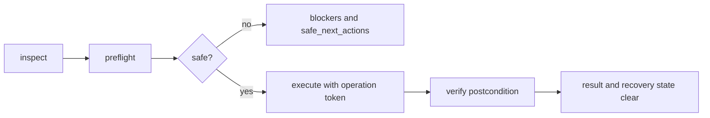

# Draftline API plan

This plan turns the scenario contract in [Draftline scenarios](scenarios.md) into candidate API families. The goal is not to expose Git more directly. The goal is to make the safe Draftline path the easiest path for host apps, developer copilots, and agentic tools.

## API design goals

1. Preserve business intent: APIs should talk in workspaces, versions, variations, shelves, recovery, and shared work.
2. Prefer read-only discovery before mutation.
3. Require preflight before any operation that writes files, moves refs, deletes refs, publishes, purges, or clears recovery state.
4. Return structured blockers and safe next actions instead of raw Git guidance.
5. Use opaque Draftline IDs; callers should not parse branch names, ref paths, or operation IDs for semantics.
6. Make local-only, shared-capable, and shared-remote behavior explicit.
7. Treat recovery, locks, support refs, content policy, and target-tree collisions as first-class API concepts.
8. Provide the same safety model through Rust APIs, CLI commands, and agent/tool facades.

## Cross-cutting operation model

Most mutating APIs should follow the same shape:



| Concept | Purpose |
|---|---|
| `WorkspaceInspection` | One snapshot of workspace mode, current variation, remotes, dirty state, policy diagnostics, lock/recovery state, support refs, and safe next actions. |
| `Preflight<T>` | Operation-specific analysis with affected files/refs, blockers, warnings, required confirmations, and an execution token. |
| `OperationToken` | Opaque token tying execution to the preflighted workspace state. Prevents agents from executing stale plans. |
| `OperationId` | Idempotency and recovery handle for a started operation. |
| `VerificationResult` | Structured postcondition check after execution. |
| `SafeNextAction` | Machine-readable guidance such as `save_first`, `apply_incoming`, `repair_recovery`, `choose_remote`, or `ask_user`. |

### Common result shape

```rust
pub struct ApiResult<T> {
    pub value: Option<T>,
    pub warnings: Vec<ApiWarning>,
    pub safe_next_actions: Vec<SafeNextAction>,
}

pub struct ApiFailure {
    pub code: ErrorCode,
    pub message: String,
    pub blockers: Vec<Blocker>,
    pub safe_next_actions: Vec<SafeNextAction>,
    pub retry: RetryClass,
}

pub enum RetryClass {
    Retryable,
    RetryAfterRepair,
    RetryAfterUserChoice,
    NotRetryable,
}
```

The exact Rust shape can differ, but the API should preserve these semantics across Rust, CLI JSON, and tool calls.

## Phase 1: diagnostics and safety foundation

These APIs support adoption, agent use, and safer existing operations.

### Workspace inspection

| API | Purpose |
|---|---|
| `Workspace::inspect()` | Return a complete machine-readable workspace snapshot. |
| `Workspace::capabilities()` | Report which advanced workflows this crate version supports. |
| `Workspace::safe_next_actions()` | Return suggested actions based on current state. |

Candidate data:

```rust
pub struct WorkspaceInspection {
    pub workspace_id: WorkspaceId,
    pub sharing_mode: SharingMode,
    pub current_variation: Option<VariationId>,
    pub actor: Option<ActorIdentity>,
    pub remotes: Vec<RemoteSummary>,
    pub dirty: DirtySummary,
    pub content_policy: ContentPolicyDiagnostics,
    pub target_tree_hazards: Vec<FileHazard>,
    pub recovery: Option<RecoverySummary>,
    pub operation_lock: Option<OperationLockSummary>,
    pub support_refs: SupportRefSummary,
    pub safe_next_actions: Vec<SafeNextAction>,
}
```

### Adoption/setup preflight

| API | Purpose |
|---|---|
| `Workspace::preflight_adopt_workspace(policy)` | Read-only setup report for existing repositories. |
| `Workspace::apply_adoption_plan(token)` | Optional setup action after the host chooses policy/remote/identity. |
| `Workspace::generate_agent_instructions()` | Produce `AGENTS.md`-style rules for coding agents. |

The adoption report should detect:

- detached or unborn HEAD
- multiple remotes and canonical shared remote ambiguity
- current branch to variation mapping
- dirty index vs dirty working tree
- `.gitignore` and `.gitattributes` conflicts with `ContentPolicy`
- symlinks, submodules/gitlinks, LFS/filter drivers, filemode churn
- case-insensitive and Unicode path collisions
- existing support refs, recovery state, stale locks, and non-Draftline ref mutations

### Content policy and Git metadata diagnostics

| API | Purpose |
|---|---|
| `Workspace::audit_content_policy()` | Find files that policy includes but Git ignores/transforms, plus old-policy content in history. |
| `Workspace::policy_git_diagnostics()` | Lightweight current-workspace diagnostics for save/switch/restore preflights. |
| `Workspace::preflight_policy_migration()` | Plan migration or redaction after policy changes. |

### Target-tree collision preflight

| API | Purpose |
|---|---|
| `Workspace::preflight_target_tree_write(target)` | Shared helper for switch, restore, apply, and merge. |

It should detect when a target tree would overwrite:

- untracked files
- ignored files
- generated files
- files excluded by the current content policy
- case/Unicode path aliases
- symlink or submodule boundaries

## Phase 2: recovery and repair

### Operation locks and recovery

| API | Purpose |
|---|---|
| `Workspace::inspect_operation_lock()` | Determine active vs possibly stale lock. |
| `Workspace::preflight_clear_stale_lock()` | Guarded stale-lock repair preflight. |
| `Workspace::clear_stale_lock(token)` | Clear an abandoned lock only after diagnostics. |
| `Workspace::repair_recovery(operation_id)` | Complete or repair an interrupted operation. |
| `Workspace::rollback_recovery(operation_id)` | Roll back when safe. |
| `Workspace::acknowledge_recovery()` | Keep, but document as metadata acknowledgment only. |

Recovery APIs should report completed substeps for compound operations such as save-then-switch, shelve-then-switch, apply-then-checkout, or support-ref-publish-then-delete.

## Phase 3: remote and collaboration safety

### Publish with leases

| API | Purpose |
|---|---|
| `Workspace::preflight_publish()` | Fetch, compute expected remote OID/absence, and report blockers. |
| `Workspace::publish(token)` | Push only if remote state still matches preflight. |
| `Workspace::publish_create_only(token)` | First publish that fails if the remote ref appeared after preflight. |

Required results:

- `published`
- `up_to_date`
- `incoming_available`
- `needs_merge`
- `remote_ref_deleted`
- `remote_ref_recreated`
- `remote_rewound`
- `expected_oid_mismatch`

### Remote variation lifecycle

| API | Purpose |
|---|---|
| `Workspace::remote_variations(remote)` | List visible variations from the fetched remote-tracking namespace. Implemented. |
| `Workspace::preflight_adopt_remote_variation(id)` | Plan local adoption of teammate-created work. Not implemented as a separate tokenized preflight. |
| `Workspace::adopt_remote_variation(remote, id)` | Create a local variation from a remote-tracking variation. Implemented without a separate preflight token. |
| `Workspace::fetch_all_variations(remote)` | Fetch and prune all visible remote variation refs. Implemented. |
| `Workspace::remote_variation_diagnostics(remote)` | Compare local, shared, and remote-only variation refs after fetch/prune. Implemented. |

### Merge incoming

| API | Purpose |
|---|---|
| `Workspace::preflight_merge_incoming()` | Compute merge base, file hazards, and semantic conflicts. Implemented. |
| `Workspace::merge_incoming(token, label)` | Write a clean semantic merge result as a new two-parent version. Implemented for clean merges; explicit conflict resolutions remain future work. |

Merge is file-writing and ref-moving. It must use operation locks, recovery state, target-tree collision preflight, and semantic conflict results.

## Phase 4: shelves

Shelves are personal work-in-progress by default. Sharing a shelf should be a separate explicit operation.

| API | Purpose |
|---|---|
| `Workspace::preflight_save_files(paths)` | Partial save plan. |
| `Workspace::save_files(paths, label)` | Save selected tracked content changes. |
| `Workspace::shelve_changes(label)` | Put work aside without switching. |
| `Workspace::preflight_shelve_files(name, paths)` | Partial shelf plan. |
| `Workspace::shelve_files(name, paths)` | Put selected tracked content changes aside without switching. |
| `Workspace::preflight_discard_files(paths)` | Partial discard plan. |
| `Workspace::discard_files(paths)` | Discard selected tracked content changes. |
| `Workspace::list_shelves()` | List local shelves. |
| `Workspace::preview_shelf(id)` | Read-only shelf preview. |
| `Workspace::preflight_apply_shelf(id)` | Detect conflicts and target-tree collisions. |
| `Workspace::apply_shelf(token, resolutions)` | Apply shelf safely and preserve it unless success/delete is explicit. |
| `Workspace::delete_shelf(id)` | Delete a shelf after confirmation. |
| `Workspace::share_shelf(id)` | Optional explicit share flow, if hosts want it. |

Shelf names/IDs should be unique and create-only. Collision should return a business-shaped blocker, not a raw Git failure after partial mutation.

## Phase 5: support refs and shared recovery

Recovery support refs are hidden from normal views but not private from collaborators once synced.

| API | Purpose |
|---|---|
| `Workspace::list_support_refs(scope)` | List local and remote-tracking support refs. |
| `Workspace::preflight_publish_support_refs(remote)` | Plan create-only publication of local recovery support refs. Implemented. |
| `Workspace::publish_support_refs(token)` | Create-only push of recovery support refs. Implemented. |
| `Workspace::fetch_support_refs(remote)` | Fetch into a remote-tracking support namespace without overwriting local refs. Implemented. |
| `Workspace::preflight_restore_support_ref(id)` | Plan restore as a new visible variation. Implemented for local and remote-tracking support refs. |
| `Workspace::restore_support_ref(token)` | Restore without overwriting existing visible refs. Implemented. |
| `Workspace::restore_support_ref_as_variation(id, name)` | Compatibility restore helper that preflights and executes. Implemented. |
| `Workspace::preflight_expire_support_refs(ids)` | Retention cleanup preflight. |
| `Workspace::expire_support_refs(token)` | Delete support refs as retention, not purge. |

Support refs should be:

- uniquely named
- append-only
- create-only on publish
- fetched into remote-tracking layout
- included in purge/redaction enumeration

## Phase 6: shared cleanup and history replacement

| API | Purpose |
|---|---|
| `Workspace::preflight_delete_variation(id)` | Local delete preflight with archive details. Implemented. |
| `Workspace::delete_variation_with_token(token)` | Local delete after archive. Implemented. |
| `Workspace::delete_variation(id)` | Compatibility helper that preflights and executes. Implemented. |
| `Workspace::preflight_delete_remote_variation(id)` | Shared delete preflight with expected remote OID and support-ref plan. |
| `Workspace::delete_remote_variation(token)` | Publish support ref first, then delete visible remote ref by lease. |
| `Workspace::preflight_squash_versions(count)` | Local squash preflight with archive details. Implemented. |
| `Workspace::squash_versions_with_token(token)` | Local squash after archive. Implemented. |
| `Workspace::squash_versions(count, label)` | Compatibility helper that preflights and executes. Implemented. |
| `Workspace::preflight_replace_remote_history(remote)` | Current-variation shared history replacement preflight with support-ref plan. Implemented. |
| `RemoteHistoryReplaceToken::confirm_shared_history_rewrite()` | Explicit confirmation boundary before shared history replacement. Implemented. |
| `Workspace::replace_remote_history(token)` | Lease-protected replacement after confirmation and shared support ref publication. Implemented. |

Shared visible refs should never be deleted or replaced unless the recovery support ref is durably published to the shared remote.

## Phase 7: purge/redaction

Purge is a destructive, admin-permissioned, best-effort workflow. It cannot guarantee deletion from existing clones, forks, backups, logs, hosting caches, or offline devices.

| API | Purpose |
|---|---|
| `Workspace::preflight_purge_content(selector)` | Enumerate refs, reflogs, support refs, tags, notes, replace refs, stash refs, remote-tracking refs, alternates, and reachable objects. |
| `Workspace::purge_content(token)` | Execute destructive rewrite/deletion after approval. |
| `Workspace::verify_purge(token)` | Post-purge reachability verification. |

This should remain separate from cleanup, support-ref expiration, and normal delete/squash.

## Agent and tool facade

Draftline should expose the same safety model through CLI or tool calls for coding agents.

### CLI shape

```text
draftline inspect --json
draftline capabilities --json
draftline verify --json
draftline explain-error --json <code>
```

Future mutation/recovery CLI commands:

```text
draftline preflight <operation> --json
draftline execute <operation> --operation-id <id> --json
draftline recovery diagnose --json
draftline repair <operation-id> --json
draftline rollback <operation-id> --json
draftline clear-stale-lock --token <token> --json
```

### Tool shape

| Tool | Purpose |
|---|---|
| `draftline.inspect` | Return workspace state and safe next actions. |
| `draftline.preflight` | Analyze proposed operation and return a preflight token. |
| `draftline.execute` | Execute a tokenized operation. |
| `draftline.verify` | Verify workspace, ref, remote, or operation postconditions. |
| `draftline.recovery` | Diagnose, repair, roll back, or clear stale locks. |
| `draftline.explain` | Map stable result/error codes to safe next actions. |

Tool calls that mutate state should require a preflight token generated from the current workspace state. Tools should be narrow and typed; they should not expose a generic raw Git command.

## Proposed priority slices

This table tracks the intended API shape and the current implementation state. "Partial" means the public Rust surface exists for part of the scenario, but the full product contract still needs the listed follow-up work.

| Slice | APIs | Outcome | Current status |
|---|---|---|---|
| 1. Diagnostics baseline | `inspect`, `capabilities`, adoption report, content/Git diagnostics | Hosts and agents can understand workspace safety before mutating. | Implemented for Rust callers; content/Git diagnostics are current-ignore focused. |
| 2. Recovery baseline | stale-lock inspection, repair/rollback skeleton, verification | Crashes and interrupted operations have a principled path. | Partial: stale-lock inspection/clear and skeleton repair/rollback reports exist; operation-specific mutation is missing. |
| 3. Target-tree safety | shared collision preflight wired into switch, restore, apply, shelf apply | File-writing operations stop before clobbering local non-versioned files. | Partial: ignored and policy-excluded target-path hazards are wired for key operations; generated/platform hazards remain. |
| 4. Remote race safety | publish preflight, expected-OID push, create-only first publish | Normal sharing no longer relies only on fetch-then-push. | Partial: tokenized preflight/publish rejects changed fetched state; push still needs explicit lease/create-only mechanics. |
| 5. Agent/tool facade | JSON CLI/tool layer over inspect/preflight/execute/verify | Coding agents can use Draftline safely without raw Git. | Partial: Rust JSON helpers and CLI inspect/capabilities/verify/explain-error exist; generic CLI mutation remains. |
| 6. Shelf lifecycle | shelve in place, list, preview, apply with conflicts, delete | "Put aside" becomes a complete workflow. | Implemented for all-work and selected-file shelves; conflict-resolution apply remains. |
| 7. Support refs | publish/fetch/list/restore/expire support refs | Shared recovery works across machines. | Implemented for local publish/fetch/list/restore and local expiration; remote retention remains. |
| 8. Collaboration expansion | remote variation lifecycle and merge incoming | Team workflows cover created/deleted/renamed/diverged variations. | Partial: fetch-all/prune diagnostics, remote list/adopt, merge preflight, and clean merge execution exist; rename inference/conflict execution remain. |
| 9. Shared cleanup | remote delete and shared history replacement | Team cleanup becomes lease-protected and recoverable. | Implemented for remote delete and current-variation replacement with explicit confirmation plus support-ref-first lease mechanics; broader admin UX remains. |
| 10. Admin deletion | purge/redaction | Sensitive-content deletion is explicit and best-effort. | Partial planning only: purge preflight and verify exist; destructive execution is missing. |

## Open design questions

1. Should preflight tokens be cryptographic snapshots, opaque in-memory IDs, or serialized signed plans?
2. How much of the CLI/tool facade belongs in this crate versus a companion binary?
3. How should actor/device identity be supplied and persisted for support-ref names and audit copy?
4. Which support refs sync automatically, and which require explicit admin/user action?
5. How should fetched support refs be represented locally: remote-tracking refs, an index, or both?
6. What is the minimum safe stale-lock metadata: PID, process start time, host, actor, operation ID, and timestamp?
7. What confirmation model should be enforced by the library versus the host for destructive/admin operations?
8. How should target-tree collision checks account for platform-specific path behavior across Windows, macOS, and Linux?
