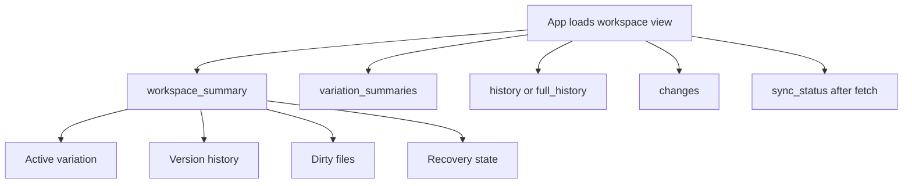
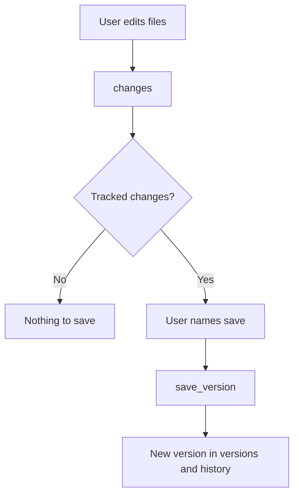
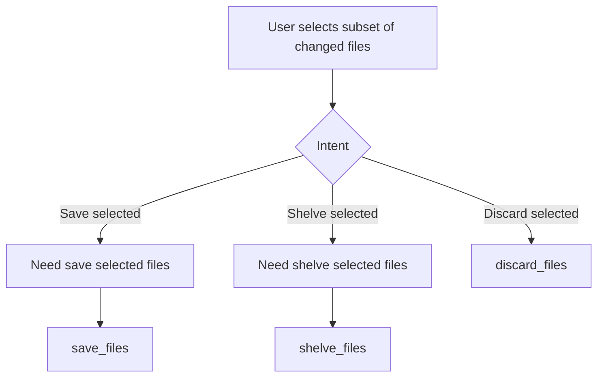
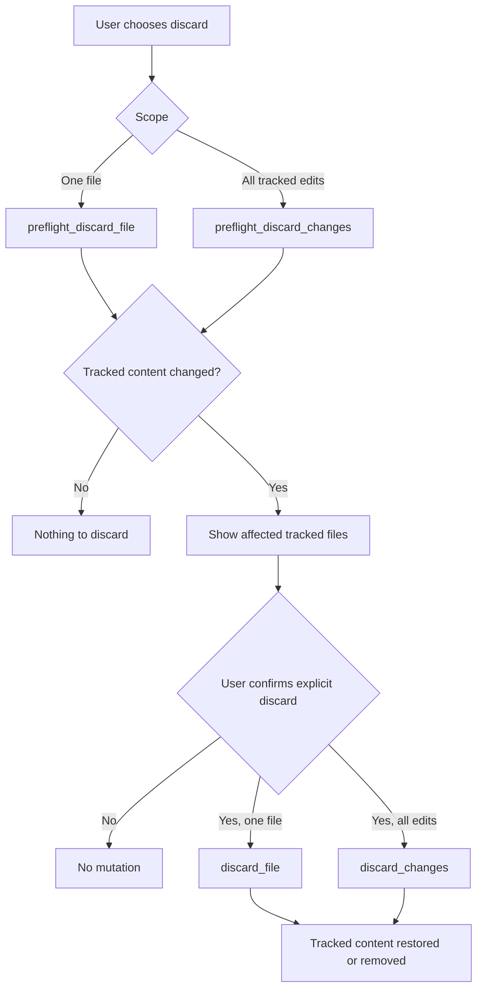
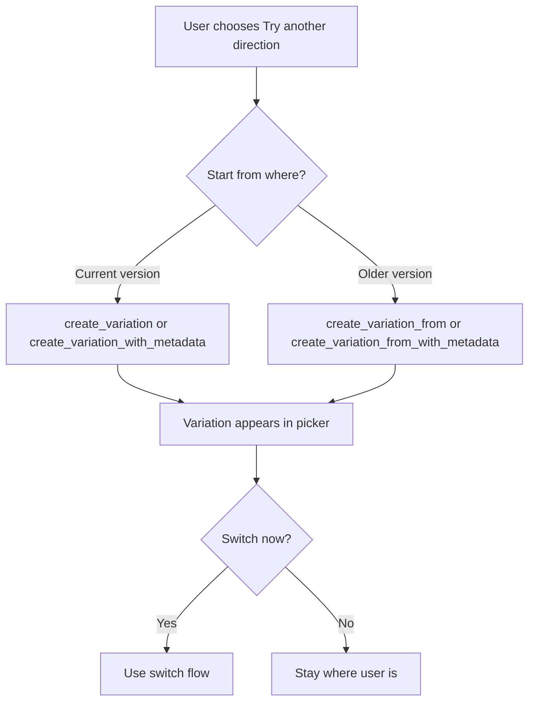
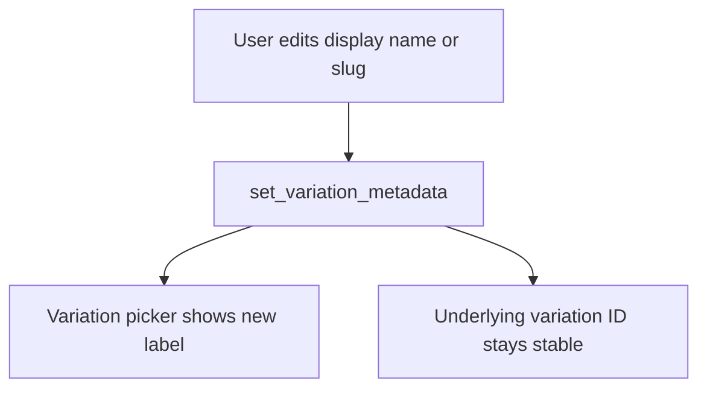
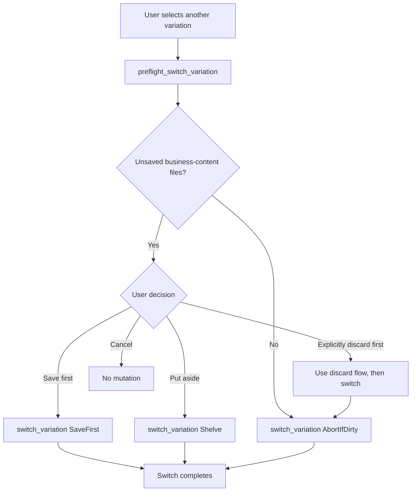
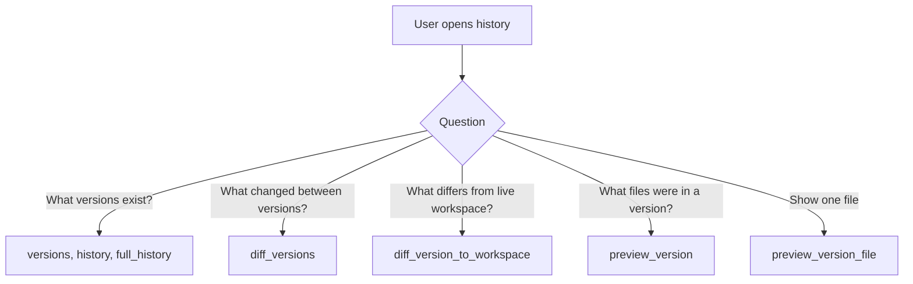
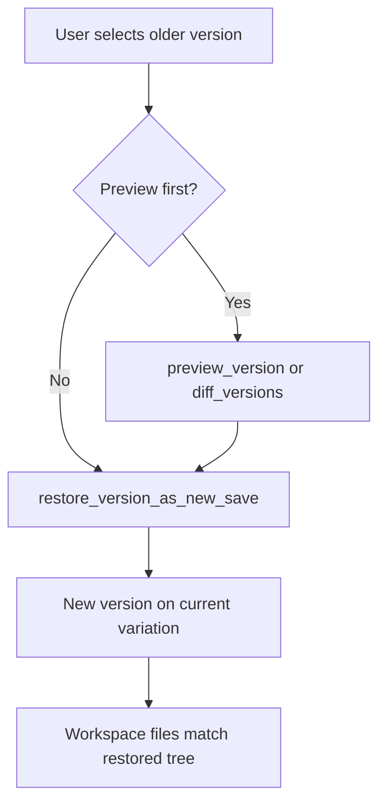
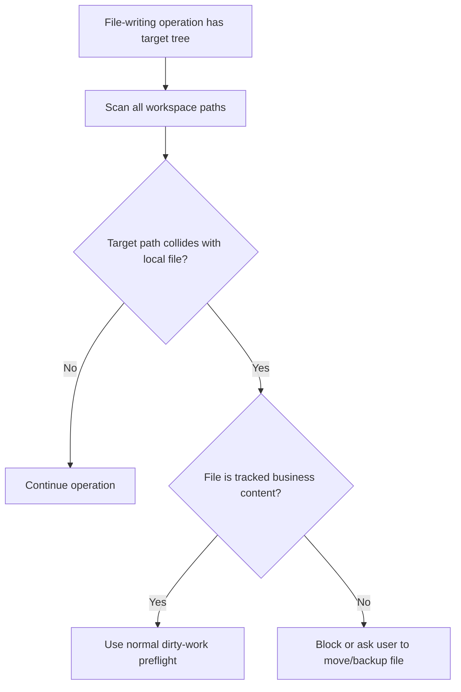

# Authoring and version scenarios

[Back to scenario index](../scenarios.md)

## Flow 3: understand current state

Business goal: "Where am I, what changed, and what choices exist?"

Why this flow exists: users need one coherent dashboard before choosing an action, especially when local edits, remote updates, variations, or recovery state may change what is safe.

| Question | Answer |
|---|---|
| Covered today? | Covered. |
| Correct primitive path | `workspace_summary` for the dashboard, plus `variation_summaries`, `history`, `full_history`, `changes`, and `sync_status` for focused panels. |
| Safety behavior | Summary succeeds even with recovery state; most normal APIs block when recovery is pending. |
| Edge cases | Brand-new workspaces can have empty history. Detached or unborn Git states can surface `NoCurrentVariation`. |

## Flow 4: save business work

Business goal: "I finished a meaningful draft and want to save it."

Why this flow exists: a saved version is the durable, user-facing checkpoint that makes later review, restore, publish, and branching understandable.

| Question | Answer |
|---|---|
| Covered today? | Covered. |
| Correct primitive path | `changes` -> `save_version(label)`. |
| Safety behavior | Currently content-policy-tracked dirty files are staged for the save. Deleted tracked files are removed from the index. |
| Edge cases | This assumes the host is using a stable policy; changing policy after files were saved is not a redaction. Binary and large files are detected for preflight/reporting. Saving with no changes may still create an equivalent tree commit; host UX can decide whether to hide "save" when `changes().is_empty()`. |

## Flow 4a: save or shelve selected work

Business goal: "Save this ready piece, but keep my other edits unfinished."

Why this flow exists: business users often have mixed work in progress. All-or-nothing save and all-or-nothing shelve force users to either over-save unfinished work or manually move files around.

| Question | Answer |
|---|---|
| Covered today? | Yes for selected save, selected shelf, batch discard, one-file discard, and all-work shelves. |
| Current support | `preflight_save_files`/`save_files`, `preflight_shelve_files`/`shelve_files`, `preflight_discard_files`/`discard_files`, `discard_file`, `SwitchPolicy::Shelve`, and `shelve_changes`. |
| Safety behavior | Selected-file operations normalize paths through the active content policy and preserve unselected dirty files. Shelves remain local-only by default because they may contain personal unfinished work. |
| Gap | Need explicit policy if shelved work can ever be shared and richer selected-file conflict UX. |

## Flow 5: abandon unsaved edits

Business goal: "I do not want these local edits anymore."

Why this flow exists: discarding can destroy local work, so it must be an explicit, scoped, policy-aware action rather than an accidental side effect of switching, publishing, or applying updates.

| Question | Answer |
|---|---|
| Covered today? | Covered. |
| Correct primitive path | `preflight_discard_file` -> `discard_file`, or `preflight_discard_changes` -> `discard_changes`. |
| Safety behavior | Discard is explicit and policy-aware. Excluded runtime files are preserved, and path-based discard rejects files outside tracked content. |
| Edge cases | Added tracked files are removed. Modified/deleted/renamed/type-changed/conflicted tracked files are restored from `HEAD`. If a requested file is unchanged, `discard_file` returns `None`. |

## Flow 6: try another direction

Business goal: "Let's try a different approach without losing the current one."

Why this flow exists: alternate directions are core creative workflow; they need stable names and history without exposing users to detached HEAD or raw branch mechanics.

| Question | Answer |
|---|---|
| Covered today? | Covered. |
| Correct primitive path | `create_variation*` or `create_variation_from*`; optionally `set_variation_metadata`. |
| Safety behavior | Creating a variation does not require checking it out. Display metadata does not rename Git refs. |
| Edge cases | Invalid variation names are rejected. Duplicate branch names fail through Git. Creating from an unknown version returns `VersionNotFound`. |

## Flow 6a: rename or relabel a direction

Business goal: "Change how this option appears to users."

Why this flow exists: product labels, URLs, and routing metadata should be editable without rewriting the underlying branch/ref identity.

| Question | Answer |
|---|---|
| Covered today? | Covered for display metadata. |
| Correct primitive path | `set_variation_metadata`, `variation_metadata`, `Variation::display_label`. |
| Safety behavior | Metadata changes do not rename Git refs, so stored variation IDs continue to round-trip. |
| Gap | True ref rename is intentionally not exposed; if needed later, it should be separate from display metadata and should archive the old ref name. |

## Flow 7: move between directions

Business goal: "I want to switch options, but I may have unsaved work."

Why this flow exists: switching writes workspace files, so Draftline must force a clear decision for unsaved work before changing what the user sees on disk.

| Question | Answer |
|---|---|
| Covered today? | Yes for full-variation switching with save-first, all-work shelve, or explicit discard-before-switch. No for selected-file switch/shelf. |
| Correct primitive path | `preflight_switch_variation` -> `switch_variation` with `AbortIfDirty`, `SaveFirst`, or `Shelve`; use shelf APIs to list, preview, apply, or delete shelved work later. |
| Safety behavior | `SwitchPolicy::Discard` remains unsupported. Dirty work must be saved, shelved, or explicitly discarded before checkout. Unsaved business-content files include modified tracked files and untracked files that match the current content policy. |
| Edge cases | `SaveFirst` should not be used with unresolved conflicts because it can commit conflict-marker content as the saved state. Switching writes recovery metadata and uses an operation lock. If checkout is interrupted, normal APIs block until recovery is addressed. Switching preflights target-tree collisions with ignored or current-policy-excluded target-path files before checkout. |

## Flow 8: review older work

Business goal: "Show me what changed or what an older version looked like."

Why this flow exists: history review should support confidence and decision-making without mutating the live workspace.

| Question | Answer |
|---|---|
| Covered today? | Covered. |
| Correct primitive path | `versions`, `history`, `full_history`, `diff_versions`, `diff_version_to_workspace`, `preview_version`, `preview_version_file`. |
| Safety behavior | Preview and diff are read-only. Content policy filters preview and version-to-workspace diff file results; version-to-version diffs compare historical trees and are not policy-redaction tools. |
| Edge cases | Missing or excluded preview files return `None`. Binary preview content returns `content: None` with `is_binary: true`. Invalid version IDs return `VersionNotFound`. |

## Flow 9: restore older work

Business goal: "Bring back that older version, but do not erase history."

Why this flow exists: users often need to recover prior content, but a destructive reset would hide what happened and could erase newer work from the visible timeline.

| Question | Answer |
|---|---|
| Covered today? | Partially covered. |
| Correct primitive path | `restore_version_as_new_save(version, label)`. |
| Safety behavior | Restore creates a new save on the current variation and does not reset or delete older versions. Dirty work and target-tree collisions block before the restore writes workspace files. |
| Edge cases | Unknown version IDs return `VersionNotFound`. Interrupted restore is recorded in recovery metadata. Old versions may contain files that are now excluded by the current policy, and restore planning does not yet explain exact historical-tree restore vs current-policy-filtered restore. |
| Gap | Need a richer restore preflight that reports exact historical-tree restore vs current-policy-filtered restore and old-policy content before writing workspace files. |

## Flow 9a: target tree collides with local non-versioned files

Business goal: "Do not overwrite local files just because they are not currently tracked by Draftline."

Why this flow exists: switching, restore, apply incoming, merge, and checkout-like operations write a target tree into the workspace. A clean content-policy status is not enough if the target tree would overwrite untracked, ignored, generated, or current-policy-excluded files.

| Question | Answer |
|---|---|
| Covered today? | Partially covered. |
| Current support | Shared `FileHazard` target-tree checks are wired into switching, restoring, applying incoming changes, merging incoming changes, and applying shelves. |
| Safety behavior | No operation should overwrite a local file merely because it is untracked, ignored, generated, or excluded by the current policy. |
| Edge cases | Current checks cover ignored and current-policy-excluded target-path collisions. Case-insensitive filesystems, Unicode-normalization differences, symlinks, submodules, generated files, distinct untracked hazard reporting, and old-policy paths can still make collisions non-obvious. |
| Gap | Need to broaden target-tree collision coverage for platform-specific path hazards such as generated files, symlinks, submodules, case-insensitive collisions, and Unicode-normalization differences. |
