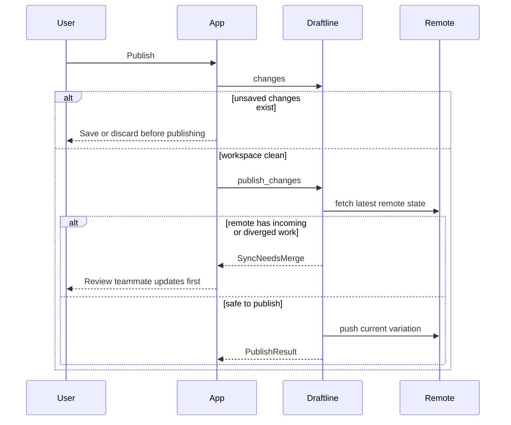
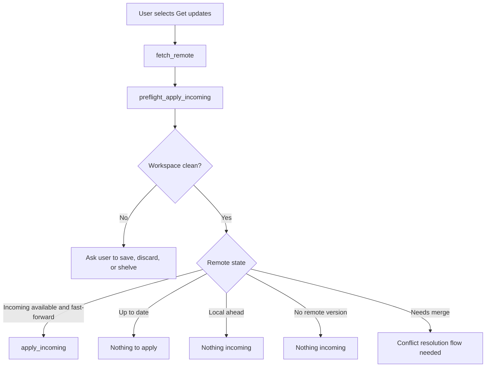
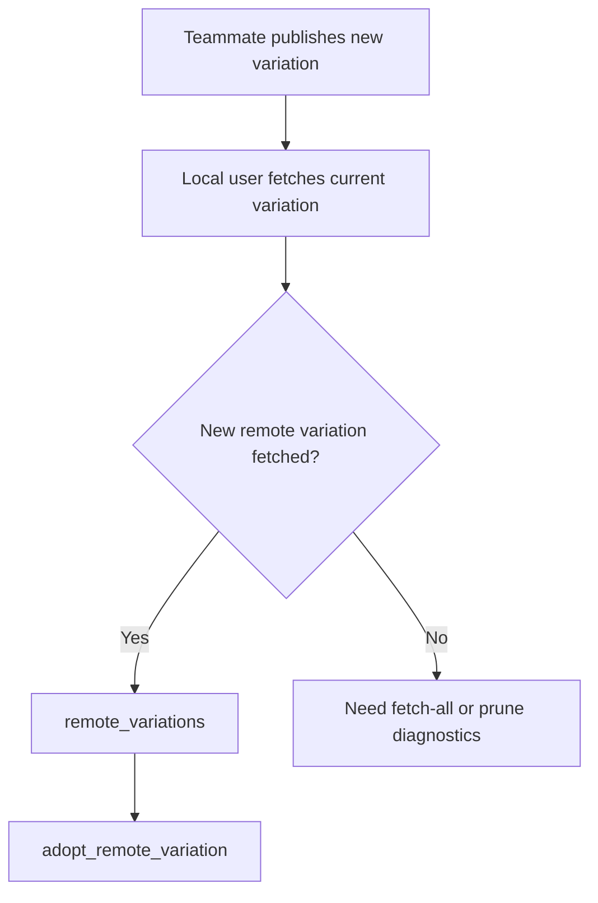
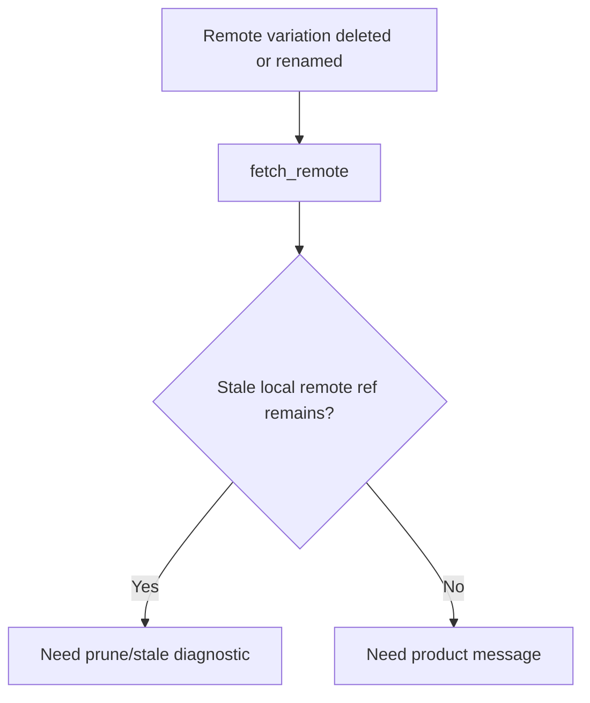
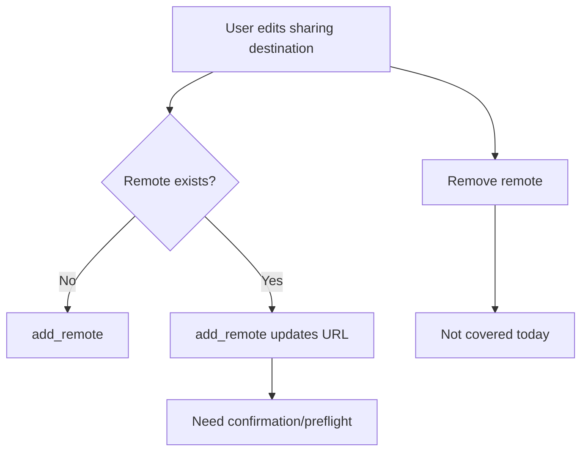
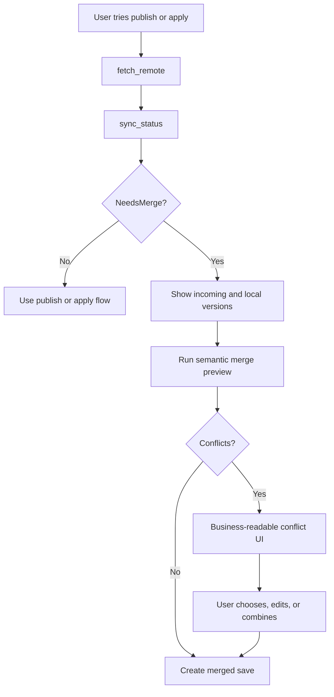

# Collaboration scenarios

[Back to scenario index](../scenarios.md)

## Flow 10: publish my work to the team

Business goal: "Share my saved work with everyone else."

Why this flow exists: publishing is a collaborative operation; Draftline must verify the remote did not change before pushing so teammate work is not overwritten.

| Question | Answer |
|---|---|
| Covered today? | Covered for the current variation. |
| Correct primitive path | `changes` -> `preflight_publish` -> `publish`, or legacy `publish_changes` / `publish_changes_with_options`. |
| Safety behavior | `publish_changes` fetches first, checks `sync_status`, and refuses incoming or diverged remote state. Tokenized `publish` also rejects changed local state or changed remote-tracking OID/absence after preflight, and uses push expectations so create/update races surface as remote races instead of overwrites. Draftline does not force-push for normal publish. |
| Edge cases | The library enforces a clean workspace before publish even though push itself does not write local files. `NoRemoteVersion` publishes the current variation as a new remote branch. Authentication is supplied by the host through `RemoteOptions`. `SyncNeedsMerge` can wrap either `IncomingAvailable` or `NeedsMerge`; hosts must inspect `SyncStatus.state` before deciding whether to apply incoming work or start merge. |
| Tests | `scenario_flow_10_11_12_collaboration_fast_forward_and_clean_merge`, `scenario_flow_1c_11a_11b_remote_bootstrap_variation_diagnostics_and_adoption`, and `tauri_contract_smokes_publish_current_variation`. |
| Gap | Broader product result copy for branch disappeared, branch recreated, first-publish race, and remote rewind remains future UX work. |

## Flow 11: receive teammate updates

Business goal: "Bring in the latest work from the team."

Why this flow exists: applying remote work changes local files and refs, so it is safe only when the workspace is clean and the local variation can fast-forward.

| Question | Answer |
|---|---|
| Covered today? | Yes for current-variation fast-forward updates. Diverged clean-merge execution is covered by Flow 12; unresolved conflict UX and broad remote lifecycle diagnostics remain future work. |
| Correct primitive path | `fetch_remote` -> `preflight_apply_incoming` -> `apply_incoming`. |
| Safety behavior | Dirty work blocks apply. Diverged history returns `SyncNeedsMerge` instead of overwriting. Fast-forward ref updates roll back if checkout fails. Apply must also avoid target-tree collisions with untracked, ignored, generated, or policy-excluded files. |
| Edge cases | `preflight_apply_incoming` uses cached remote-tracking state; fetch before preflight for accurate reporting. `apply_incoming` fetches again before applying, so a clean preflight can still fail if the remote changed between preflight and apply. `UpToDate`, `LocalAhead`, and `NoRemoteVersion` return `applied_count: 0`. A remote branch can disappear or be recreated between fetch and apply. |

## Flow 11a: discover teammate-created directions

Business goal: "My teammate published a new option; I want to see and adopt it."

Why this flow exists: collaboration is not only updates to the current variation. Teammates can create new directions that should appear in a product variation picker.

| Question | Answer |
|---|---|
| Covered today? | Partially covered. |
| Current support | `fetch_all_variations` fetches and prunes visible remote variation refs. `remote_variations` lists fetched remote-tracking variations, `remote_variation_diagnostics` reports shared/local-only/remote-only variation sets, and `adopt_remote_variation` creates a local variation from one. `fetch_remote` and `sync_status` still operate on the current variation. |
| Safety behavior | Draftline avoids surprising local branch creation; adoption is an explicit call. |
| Tests | `scenario_flow_1c_11a_11b_remote_bootstrap_variation_diagnostics_and_adoption` and `remote_variations_can_be_discovered_and_adopted_locally`. |
| Gap | Tokenized adoption and richer product copy remain future work. |

## Flow 11b: remote variation was deleted or renamed

Business goal: "A shared option disappeared or changed remotely; explain what happened."

Why this flow exists: stale remote-tracking refs can make deleted or renamed remote work look like it still exists locally.

| Question | Answer |
|---|---|
| Covered today? | Partially covered. |
| Current support | `fetch_all_variations` fetches and prunes remote-tracking variation refs. `remote_variation_diagnostics` reports local-only variations after remote deletion and remote-only variations after teammate publication. |
| Safety behavior | Draftline does not delete local variations automatically. |
| Tests | `scenario_flow_1c_11a_11b_remote_bootstrap_variation_diagnostics_and_adoption` and `remote_variation_diagnostics_reports_local_and_remote_only_variations_after_prune`. |
| Gap | Rename inference and user-facing "remote option removed or renamed" guidance remain future work. |

## Flow 11c: change or remove remote destination

Business goal: "Publish this workspace somewhere else, or stop publishing to this place."

Why this flow exists: changing a remote URL changes where business content is shared and backed up. That deserves explicit confirmation.

| Question | Answer |
|---|---|
| Covered today? | Partially covered. |
| Current support | `add_remote` creates a remote or updates the URL of an existing one. `remotes` lists configured endpoints. |
| Safety behavior | Draftline does not push until `publish_changes`, but updating an existing remote URL is currently silent. |
| Tests | `tauri_contract_smokes_publish_current_variation` covers add-and-publish; no executable remove-remote flow exists. |
| Gap | Need remote update preflight/confirmation and remove-remote APIs. |

## Flow 12: reconcile teammate changes

Business goal: "My teammate and I both saved changes. Help us reconcile them."

Why this flow exists: divergence is normal collaboration, but resolving it requires user-understandable content conflicts rather than hidden Git merge behavior.

| Question | Answer |
|---|---|
| Covered today? | Partially covered. |
| Current support | `sync_status` detects `NeedsMerge`; `SyncNeedsMerge` prevents unsafe publish/apply; `preflight_merge_incoming` reports the diverged state without mutating; `merge_incoming` writes a clean two-parent merged version through a preflight token; `MergeOutcome`, `MergeConflict`, `ResolverRegistry`, `PlainTextResolver`, and `MarkdownResolver` model conflict results. |
| Safety behavior | Draftline blocks overwrite and routes the user into an explicit merge decision. Clean merge execution re-fetches, validates the tokenized local/remote/base OIDs, checks dirty work and target-tree hazards, uses the operation lock, and writes recovery state before moving files/refs. |
| Tests | `scenario_flow_10_11_12_collaboration_fast_forward_and_clean_merge`, `scenario_flow_12_conflict_preflight_reports_without_mutating`, and `tauri_contract_smokes_collaboration_incoming_and_merge`. |
| Gap | Need user-driven execution for unresolved conflicts, richer binary/large-file conflict UX, and host copy for choosing, editing, or combining conflicting content. |
