# Recovery and cleanup scenarios

[Back to scenario index](../scenarios.md)

## Flow 12a: apply shelved work

Business goal: "Bring my put-aside work back into the current workspace."

Why this flow exists: applying a shelf is not always a simple file copy. The workspace may have moved forward since the shelf was created, so applying shelved work can conflict with current files just like teammate changes can.

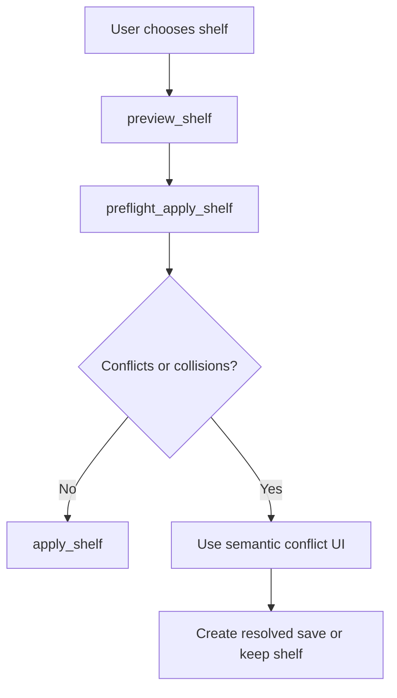

| Question | Answer |
|---|---|
| Covered today? | Yes for all-work shelf list, preview, clean apply, and delete. No for selected-file shelves or conflict-resolution apply. |
| Current support | `shelve_changes`, `list_shelves`, `preview_shelf`, `preflight_apply_shelf`, `apply_shelf`, and `delete_shelf` are public. Switch-with-shelve also creates shelf refs. |
| Safety behavior | Shelf application is treated as a file-writing operation with dirty-work and target-tree collision preflight. It preserves the shelf until the user explicitly deletes it. |
| Edge cases | Shelf names must be unique/create-only. Applying a shelf can conflict with current tracked work or collide with untracked/ignored/excluded files. Conflict-resolution apply and selected-file shelves remain future work. |
| Gap | Need selected-file shelves and semantic conflict-resolution apply for shelves that cannot be applied cleanly. |

## Flow 13: remove or clean up work

Business goal: "Hide old options and simplify the history without losing the ability to recover."

Why this flow exists: cleanup should reduce clutter while preserving a recoverable support ref to the old state before any visible ref is deleted or rewritten.

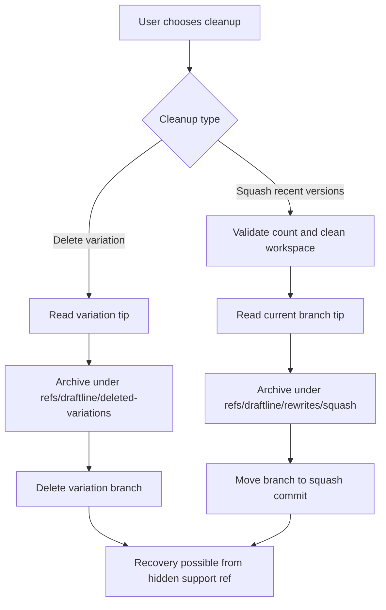

| Question | Answer |
|---|---|
| Covered today? | Covered for local delete, local squash, and local milestone compaction. |
| Current support | `delete_variation`, `squash_versions`, `history_compaction_candidates`, `preview_history_cleanup`, `apply_history_cleanup`, `resolve_rewritten_version`, `preflight_undo_history_cleanup`, and `undo_history_cleanup` preserve old history under local `refs/draftline/...` refs before destructive ref movement. |
| Safety behavior | The old commit remains named by a Draftline support ref locally, so it is not left only to reflog or garbage-collection timing on that machine. History cleanup writes a remapping ledger so stale version IDs can resolve after compaction. |
| Edge cases | Deleting the current variation is rejected. Squash rejects dirty work, `count < 2`, and ranges without a parent outside the squash range. Milestone compaction rejects dirty work, non-contiguous ranges, unsafe merge boundaries, and named-variation hazards according to the request safety policy. |
| Gap | Product UI still needs clear language for candidate selection, stale-version resolution, undo, and why some merge/named-branch ranges cannot be compacted automatically. |

## Flow 13a: compact local version history

Business goal: "Turn several noisy saves into a clean milestone while keeping the final files and a recovery path."

Why this flow exists: authoring timelines often contain useful final content but too many intermediate snapshots. Compaction should simplify the visible history without silently losing recovery or invalidating app-owned references to old versions.

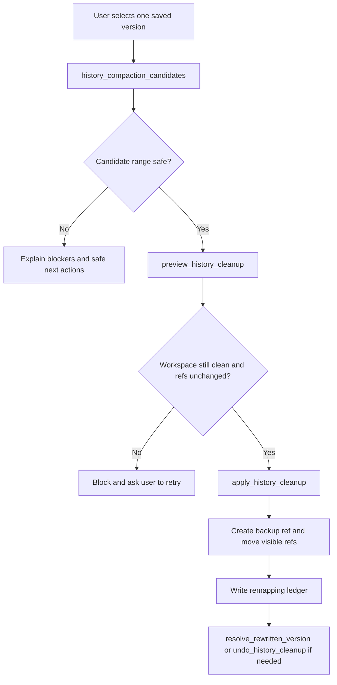

| Question | Answer |
|---|---|
| Covered today? | Covered for linear milestone compaction, descendant replay, stale-version resolution, undo, and dirty-work blocking. |
| Current support | `history_compaction_candidates` reports viable endpoints and blockers. `preview_history_cleanup` creates a durable preview ref, backup plan, graph diff, operations, commit/snapshot maps, affected refs, remote impact when requested, and warnings. `apply_history_cleanup` validates the preview and refs before moving visible refs. `resolve_rewritten_version` and undo APIs preserve follow-up navigation. |
| Safety behavior | Compaction must preserve final workspace file content. Visible refs move only after backup refs exist and the preview/target refs still match. Dirty work blocks by default so unsaved content is not overwritten by checkout. |
| Edge cases | Candidate selection must account for selected node role, descendant replay, merge boundaries, named variation refs inside the compacted range, stale preview refs, and target ref movement between preview and apply. |
| Tests | `scenario_local_milestone_compaction_preview_apply_resolve_and_undo`, `history_cleanup_compacts_milestones_maps_old_versions_and_undoes`, `history_cleanup_compacts_middle_range_and_replays_descendants`, `history_compaction_candidates_reports_viable_partner_nodes`, and related stale-ref/blocker tests. |
| Gap | Multi-range and richer semantic conflict handling remain future expansion; current support targets linear milestone compaction. |

## Flow 13b: remove or rewrite shared work

Business goal: "Remove an old option or clean up history for everyone, not just on my machine."

Why this flow exists: local archive-before-delete is not enough for collaboration. If the visible variation was already published, Draftline must make the recovery point durable in the shared remote before deleting or replacing the shared visible ref.

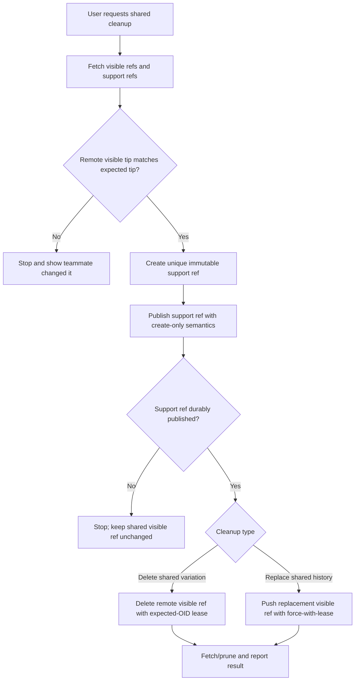

| Question | Answer |
|---|---|
| Covered today? | Covered for shared variation delete, current-variation replacement, and published history-cleanup compaction. |
| Current support | `preflight_delete_remote_variation` / `delete_remote_variation` archive the remote tip under a support ref, publish that support ref, then delete the visible remote variation. `preflight_replace_remote_history` / `replace_remote_history` and `preflight_publish_history_cleanup` / `publish_history_cleanup` publish support refs before replacing visible history. |
| Safety behavior | Shared remote cleanup is archive-first and visible-ref-last. Visible ref movement is guarded by expected remote OID / lease checks, and support-ref publication is create-only. |
| Edge cases | Support-ref push can succeed while visible cleanup fails; that is safe but leaves an extra recovery point. Visible shared cleanup must not happen if support-ref publication fails. A stale visible remote tip must stop publish instead of force-overwriting teammate work. |
| Gap | Need protected-branch/server-capability diagnostics and teammate-facing product copy for hosts that reject support-ref namespaces or lease-protected replacement. |

## Flow 13c: sync hidden recovery support refs

Business goal: "Make recovery points for shared work available from another machine without showing them as normal variations."

Why this flow exists: the shared remote represents shared work. Support refs should travel with that shared work so cleanup recovery does not depend on a specific machine, while still staying out of normal business views.

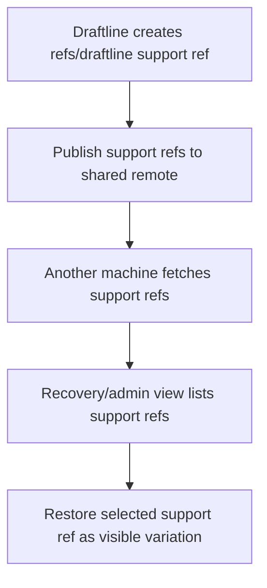

| Question | Answer |
|---|---|
| Covered today? | Covered for create-only support-ref publish, fetch, list, restore, and shared cleanup publish/sync. |
| Current support | Delete, squash, and history cleanup create support refs under `refs/draftline/...`. `preflight_publish_support_refs`, `publish_support_refs`, `fetch_support_refs`, `list_support_refs`, `restore_support_ref_as_variation`, `preflight_expire_support_refs`, and `expire_support_refs` cover support-ref lifecycle. `fetch_remote` also fetches support refs so sync can detect published compaction rewrites. |
| Safety behavior | Recovery support refs are hidden from normal views but are part of the shared repository trust boundary once synced. They are not privacy or access-control boundaries. |
| Edge cases | Remote support refs must be uniquely named, append-only, and fetched without overwriting unsynced local support refs. Hosts must surface remotes that reject `refs/draftline/...` pushes. |
| Gap | Remote support-ref retention remains local/admin oriented; hosted product UI still needs clear "hidden but shared" language. |

## Flow 13d: recover cleanup after clone or device loss

Business goal: "I deleted or squashed something on one machine and need it back elsewhere."

Why this flow exists: if support refs sync to the shared remote, recovery of shared work can follow the user across machines without adding a separate backup remote.

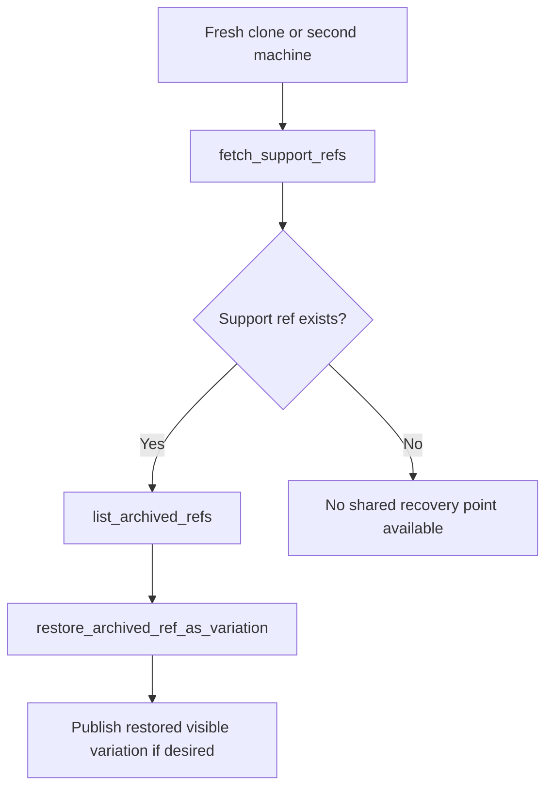

| Question | Answer |
|---|---|
| Covered today? | Covered when the cleanup support ref was published to the shared remote. |
| Current support | Local and remote-tracking archive refs can be listed and restored as a visible variation. Published history cleanup compaction also leaves support refs that another machine can fetch and use for stale-version resolution. |
| Safety behavior | The intended model is shared hidden support refs: recoverability travels with the shared remote, while normal views remain uncluttered. |
| Edge cases | Restoring an archived ref must create a new visible variation by default, require a non-conflicting name, fetch before publish, and never overwrite an existing local or remote variation without a separate explicit replace workflow. |
| Gap | Remote retention/expiration policy for old shared recovery points remains future work. |

## Flow 13e: sync incoming compacted remote history

Business goal: "A teammate compacted shared history; bring my workspace onto that compacted history without losing local work."

Why this flow exists: a published compaction is an intentional rewrite, not ordinary divergent teammate work. Draftline can recognize the rewrite because the publisher first shared a support ref naming the old remote tip, then moved the visible branch with a lease.

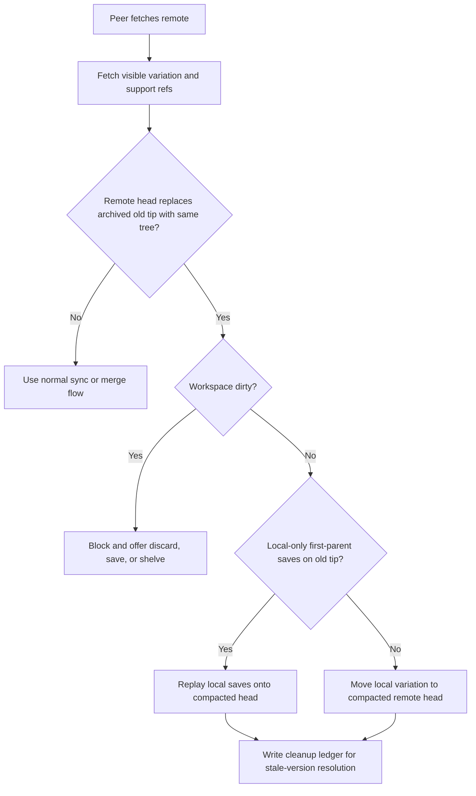

| Question | Answer |
|---|---|
| Covered today? | Covered for clean peers, dirty-work blocking, first-parent local-ahead replay, and ambiguous history fallback. |
| Current support | `fetch_remote` fetches support refs; `sync_status` classifies a recognized compaction rewrite as `IncomingAvailable`; `preflight_apply_incoming` remains the host-facing safety gate; `apply_incoming` moves clean peers to the compacted head or replays local-only first-parent saves onto it. |
| Safety behavior | A compaction rewrite is recognized only when a fetched rewrite support ref points to the old remote tip and the compacted replacement preserves that tip's tree. Dirty work blocks before mutation. Non-first-parent/merge-shaped local work stays in `NeedsMerge` instead of pretending it is safe to replay. |
| Edge cases | If local files are dirty, hosts should offer discard dirty changes, save/snapshot first, or shelve dirty changes before retrying. If replay cannot be proven first-parent and clean, the normal merge/conflict flow must handle it. |
| Tests | `scenario_remote_compaction_publish_sync_replay_and_dirty_block`, `apply_incoming_accepts_published_remote_compaction_when_clean`, `apply_incoming_replays_local_snapshots_after_published_remote_compaction`, and `remote_compaction_with_non_first_parent_local_work_stays_needs_merge`. |
| Gap | Product UI still needs explicit copy for the dirty-work choices and for explaining "incoming compaction" separately from ordinary teammate divergence. |

## Flow 13f: permanently purge or redact content

Business goal: "I accidentally saved sensitive content; remove it permanently."

Why this flow exists: archive-first safety intentionally retains old content. If support refs are synced to the shared remote, purge/redaction must include every reachable ref namespace and clear limits about distributed clones.

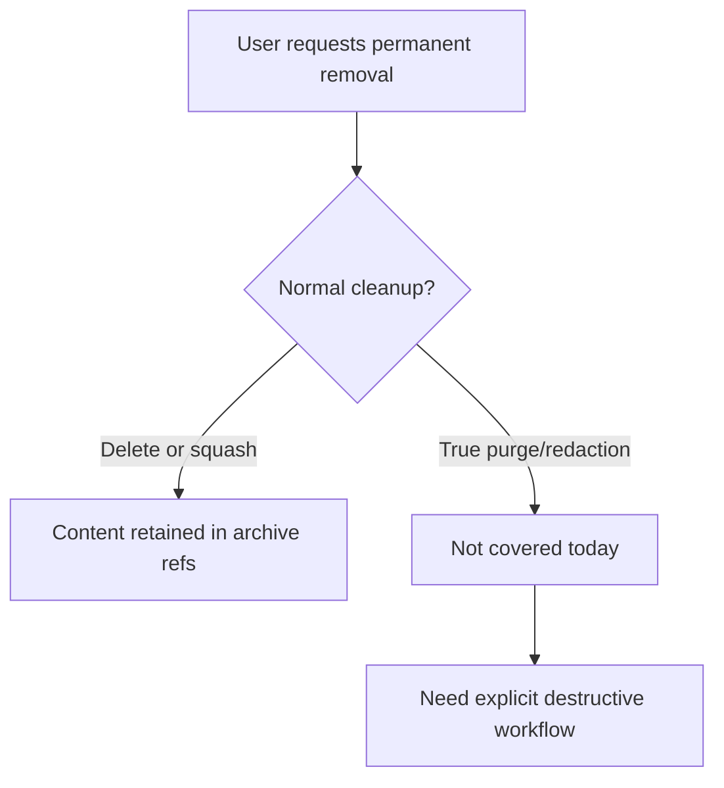

| Question | Answer |
|---|---|
| Covered today? | Planning-only. `preflight_purge_content` and `verify_purge` exist, but there is no destructive purge execution. |
| Current support | Cleanup preserves old tips by design. `preflight_purge_content` enumerates candidate refs and reports distributed-Git limitations; `verify_purge` reports verification limitations. There is no destructive `purge_content` execution primitive. Planned support-ref sync would also preserve those tips on the shared remote. |
| Safety behavior | Draftline currently optimizes for recoverability, not permanent deletion. Purge must be a destructive, admin-permissioned, best-effort workflow over controlled remotes; Git cannot guarantee removal from existing clones, forks, backups, logs, caches, or offline devices that already fetched the objects. |
| Gap | Need destructive `purge_content` execution with confirmations, enumeration of visible refs, support refs, tags, notes, replace refs, stash refs, remote-tracking refs, reflogs, alternates, hosting caches, object reachability checks, remote GC coordination, post-purge verification, audit trail, and user copy that does not over-promise deletion from distributed copies. |

## Flow 13g: expire old support refs

Business goal: "Clean up old recovery points without pretending it is a sensitive-data purge."

Why this flow exists: shared support refs improve recovery but can grow indefinitely. Retention cleanup is a normal repository maintenance scenario, distinct from purge/redaction.

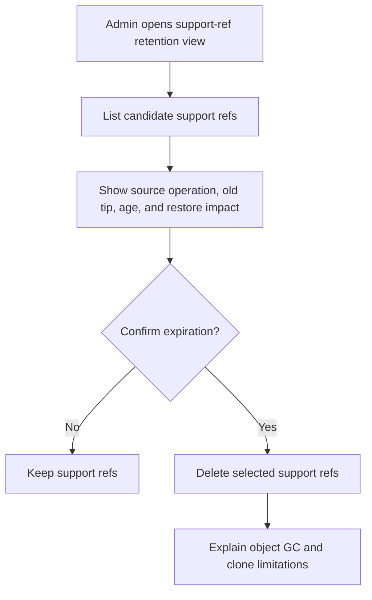

| Question | Answer |
|---|---|
| Covered today? | Partially covered locally. |
| Current support | `list_support_refs`, `preflight_expire_support_refs`, and `expire_support_refs` support local retention cleanup. General remote support-ref retention is not implemented. |
| Safety behavior | Retention cleanup may remove convenient recovery pointers but should not be framed as sensitive-content deletion. |
| Gap | Need remote support-ref retention with permissions, audit, and remote GC guidance. |

## Flow 13h: large or binary business assets

Business goal: "Save and share images, videos, PDFs, or other heavy assets safely."

Why this flow exists: creative/business content often includes binary assets, but Git history can grow quickly and text merge/diff tools do not apply.

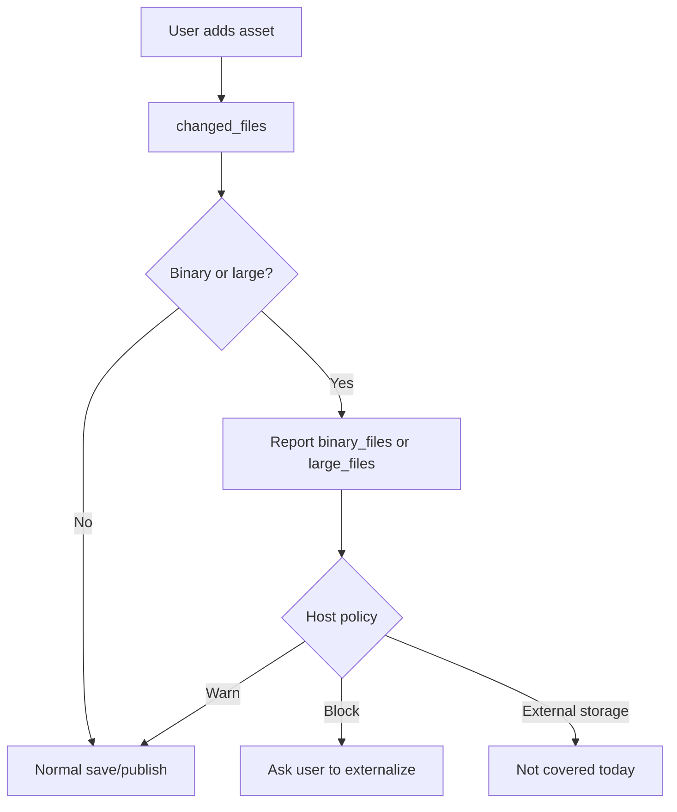

| Question | Answer |
|---|---|
| Covered today? | Partially covered. |
| Current support | Draftline detects binary and large current workspace files in change/preflight reports. Historical diffs do not preserve meaningful `is_large` data. |
| Safety behavior | Detection gives hosts a chance to warn or block, but Draftline does not enforce asset policy by itself. |
| Gap | Need a product policy for block/warn/stream/external storage/LFS-like behavior. |

## Flow 14: recover from interruption or unusual state

Business goal: "Something was interrupted or the workspace looks wrong. Help me get back safely."

Why this flow exists: interrupted ref-moving or file-writing operations can leave history, refs, and files temporarily inconsistent; the app should surface that state instead of continuing as if everything is normal.

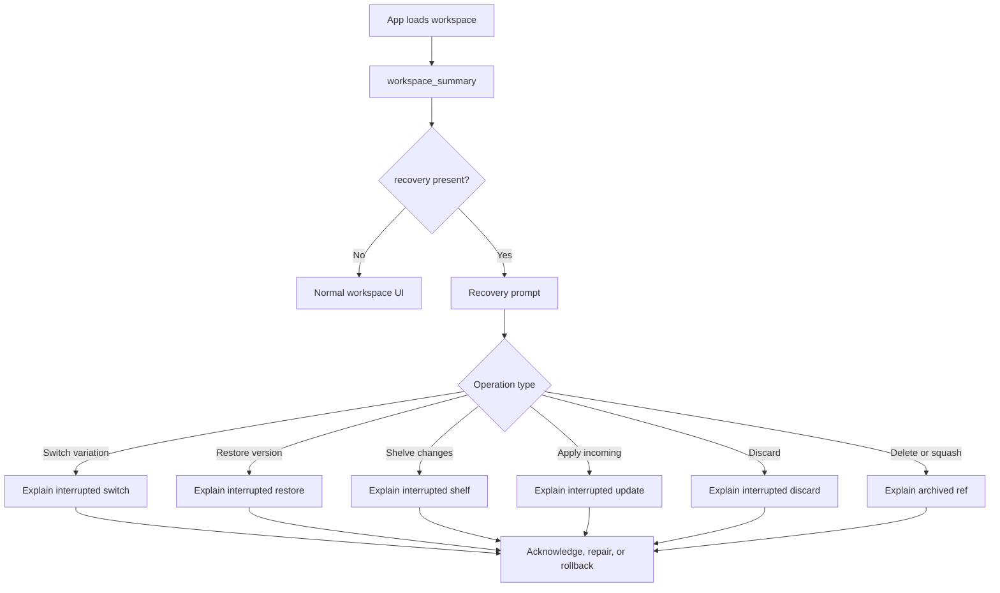

| Question | Answer |
|---|---|
| Covered today? | Partially covered. |
| Current support | Operation locks prevent concurrent risky operations. `RecoveryState` blocks normal APIs. `workspace_summary` and `inspect` can still surface recovery context. `repair_recovery` and `rollback_recovery` perform metadata-backed repair or rollback for covered operations such as discard, apply incoming, rename, remote delete, and selected history-cleanup states, and return typed blockers when the ledger lacks enough state. |
| Safety behavior | Draftline avoids pretending the workspace is coherent when an operation may have been interrupted. |
| Edge cases | `acknowledge_recovery` clears metadata but does not repair or roll back the Git state. Hosts should not present acknowledgment as repair; it can unblock normal APIs while refs and files remain inconsistent. Recovery state is single-slot because only one Draftline risky operation should hold the operation lock at a time. |
| Tests | `repair_recovery_finishes_discard_changes`, `repair_recovery_completes_apply_incoming_fast_forward`, `rollback_recovery_restores_deleted_variation`, `repair_remote_delete_recovers_after_visible_ref_was_deleted`, and related insufficient-metadata blocker tests. |
| Gap | Need broader operation metadata coverage so every interrupted risky operation can either repair, roll back, or explain why manual intervention is required. |

## Flow 14a: out-of-band Git mutation

Business goal: "Something changed outside the app; explain whether Draftline can continue safely."

Why this flow exists: users or tools may run Git directly, checkout detached commits, rewrite refs, resolve conflicts, or add commits outside Draftline.

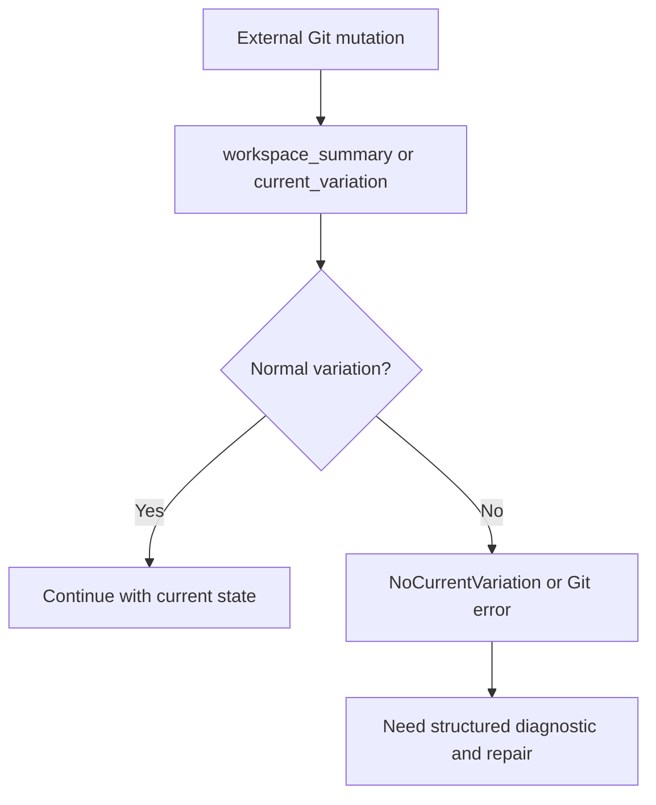

| Question | Answer |
|---|---|
| Covered today? | Partially covered. |
| Current support | Some states surface through `NoCurrentVariation`, status, `inspect`, `verify_workspace`, `explain_error`, or raw Git errors. |
| Safety behavior | Draftline refuses normal variation operations when HEAD is detached or no local variation can be identified. |
| Tests | `tauri_contract_keeps_frontend_json_shape_stable` covers structured inspection output; lower-level error-path tests cover detached/no-current-variation signals. |
| Gap | Need deeper repair flows for detached HEAD, raw Git branch changes, existing conflicted indexes, and non-Draftline history edits. |

## Flow 14b: stale or abandoned operation lock

Business goal: "The app crashed or was killed; help me unlock the workspace without corrupting it."

Why this flow exists: an operation lock protects against concurrent risky mutations, but a crashed process can leave an abandoned lock behind. Retrying forever is not a recovery strategy.

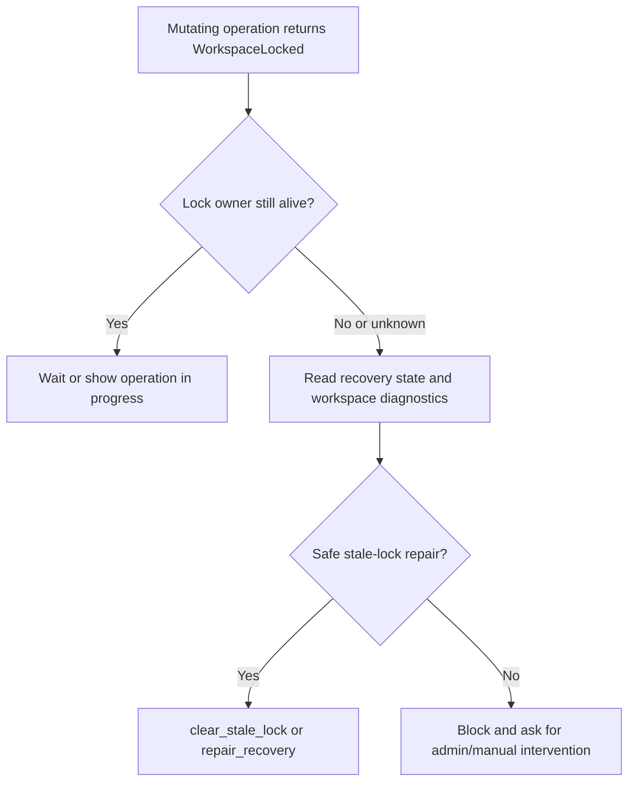

| Question | Answer |
|---|---|
| Covered today? | Partially covered. |
| Current support | `WorkspaceLocked` blocks mutating operations. `inspect_operation_lock` distinguishes active, stale, and legacy/unknown locks. `clear_stale_lock` clears only metadata locks deemed stale. `RecoveryState` may also exist, but acknowledgment does not repair refs/files. |
| Safety behavior | A host must distinguish an active operation from a stale lock. Clearing a lock should be a guarded recovery action, not a blind retry loop or automatic delete. |
| Edge cases | A crash can leave both recovery metadata and an operation lock. Multiple host instances may race on the same workspace. Lock metadata needs owner, PID/process identity, timestamp, and enough context to decide stale vs active. |
| Tests | `clear_stale_lock_removes_only_stale_metadata_lock`. |
| Gap | Need integrated repair that coordinates lock and recovery state together. |

## Edge and error scenarios

| Scenario | Status | Primitive or signal | Expected host behavior |
|---|---|---|---|
| Invalid workspace-relative path | Covered | `AbsolutePath`, `PathEscapesWorkspace`, `resolve_path` | Show path validation error; do not retry with raw path. |
| Path outside content policy | Covered | `PathOutsideContentPolicy` | Explain that the file is app/runtime/private content, not tracked user content. |
| Invalid content policy path | Covered | `InvalidContentPolicyPath` | Fix host configuration. |
| Invalid content policy extension | Covered | `InvalidContentPolicyExtension` | Fix host configuration. |
| Invalid variation name | Covered | `InvalidVariationName` | Ask user for a different option name or generate a safe internal name. |
| Current variation delete requested | Covered | `CannotDeleteCurrentVariation` | Ask user to switch first or cancel. |
| Unknown version ID | Covered | `VersionNotFound` | Refresh history or report stale link. |
| Abbreviated or non-canonical version ID | Covered | `VersionId::from_canonical_string` | Require full lowercase canonical ID from app storage. |
| No current variation / detached state | Covered as signal | `NoCurrentVariation` | Show repair flow; do not run ref-moving operations. |
| Workspace locked | Covered as signal | `WorkspaceLocked` | Show active operation if known; if the lock may be stale, use the stale-lock recovery flow instead of retrying forever. |
| Stale operation lock | Partially covered | `inspect_operation_lock`, `clear_stale_lock` | Use guarded stale-lock repair; do not retry forever or delete locks manually. |
| Pending recovery | Covered as blocker | `RecoveryRequired` | Show recovery prompt instead of normal actions. |
| Dirty workspace before risky operation | Covered | `PreflightFailed` with `PreflightReport` | Ask user to save, discard, shelve, or cancel. |
| Target tree would overwrite non-versioned file | Partially covered | `FileHazard` checks in switch, restore, apply incoming, and apply shelf | Block checkout-like operation or ask user to move/backup the file. |
| Git-ignored file matches content policy | Partially covered | `policy_git_diagnostics`, `audit_content_policy` | Warn that business content may be hidden from save/publish. |
| Binary or large files in preflight | Covered | `binary_files`, `large_files` | Warn before switching or risky operation if useful. |
| Remote has incoming work during publish | Covered as blocker | `SyncNeedsMerge` containing `SyncState::IncomingAvailable` | Ask user to apply incoming work before publishing. |
| Remote needs merge | Covered as blocker | `SyncNeedsMerge` containing `SyncState::NeedsMerge` | Start merge workflow; do not publish/apply. |
| Remote/auth failure | Covered as error propagation | `Git` errors, `RemoteOptions` callbacks | Host should surface auth or network error and offer retry. |
| Not enough versions to squash | Covered | `InvalidSquashCount`, `NotEnoughVersionsToSquash` | Disable or explain squash action. |
| Unsupported switch discard | Covered as blocker | `UnsupportedSwitchPolicy` | Direct user to explicit discard flow, then switch with `AbortIfDirty`. |
