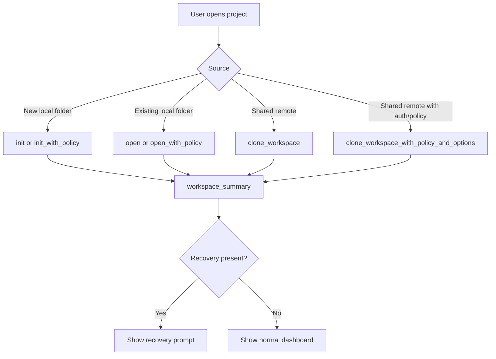
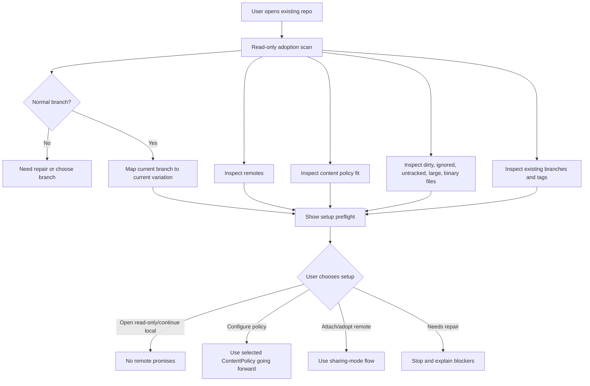
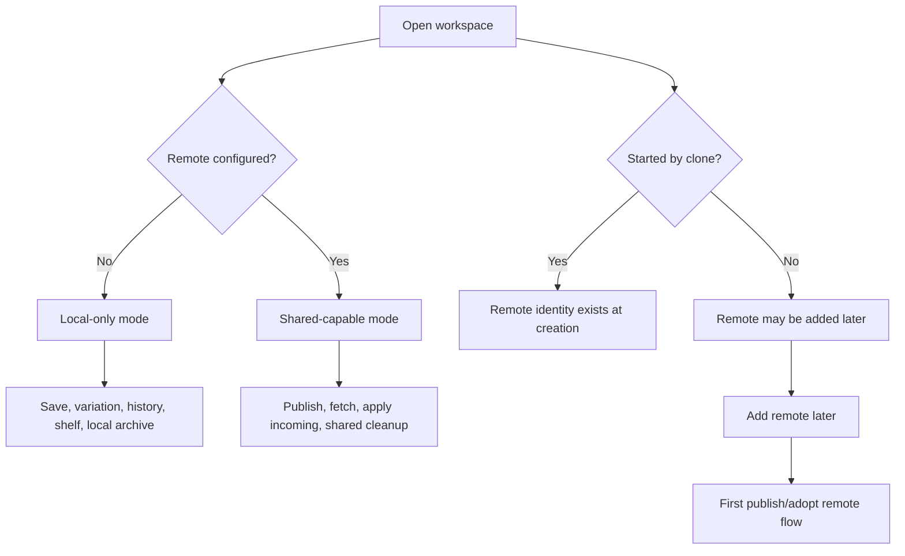
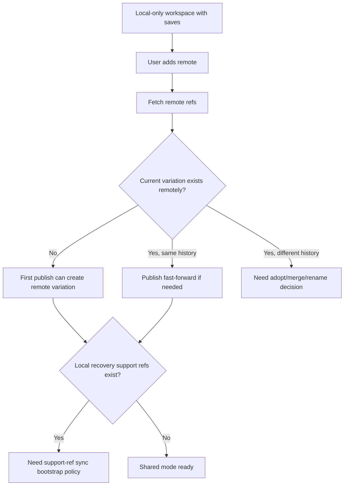
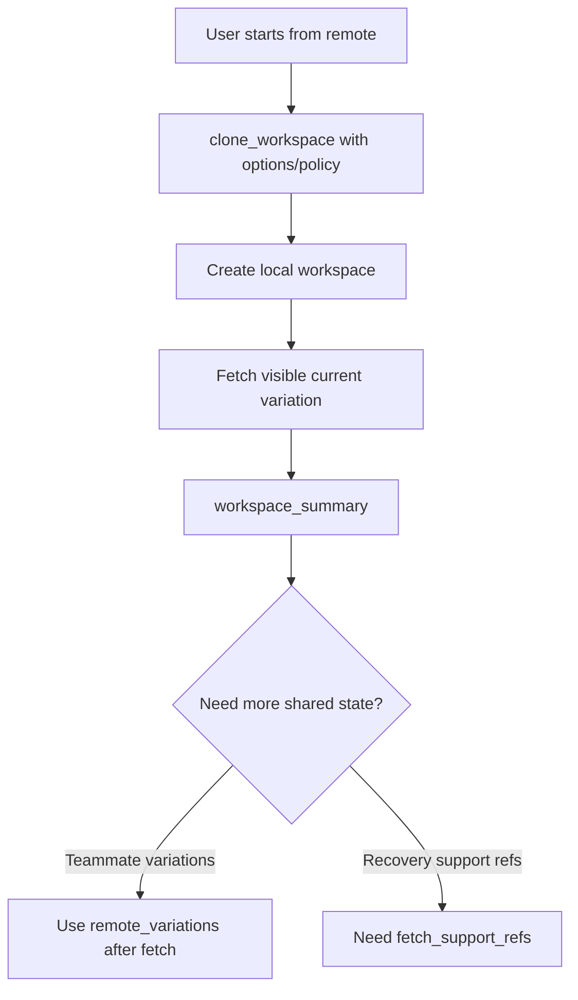
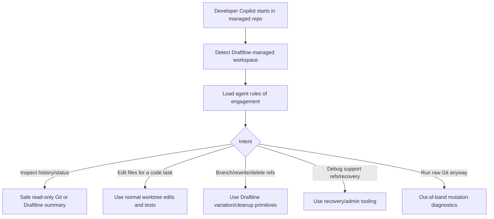
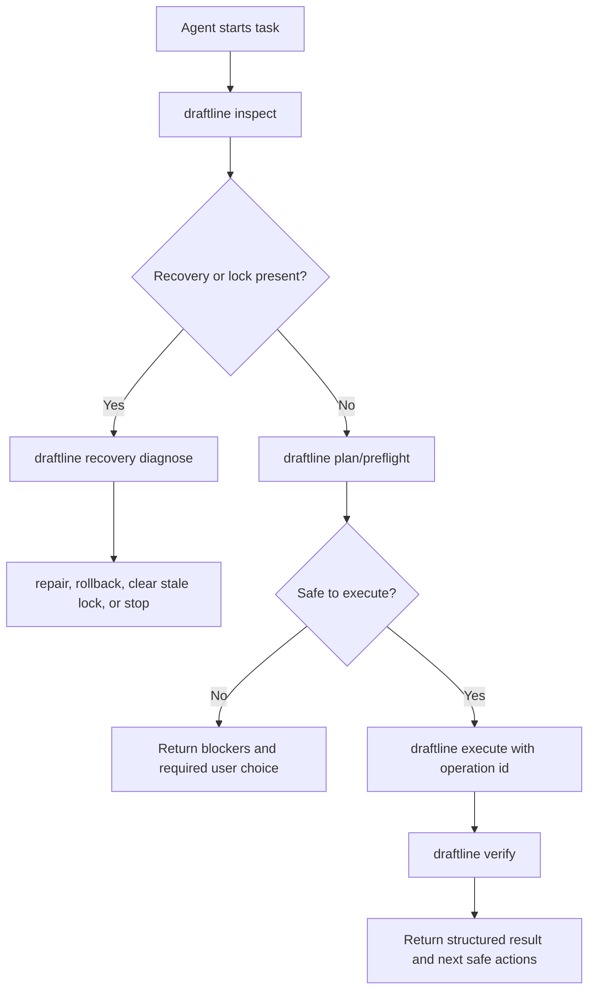

# Workspace and agent setup scenarios

[Back to scenario index](../scenarios.md)

## Flow 1: start or open a workspace

Business goal: "I need to start work or open an existing project."

Why this flow exists: every other Draftline action depends on first establishing a normal workspace, content root, active variation, and recovery status.

| Question | Answer |
|---|---|
| Covered today? | Covered. |
| Correct primitive path | `init*`, `open*`, or `clone_workspace*` -> `workspace_summary`. |
| Safety behavior | Opening is not a destructive operation. `workspace_summary` can still report recovery state if another operation was interrupted. |
| Edge cases | `open` can fail if no repository is discoverable. Clone/fetch can require host-provided credentials through `RemoteOptions`. |

## Flow 1a: adopt an existing non-Draftline repo

Business goal: "I already have a Git repo; help me set it up safely as a Draftline workspace."

Why this flow exists: an existing repository may have branches, tags, remotes, untracked files, ignored files, dirty work, detached HEAD, conflicts, large assets, or saved content outside the intended business-content policy. Draftline should not assume that `open` means the repo already follows Draftline's product model.

| Question | Answer |
|---|---|
| Covered today? | Partially covered. |
| Current support | `open*`, `workspace_summary`, `inspect`, `preflight_adopt_workspace`, `changes`, `history`, `variation_summaries`, `remotes`, and `sync_status` expose structured state. |
| Safety behavior | Adoption should begin as read-only diagnostics. Draftline should not rewrite branches, rename refs, change remotes, delete files, or persist new policy decisions until the user chooses a setup path. |
| Edge cases | Existing repos can have detached HEAD, branch names that do not fit product naming, multiple remotes, protected branches, tags/releases, submodules/gitlinks, symlinks, Git LFS or filter-driver assets, ignored generated files, staged changes that differ from the working tree, case or Unicode path collisions, multiple worktrees, existing conflict markers, or history containing files outside the selected policy. |
| Gap | Adoption preflight exists, but broader branch/remote mapping, actor identity, attributes/filter diagnostics, and product-specific migration choices still need host policy or follow-up primitives. |

For app migrations, ownership should split by layer:

| Layer | Responsibility |
|---|---|
| Draftline | Provide generic, app-agnostic adoption diagnostics for an existing Git repo. |
| Consuming app | Decide product-specific migration policy, content boundaries, branch-to-variation labels, user copy, and which fixes to offer. |
| Helper API | Expose a setup/adoption report such as `preflight_adopt_workspace` so consuming apps can migrate existing repositories without reimplementing Git safety checks. |

## Flow 1b: choose or discover sharing mode

Business goal: "Am I working only on this machine, connecting existing local work to a shared remote, or starting from shared work?"

Why this flow exists: remote collaboration, shared recovery refs, and cross-machine guarantees only exist after a remote is configured and reachable. A local-only workspace is valid, but it must not inherit promises from shared workflows.

| Question | Answer |
|---|---|
| Covered today? | Partially covered. |
| Current support | `init` and `open` support local work. `clone_workspace*` starts from a remote. `add_remote` can attach a remote after local work exists. `inspect` reports whether remotes are configured. |
| Safety behavior | Local-only work should remain fully usable for save, variation, history, discard, shelve, local cleanup, and local recovery. Shared operations should require an explicit remote and fetch before deciding. |
| Edge cases | A newly added remote may already contain a branch with the same variation name, no matching branch, different history, or support refs that need to be discovered separately. Existing repos can also have multiple remotes; the host may need the user to choose which remote represents shared Draftline work. |
| Gap | Basic sharing-mode diagnostics and publish preflight exist; hosts still need support-ref bootstrap policy and explicit remote destination confirmation flows. |

## Flow 1c: add a remote after local work exists

Business goal: "I started locally, and now I want to share or back up this workspace."

Why this flow exists: adding a remote changes the durability and audience of visible variations and eventually recovery support refs. The first publish is a boundary crossing from private/local repository state into shared repository state.

| Question | Answer |
|---|---|
| Covered today? | Partially covered. |
| Current support | `add_remote` records or updates the remote. `preflight_publish` captures expected remote state or absence, and `publish`/`publish_changes` can create a remote branch when there is no remote version for the current variation. |
| Safety behavior | First publish must fetch before deciding and must not overwrite remote work that happens to use the same variation name. |
| Edge cases | Local archive refs created before the remote was added remain local until support-ref sync exists. If support refs are synced later, they need unique names and create-only pushes just like new shared archives. |
| Gap | Need explicit remote destination confirmation, support-ref bootstrap, and product copy for "this local work will become shared." Push mechanics should use explicit lease/create-only semantics rather than only fetch-then-compare plus normal push. |

## Flow 1d: start from a shared remote

Business goal: "Open the shared workspace that already exists."

Why this flow exists: clone starts with remote identity and remote-tracking state, so the app can make collaboration promises earlier than a local-only workspace. But clone should still not imply that every teammate variation or hidden support ref has been discovered.

| Question | Answer |
|---|---|
| Covered today? | Covered for basic clone/open and remote variation discovery. |
| Current support | `clone_workspace*` can create a workspace from a remote with host-provided credentials and policy. `remote_variations` lists fetched remote-tracking variations, and `adopt_remote_variation` creates a local variation from one. |
| Safety behavior | Clone is a read/create operation, but follow-up sync should still fetch before making publish/apply decisions. |
| Edge cases | Remote variation discovery depends on fetched remote-tracking refs. Support refs may exist remotely without being visible in the normal workspace summary. |
| Gap | Need fetch-all/prune diagnostics for remote variations and support-ref fetch/list flows after clone. |

## Flow 1e: developer Copilot opens a Draftline-managed repo

Business goal: "A developer Copilot or coding agent is working in this repository; tell it how to operate without breaking Draftline's model."

Why this flow exists: a managed Draftline workspace is still a Git repository, so a developer Copilot can inspect and modify files, run tests, and use Git tools directly. That should be supported, but the repo needs clear agent-facing instructions about which direct Git actions are safe, which should go through Draftline primitives, and which namespaces are Draftline-owned.

| Question | Answer |
|---|---|
| Covered today? | Partially covered as a first-class scenario. |
| Current support | The repository remains a normal Git repo. Draftline can generate generic rules through `generate_agent_instructions` and surface unusual states through `inspect`, `verify_workspace`, `workspace_summary`, `NoCurrentVariation`, recovery state, and Git errors. |
| Safety behavior | Agent instructions should distinguish safe worktree actions from Draftline-owned state. Reading history/status, editing source files, and running tests are fine; deleting, rewriting, renaming, or force-updating visible refs or `refs/draftline/...` should use Draftline primitives or admin tooling. |
| Edge cases | A coding agent may run `git checkout`, `git reset`, `git clean`, `git stash`, `git branch -D`, force-push, edit `.gitignore`/attributes, delete support refs, clear operation locks, or resolve conflicts outside Draftline. Those actions can bypass content policy, recovery state, support-ref retention, and user-facing variation metadata. |
| Gap | Helper output exists, but no repository instruction file writer or standalone agent CLI/tool facade exists yet. Recovery repair guidance is still mostly diagnostic. |

Implementation shape:

| Artifact | Purpose |
|---|---|
| `AGENTS.md` | Generic, tool-neutral instructions for coding agents and developer Copilots operating in the repo. |
| Tool-specific files such as `CLAUDE.md` | Optional adapters for ecosystems that only read a specific instruction file. These should reference or mirror the generic contract, not fork the rules. |
| Draftline helper output | A generated rules-of-engagement summary that can be displayed by the host app or written into agent instruction files. |
| Adoption/setup report | Tells the agent whether the repo is local-only, shared-capable, recovering, locked, or outside normal Draftline assumptions. |

The instruction content should be generated from the same Draftline safety model rather than hand-maintained independently. At minimum it should say: do not rewrite/delete Draftline-owned refs directly, do not remove `refs/draftline/...` unless running a purge/retention flow, do not clear operation locks manually, fetch before reasoning about shared state, avoid destructive Git commands, and use Draftline/admin primitives for recovery, cleanup, support-ref sync, and shared history replacement.

## Flow 1f: agent uses Draftline APIs directly

Business goal: "A developer Copilot or automation agent needs to inspect, fix, or operate the workspace through Draftline instead of raw Git."

Why this flow exists: instructions help an agent avoid unsafe Git commands, but a safer system gives the agent direct, structured Draftline operations for diagnosis, preflight, mutation, verification, and recovery. Agents need machine-readable results, stable error codes, and idempotent operation handles more than human-oriented prose.

| Question | Answer |
|---|---|
| Covered today? | Partially covered as an agent-oriented Rust surface. |
| Current support | Draftline has Rust primitives, `inspect_json`, `capabilities_json`, `verify_workspace`, `explain_error`, and operation-specific preflights. It does not yet expose a standalone CLI/tool discover/preflight/execute/verify/repair protocol. |
| Safety behavior | Agent-facing APIs should make safe behavior easier than raw Git: every risky mutation should have a preflight, explicit blockers, an operation ID, recovery metadata, and a verification result. |
| Edge cases | Agents may need to operate without a human watching every step, so APIs must avoid ambiguous success, broad fallbacks, hidden force behavior, and prose-only errors. Long-running or interrupted operations need resumable status and repair paths. |
| Gap | Need a CLI/tool facade and generic tokenized execution protocol that exposes Draftline's safety model outside embedded Rust callers. |

Recommended API shape:

| API shape | Why agents need it |
|---|---|
| `draftline inspect --json` | One call that returns workspace mode, current variation, dirty state, remotes, recovery state, operation lock state, content-policy diagnostics, support-ref summary, and safe next actions. |
| `draftline capabilities --json` | Lets an agent discover supported primitives and whether advanced operations such as support-ref sync, merge, purge, or stale-lock repair exist. |
| `draftline preflight <operation> --json` | Returns exact blockers, affected files/refs, target-tree collisions, remote expected OIDs, support refs to create, and whether user confirmation is required. |
| `draftline execute <operation> --operation-id <id> --json` | Runs a previously preflighted operation with idempotency, operation-lock integration, and structured success/failure output. |
| `draftline verify <operation-id|workspace> --json` | Confirms the intended postcondition: refs moved as expected, files match target, support refs exist, remote OID matches, recovery state is clear. |
| `draftline recovery diagnose --json` | Gives repairable recovery/lock state without requiring the agent to inspect `.git/draftline` manually. |
| `draftline repair|rollback|clear-stale-lock --json` | Provides explicit recovery actions with preflight and confirmation instead of raw file deletion. |
| `draftline explain-error <code> --json` | Maps stable error codes to safe next actions, user-facing copy, and whether retry is valid. |

Design requirements:

1. Results should be structured JSON with stable codes, not only display strings.
2. Every mutating call should have a dry-run/preflight equivalent.
3. Mutations should accept idempotency keys or operation IDs so retries are safe.
4. Errors should distinguish retryable, requires-user-choice, requires-repair, and unsafe states.
5. APIs should return opaque Draftline IDs, not ask agents to parse branch names or ref paths.
6. Remote operations should expose expected-OID/lease fields explicitly.
7. File-writing operations should expose target-tree collision reports.
8. Recovery actions should be first-class APIs; agents should not delete lock files or recovery files directly.
9. The API should offer both a Rust surface for app integrations and a CLI/tool surface for coding agents.
10. Human approval boundaries should be explicit for destructive, shared, purge, or history-replacement operations.

Agentic software may also want Draftline operations exposed as tools rather than a CLI. The same safety contract should apply:

| Tool | Purpose |
|---|---|
| `draftline.inspect` | Return workspace summary, sharing mode, dirty state, recovery/lock state, remotes, policy diagnostics, support-ref state, and safe next actions. |
| `draftline.preflight` | Analyze a proposed operation and return blockers, affected files/refs, required confirmations, target-tree collisions, and remote expected OIDs. |
| `draftline.execute` | Execute a preflighted operation by opaque operation ID or exact preflight token. |
| `draftline.verify` | Check that the workspace/remote/support refs satisfy the expected postcondition. |
| `draftline.recovery` | Diagnose, repair, roll back, or clear stale locks through explicit recovery actions. |
| `draftline.explain` | Convert stable error/result codes into safe next actions for the agent and host UX. |

Tool design rules:

1. Tools should be narrow and typed; avoid a generic "run Git command" escape hatch.
2. Tool calls that mutate state should require a preflight token generated from the current workspace state.
3. Tool results should include `safe_next_actions` so agents can recover without guessing.
4. Tools should distinguish local-only, shared-capable, and shared-remote operations.
5. Tools should encode approval requirements, especially for discard, purge, shared cleanup, history replacement, support-ref deletion, and stale-lock repair.
6. Tools should be usable by MCP-style servers, host-app plugins, and coding-agent sandboxes without giving the agent unrestricted repository control.
