# Draftline scenarios

This document maps the scenarios a business user or host application can hit when working with Draftline. It starts from user intent, then calls out why the scenario exists, how Draftline should execute it, which invariant protects the user, and whether the current crate covers the scenario.

The scope is the current public library surface: workspace setup, content policy, authoring, versions, variations, discard, remotes, collaboration, cleanup, recovery, and known edge/error states.

This should be treated as a living product/engineering contract. When a new primitive is added, it should be mapped to a scenario here. When a new business scenario appears, it should be classified here before implementing APIs so the behavior stays principled rather than becoming a collection of Git wrappers.

See the [Draftline API plan](api-plan.md) for the roadmap from these scenarios to Rust APIs, CLI commands, and agent/tool surfaces.

## Coverage legend

| Status | Meaning |
|---|---|
| Covered | Existing primitives support the scenario safely. |
| Partially covered | The safe foundation exists, but the full business workflow still needs one or more primitives or UI steps. |
| Not covered | The scenario is identified, but Draftline does not yet expose the needed primitive. |
| Host concern | Draftline exposes the low-level signal; the embedding app owns product copy, UX, auth, or policy decisions. |

## Business safety principles

1. Users should choose product actions, not Git commands.
2. "Look around" flows must be read-only.
3. "Keep this" flows should create a named version, variation, shelf, or archive ref.
4. "Move to something else" flows must preflight local unsaved work.
5. "Share or receive team work" flows must fetch latest remote state before deciding.
6. "We both changed it" flows require explicit merge or conflict resolution.
7. "Go back" creates a new save; it must not reset history.
8. "Abandon edits" must be explicit and content-policy-aware.
9. "Clean up" and "remove" flows must preserve old tips under `refs/draftline/...`, unless an explicit purge/redaction operation overrides recovery.
10. Interrupted operations should produce a recovery prompt before normal work resumes.
11. Content policy changes are not retroactive unless an explicit migration or redaction operation says so.
12. Archive retention and permanent deletion are separate business intents.
13. Remote state includes remote identity and branch existence, not only ahead/behind counts.
14. Every mutating operation should state whether it affects all tracked changes or a selected subset.
15. The shared remote is the trust boundary for shared work; Draftline recovery support refs are hidden from normal views, not private from collaborators.
16. Shared recovery requires explicit support-ref sync; local archive refs alone are not a cross-machine guarantee.
17. Publishing support refs must be append-only: never force-overwrite a recovery point.
18. Shelves are personal work-in-progress by default; sharing shelved work requires a separate explicit policy.
19. Workspaces have a sharing mode: local-only, local with a remote added later, or cloned from a remote. Flows must not assume `origin` exists.
20. Any operation that writes a target tree into the workspace must preflight collisions against tracked, untracked, ignored, and current-policy-excluded files.
21. Remote mutations must use expected remote identity, not just "fetch then decide"; branch deletion, recreation, or rewind after fetch is a first-class race.

## Principled support model

Every supported scenario should answer the same questions:

| Question | Purpose |
|---|---|
| What is the user trying to do? | Keeps the API anchored in business intent instead of Git vocabulary. |
| Why does this scenario exist? | Identifies the risk, collaboration need, or product promise behind the flow. |
| How does Draftline execute it? | Names the exact primitive sequence and which operations are read-only or mutating. |
| What invariant protects the user? | States the rule that prevents data loss, hidden overwrites, or confusing detached states. |
| What should the host show? | Separates library behavior from app-owned confirmation, copy, and recovery UX. |
| What is missing? | Makes partial coverage explicit instead of implying safety by omission. |

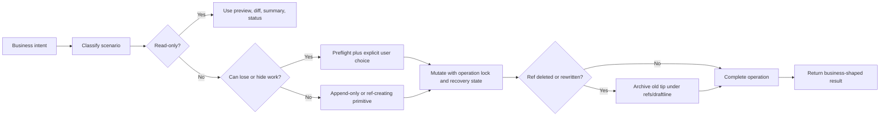
```mermaid
flowchart LR
    A[Business intent] --> B[Classify scenario]
    B --> C{Read-only?}
    C -- Yes --> D[Use preview, diff, summary, status]
    C -- No --> E{Can lose or hide work?}
    E -- Yes --> F[Preflight plus explicit user choice]
    E -- No --> G[Append-only or ref-creating primitive]
    F --> H[Mutate with operation lock and recovery state]
    G --> H
    H --> I{Ref deleted or rewritten?}
    I -- Yes --> J[Archive old tip under refs/draftline]
    I -- No --> K[Complete operation]
    J --> K
    K --> L[Return business-shaped result]
```

## Design rules by user intent

| User intent | Product action | Git-backed shape | Why this shape |
|---|---|---|---|
| Look around | Summary, preview, diff, status | Read trees, diffs, refs, and status only | Users should be able to inspect history without changing files. |
| Keep current work | Save version | Commit tracked content | A named save is the durable unit users understand. |
| Keep selected work | Save selected files | Not yet exposed | Mixed ready/unfinished edits need partial workflows. |
| Try another idea | Create variation | Create branch/ref | Alternatives need stable names without detached HEAD. |
| Rename an idea | Edit variation metadata | Config metadata, not ref rename | Product labels should change without rewriting Git branch identity. |
| Move to another idea | Switch variation | Preflight, optional save/shelve, checkout branch | Switching writes files, so dirty work needs an explicit plan first. |
| Put work aside | Shelve | Local support ref by default | Temporary work should be recoverable without silently publishing unfinished work. |
| Abandon edits | Discard | Policy-aware checkout/reset/removal | Destructive local cleanup must be explicit and scoped to tracked content. |
| Share work | Publish | Fetch, check ahead/behind, push current variation | Publishing must not overwrite teammate work. |
| Receive work | Apply incoming | Fetch, preflight, fast-forward only | Remote updates are safe only when local history can advance without merge. |
| Reconcile work | Merge incoming | Three-way merge with semantic conflict model | Divergence needs human-readable conflict decisions, not hidden Git merges. |
| Go back | Restore as new save | New commit from old tree | Restoring should preserve the audit trail instead of moving history backward. |
| Clean up | Squash or delete | Archive old tip as a support ref, then rewrite/delete visible ref | Cleanup should simplify UI while preserving a hidden recovery pointer. |
| Recover | Recovery prompt | Read ledger, block normal operations, repair/rollback/acknowledge | Interrupted operations should be visible and deliberate. |
| Permanently remove content | Purge/redact | Not yet exposed | True deletion conflicts with archive-first safety and needs a separate explicit workflow. |

## Visible work vs support refs

Draftline should distinguish normal business views from the hidden support refs that make recovery possible.

| Ref namespace | Product meaning | Normal UI visibility | Sync policy |
|---|---|---|---|
| `refs/heads/<variation>` | Visible team variations | Shown in normal variation/history views | Published/fetched as shared work. |
| `refs/draftline/shelves/...` | Work intentionally set aside | Hidden from normal views; shown in shelf/recovery views | Local-only by default; any sharing must be explicit and separately permissioned. |
| `refs/draftline/deleted-variations/...` | Recovery points for deleted variations | Hidden from normal views; shown in recovery/admin views | Planned support-ref sync policy; currently local-only. |
| `refs/draftline/rewrites/...` | Recovery points for history rewrites such as squash | Hidden from normal views; shown in recovery/admin views | Planned support-ref sync policy; currently local-only. |

Shared recovery support refs are **not private**. They live inside the same shared repository trust boundary as visible work. They are hidden because they are not primary business objects, not because they contain secret content. Git server ACLs and refspec policy, not naming, determine who can fetch them. If content must not be retained by collaborators, the right scenario is purge/redaction, not delete, squash, or shared recovery.

Shelves are different from cleanup archives. A shelf may contain unfinished or sensitive local work that the user never intended to publish, so shelf sync must be local-only by default or require an explicit "share shelved work" flow with clear warning copy and permissions.

Support-ref sync needs its own ref contract:

| Rule | Requirement |
|---|---|
| Unique names | Archive refs should include operation identity and source context, such as source ref, old tip OID, operation UUID, actor/device, and time. |
| Immutability | Once published, a recovery support ref must not be force-updated or reused for another old tip. |
| Race safety | Shared cleanup must push support refs with "create only" semantics and delete/rewrite visible refs only with expected-OID or lease checks. |
| Local/remote mapping | Fetched remote support refs should not overwrite unsynced local support refs; use a remote-tracking layout such as `refs/draftline/remotes/<remote>/...` or an equivalent indexed model. |
| Host permissions | Some Git servers may reject non-branch namespaces. Support-ref sync must surface that as a host/remote capability issue, not silently fall back to unsafe cleanup. |

## Scenario support checklist

Before adding or changing a primitive, verify the scenario can answer:

1. Is the operation read-only, append-only, ref-creating, file-writing, ref-moving, or ref-deleting?
2. If it writes files, does it have a preflight report or an explicit policy?
3. If it can overwrite unsaved work, does it require save, shelve, discard, or cancel?
4. If it talks to a remote, does it fetch before deciding and refuse unsafe divergence?
5. If it deletes or rewrites a ref, does it preserve the old tip under `refs/draftline/...`?
6. If it can be interrupted, does it write recovery state before mutation and clear it after completion?
7. If it returns an ID, does the ID round-trip without parsing business semantics?
8. If a path is provided, is it normalized, workspace-relative, and content-policy-aware where needed?
9. If it creates support refs, does the scenario state whether those refs are local-only today or synced to the shared remote?
10. If it syncs support refs, are naming, immutability, refspec mapping, permissions, and failure ordering defined?
11. If the scenario is only partially covered, is the missing primitive listed in the roadmap?

## Full business lifecycle

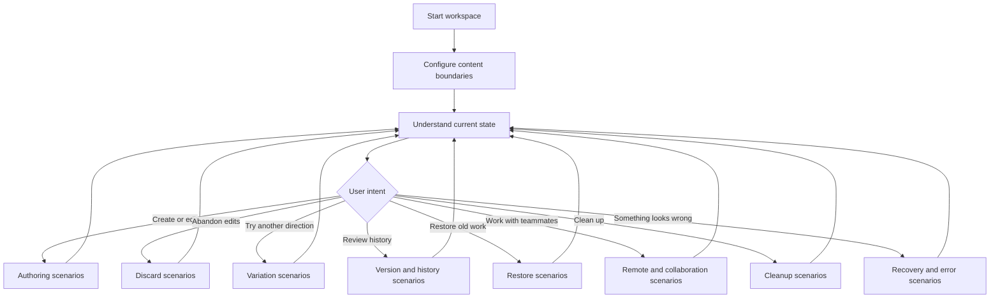
```mermaid
flowchart TD
    A[Start workspace] --> B[Configure content boundaries]
    B --> C[Understand current state]
    C --> D{User intent}

    D -- Create or edit --> E[Authoring scenarios]
    D -- Abandon edits --> F[Discard scenarios]
    D -- Try another direction --> G[Variation scenarios]
    D -- Review history --> H[Version and history scenarios]
    D -- Restore old work --> I[Restore scenarios]
    D -- Work with teammates --> J[Remote and collaboration scenarios]
    D -- Clean up --> K[Cleanup scenarios]
    D -- Something looks wrong --> L[Recovery and error scenarios]

    E --> C
    F --> C
    G --> C
    H --> C
    I --> C
    J --> C
    K --> C
    L --> C
```

## Executive scenario coverage

| Scenario group | Coverage | Current primitives | Remaining gap |
|---|---|---|---|
| Start or open workspace | Covered | `init`, `open`, `clone_workspace`, `workspace_summary` | None for MVP. |
| Adopt existing non-Draftline repo | Partially covered | `open`, `workspace_summary`, status/history APIs | Need setup preflight that maps branches/remotes/content policy into Draftline concepts without mutating first. |
| Developer Copilot opens a Draftline-managed repo | Not covered | Informal docs only | Need agent-facing instructions that explain safe direct Git interaction and Draftline-owned state. |
| Agent uses Draftline APIs directly | Not covered | Library APIs only | Need agent-friendly API/CLI shape with discovery, preflight, execute, verify, and repair operations. |
| Configure actor identity | Host concern | Commit signatures through workspace configuration | Need explicit identity diagnostics because authorship, audit, and support-ref naming depend on it. |
| Work local-only before remote exists | Covered | `init`, `open`, local save/variation/history APIs | Publish, apply incoming, and shared support-ref sync are unavailable until a remote is configured. |
| Add remote after local work exists | Partially covered | `add_remote`, `publish_changes` | Need preflight that explains first publish, remote branch conflicts, and support-ref sync bootstrap. |
| Start from shared remote | Covered for clone/open | `clone_workspace`, `clone_workspace_with_policy_and_options` | Need broader remote variation discovery after clone. |
| Configure tracked content | Host concern | `ContentPolicy`, `tracks`, `content_policy`, `resolve_path` | Default policy is permissive except `.draftline`; hosts must choose app-specific policy and account for Git ignore rules. |
| Content policy vs Git ignore rules | Partially covered | Git status plus `ContentPolicy` | Need warnings for policy-tracked files hidden by `.gitignore` or attributes. |
| Change content policy after saves | Not covered | Runtime `ContentPolicy` only | Need policy migration/redaction model; existing versions are not retroactively filtered. |
| Workspace before first save | Partially covered | `changes`, `save_version`, `workspace_summary` | Variation, remote, and history actions may require an initial version. |
| Understand current state | Covered | `workspace_summary`, `changes`, `history`, `full_history`, `variation_summaries`, `sync_status` | During recovery, only `workspace_summary` and `recovery_state` are available; better product copy for unusual Git states. |
| Save business work | Partially covered | `changes`, `save_version`, `ContentPolicy` | Need diagnostics for policy-tracked files hidden by Git ignore/attributes. |
| Save or shelve selected work | Not covered | `save_version`, `SwitchPolicy::Shelve` affect all tracked dirty files | Need partial save/shelf APIs. |
| Abandon unsaved edits | Covered | `preflight_discard_changes`, `discard_changes`, `preflight_discard_file`, `discard_file` | Switch-time discard remains intentionally unsupported; discard must be a separate explicit action. |
| Try another direction | Covered | `create_variation`, `create_variation_from`, variation metadata APIs | None for MVP. |
| Rename or relabel direction | Covered | `set_variation_metadata`, `variation_metadata` | Ref renaming is intentionally not exposed. |
| Move between directions | Partially covered | `preflight_switch_variation`, `switch_variation`, `AbortIfDirty`, `SaveFirst`, `Shelve` | `SaveFirst` is covered; shelve is incomplete without list/preview/apply/delete APIs. |
| Review older work | Covered | `history`, `full_history`, `diff_versions`, `preview_version`, `preview_version_file` | None for MVP. |
| Restore older work | Partially covered | `restore_version_as_new_save` | Need target-tree collision and current-policy preflight for old-policy files. |
| Target tree collides with local files | Not covered | File-writing operations vary | Need preflight for untracked, ignored, generated, and policy-excluded files before checkout/restore/apply/switch. |
| Publish my work | Partially covered | `fetch_remote`, `sync_status`, `publish_changes` | Need expected-OID/lease semantics for first publish and remote branch races. |
| Receive teammate work | Covered for current-variation fast-forward | `fetch_remote`, `preflight_apply_incoming`, `apply_incoming` | Diverged merge flow, teammate-created variation discovery, and broad target-tree collision preflight are missing. |
| We both changed the same workspace | Partially covered | `sync_status`, `SyncNeedsMerge`, semantic resolver types | No public `merge_incoming` workflow yet. |
| Discover teammate-created variations | Not covered | Current-variation fetch/status only | Need remote variation listing/import/adoption APIs. |
| Remote variation deleted or renamed | Not covered | `fetch_remote` ignores missing remote refs | Need prune/stale-ref diagnostics and product messaging. |
| Change or remove remote destination | Partially covered | `add_remote`, `remotes` | Updating an existing remote URL is silent; need preflight/confirmation/remove APIs. |
| Remove old local direction | Partially covered | `delete_variation` archives tip first | Need preflight and restore-from-archive APIs. |
| Remove shared direction for the team | Not covered | Local delete only | Need remote-safe delete with archive-first, support-ref publish, and expected-OID remote deletion. |
| Clean up local version history | Partially covered | `squash_versions` archives old tip first | Published branches cannot use normal `publish_changes` after squash because Draftline does not force-push. |
| Replace shared history | Not covered | Local squash only | Needs explicit replace-remote-history workflow with consent, support-ref publish, and force-with-lease semantics. |
| Sync hidden recovery support refs | Not covered | Local `refs/draftline/...` refs only | Need support-ref fetch/publish refspecs for the shared remote. |
| Recover cleanup after clone/device loss | Not covered | Local archive refs only | Needs shared support-ref sync plus archive listing/restore APIs. |
| Permanently purge/redact content | Not covered | Archive refs intentionally retain content | Need explicit best-effort purge/redaction workflow separate from cleanup. |
| Large or binary business assets | Partially covered | `is_binary`, `is_large`, preview metadata | Need policy for block/warn/stream/external storage. |
| Out-of-band Git mutation | Partially covered | `NoCurrentVariation`, Git errors, status | Need structured diagnostics and repair guidance. |
| Recover from interruption | Partially covered | `RecoveryState`, `workspace_summary.recovery`, operation lock, `acknowledge_recovery` | Need operation-specific repair or rollback APIs. |
| Recover stale operation lock | Not covered | `WorkspaceLocked` only | Need stale-lock detection and guarded unlock/repair flow. |
| Bring shelved work back | Not covered | Shelf refs are created internally | Need shelf listing, preview, apply, and delete APIs. |

## Flow 1: start or open a workspace

Business goal: "I need to start work or open an existing project."

Why this flow exists: every other Draftline action depends on first establishing a normal workspace, content root, active variation, and recovery status.

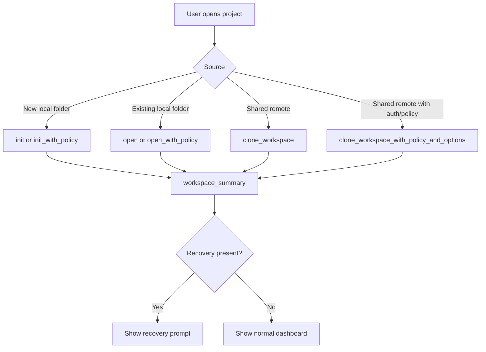
```mermaid
flowchart TD
    A[User opens project] --> B{Source}
    B -- New local folder --> C[init or init_with_policy]
    B -- Existing local folder --> D[open or open_with_policy]
    B -- Shared remote --> E[clone_workspace]
    B -- Shared remote with auth/policy --> F[clone_workspace_with_policy_and_options]
    C --> G[workspace_summary]
    D --> G
    E --> G
    F --> G
    G --> H{Recovery present?}
    H -- Yes --> I[Show recovery prompt]
    H -- No --> J[Show normal dashboard]
```

| Question | Answer |
|---|---|
| Covered today? | Covered. |
| Correct primitive path | `init*`, `open*`, or `clone_workspace*` -> `workspace_summary`. |
| Safety behavior | Opening is not a destructive operation. `workspace_summary` can still report recovery state if another operation was interrupted. |
| Edge cases | `open` can fail if no repository is discoverable. Clone/fetch can require host-provided credentials through `RemoteOptions`. |

## Flow 1a: adopt an existing non-Draftline repo

Business goal: "I already have a Git repo; help me set it up safely as a Draftline workspace."

Why this flow exists: an existing repository may have branches, tags, remotes, untracked files, ignored files, dirty work, detached HEAD, conflicts, large assets, or saved content outside the intended business-content policy. Draftline should not assume that `open` means the repo already follows Draftline's product model.

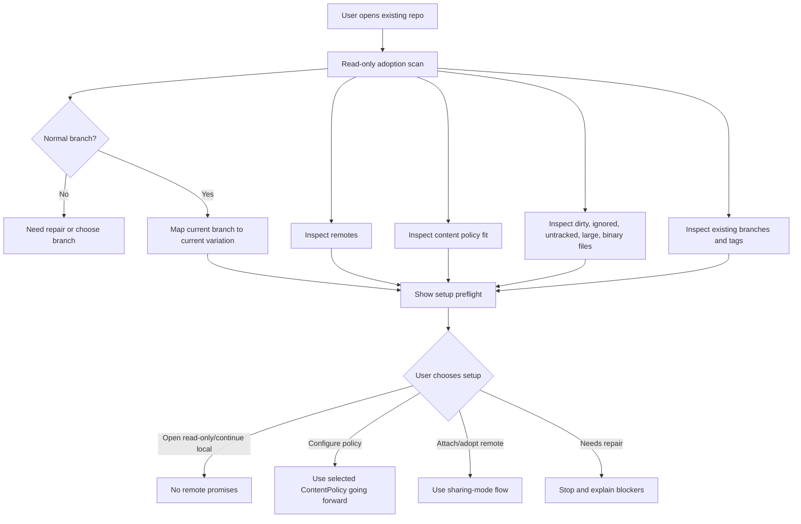
```mermaid
flowchart TD
    A[User opens existing repo] --> B[Read-only adoption scan]
    B --> C{Normal branch?}
    C -- No --> D[Need repair or choose branch]
    C -- Yes --> E[Map current branch to current variation]
    B --> F[Inspect remotes]
    B --> G[Inspect content policy fit]
    B --> H[Inspect dirty, ignored, untracked, large, binary files]
    B --> I[Inspect existing branches and tags]
    E --> J[Show setup preflight]
    F --> J
    G --> J
    H --> J
    I --> J
    J --> K{User chooses setup}
    K -- Open read-only/continue local --> L[No remote promises]
    K -- Configure policy --> M[Use selected ContentPolicy going forward]
    K -- Attach/adopt remote --> N[Use sharing-mode flow]
    K -- Needs repair --> O[Stop and explain blockers]
```

| Question | Answer |
|---|---|
| Covered today? | Partially covered. |
| Current support | `open*`, `workspace_summary`, `changes`, `history`, `variation_summaries`, `remotes`, and `sync_status` expose pieces of the state. |
| Safety behavior | Adoption should begin as read-only diagnostics. Draftline should not rewrite branches, rename refs, change remotes, delete files, or persist new policy decisions until the user chooses a setup path. |
| Edge cases | Existing repos can have detached HEAD, branch names that do not fit product naming, multiple remotes, protected branches, tags/releases, submodules/gitlinks, symlinks, Git LFS or filter-driver assets, ignored generated files, staged changes that differ from the working tree, case or Unicode path collisions, multiple worktrees, existing conflict markers, or history containing files outside the selected policy. |
| Gap | Need an explicit `preflight_adopt_workspace` or setup report that explains blockers, maps Git concepts to Draftline concepts, recommends a content policy, identifies actor identity and sharing mode, detects Git ignore/attributes hazards, and lists which follow-up primitives are safe. |

For app migrations, ownership should split by layer:

| Layer | Responsibility |
|---|---|
| Draftline | Provide generic, app-agnostic adoption diagnostics for an existing Git repo. |
| Consuming app | Decide product-specific migration policy, content boundaries, branch-to-variation labels, user copy, and which fixes to offer. |
| Helper API | Expose a setup/adoption report such as `preflight_adopt_workspace` so consuming apps can migrate existing repositories without reimplementing Git safety checks. |

## Flow 1b: choose or discover sharing mode

Business goal: "Am I working only on this machine, connecting existing local work to a shared remote, or starting from shared work?"

Why this flow exists: remote collaboration, shared recovery refs, and cross-machine guarantees only exist after a remote is configured and reachable. A local-only workspace is valid, but it must not inherit promises from shared workflows.

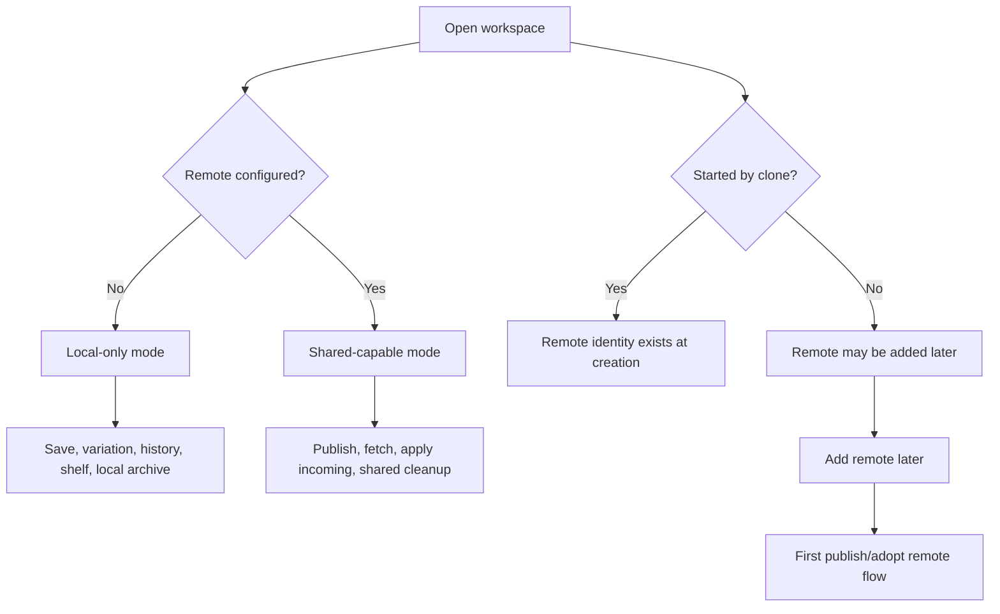
```mermaid
flowchart TD
    A[Open workspace] --> B{Remote configured?}
    B -- No --> C[Local-only mode]
    B -- Yes --> D[Shared-capable mode]
    A --> E{Started by clone?}
    E -- Yes --> F[Remote identity exists at creation]
    E -- No --> G[Remote may be added later]

    C --> H[Save, variation, history, shelf, local archive]
    D --> I[Publish, fetch, apply incoming, shared cleanup]
    G --> J[Add remote later]
    J --> K[First publish/adopt remote flow]
```

| Question | Answer |
|---|---|
| Covered today? | Partially covered. |
| Current support | `init` and `open` support local work. `clone_workspace*` starts from a remote. `add_remote` can attach a remote after local work exists. |
| Safety behavior | Local-only work should remain fully usable for save, variation, history, discard, shelve, local cleanup, and local recovery. Shared operations should require an explicit remote and fetch before deciding. |
| Edge cases | A newly added remote may already contain a branch with the same variation name, no matching branch, different history, or support refs that need to be discovered separately. Existing repos can also have multiple remotes; the host may need the user to choose which remote represents shared Draftline work. |
| Gap | Need explicit sharing-mode diagnostics and first-publish/adopt-remote preflight so hosts can explain what will become shared. |

## Flow 1c: add a remote after local work exists

Business goal: "I started locally, and now I want to share or back up this workspace."

Why this flow exists: adding a remote changes the durability and audience of visible variations and eventually recovery support refs. The first publish is a boundary crossing from private/local repository state into shared repository state.

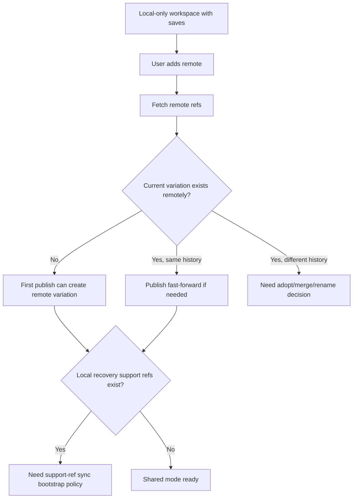
```mermaid
flowchart TD
    A[Local-only workspace with saves] --> B[User adds remote]
    B --> C[Fetch remote refs]
    C --> D{Current variation exists remotely?}
    D -- No --> E[First publish can create remote variation]
    D -- Yes, same history --> F[Publish fast-forward if needed]
    D -- Yes, different history --> G[Need adopt/merge/rename decision]
    E --> H{Local recovery support refs exist?}
    F --> H
    H -- Yes --> I[Need support-ref sync bootstrap policy]
    H -- No --> J[Shared mode ready]
```

| Question | Answer |
|---|---|
| Covered today? | Partially covered. |
| Current support | `add_remote` records or updates the remote. `publish_changes` can create a remote branch when there is no remote version for the current variation. |
| Safety behavior | First publish must fetch before deciding and must not overwrite remote work that happens to use the same variation name. |
| Edge cases | Local archive refs created before the remote was added remain local until support-ref sync exists. If support refs are synced later, they need unique names and create-only pushes just like new shared archives. |
| Gap | Need preflight for first publish, remote name conflicts, support-ref bootstrap, and explicit product copy for "this local work will become shared." |

## Flow 1d: start from a shared remote

Business goal: "Open the shared workspace that already exists."

Why this flow exists: clone starts with remote identity and remote-tracking state, so the app can make collaboration promises earlier than a local-only workspace. But clone should still not imply that every teammate variation or hidden support ref has been discovered.

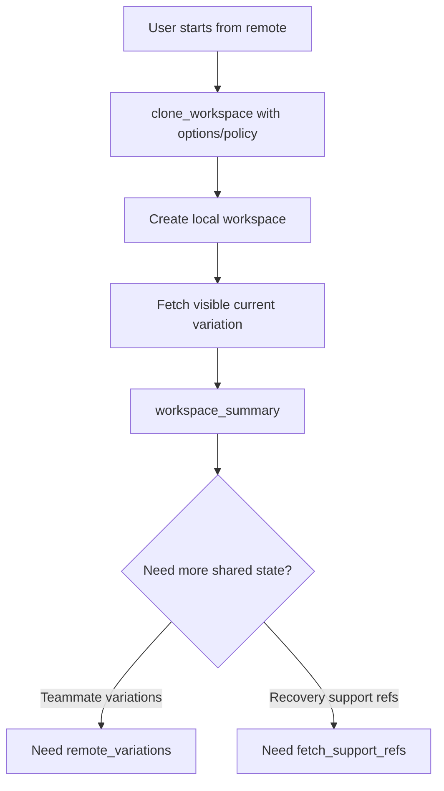
```mermaid
flowchart TD
    A[User starts from remote] --> B[clone_workspace with options/policy]
    B --> C[Create local workspace]
    C --> D[Fetch visible current variation]
    D --> E[workspace_summary]
    E --> F{Need more shared state?}
    F -- Teammate variations --> G[Need remote_variations]
    F -- Recovery support refs --> H[Need fetch_support_refs]
```

| Question | Answer |
|---|---|
| Covered today? | Covered for basic clone/open. |
| Current support | `clone_workspace*` can create a workspace from a remote with host-provided credentials and policy. |
| Safety behavior | Clone is a read/create operation, but follow-up sync should still fetch before making publish/apply decisions. |
| Edge cases | Current remote APIs are current-variation-oriented. Teammate-created variations and support refs may exist remotely without being visible in the normal workspace summary. |
| Gap | Need remote variation discovery and support-ref fetch/list flows after clone. |

## Flow 1e: developer Copilot opens a Draftline-managed repo

Business goal: "A developer Copilot or coding agent is working in this repository; tell it how to operate without breaking Draftline's model."

Why this flow exists: a managed Draftline workspace is still a Git repository, so a developer Copilot can inspect and modify files, run tests, and use Git tools directly. That should be supported, but the repo needs clear agent-facing instructions about which direct Git actions are safe, which should go through Draftline primitives, and which namespaces are Draftline-owned.

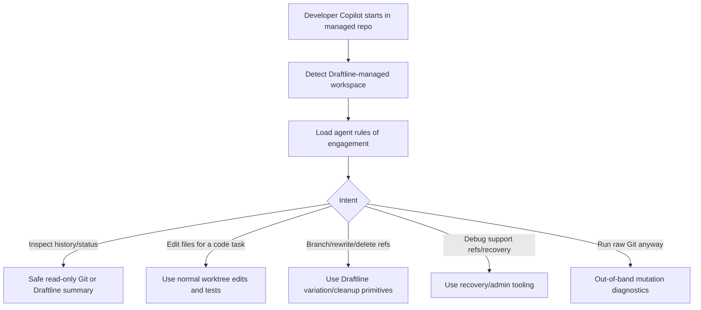
```mermaid
flowchart TD
    A[Developer Copilot starts in managed repo] --> B[Detect Draftline-managed workspace]
    B --> C[Load agent rules of engagement]
    C --> D{Intent}
    D -- Inspect history/status --> E[Safe read-only Git or Draftline summary]
    D -- Edit files for a code task --> F[Use normal worktree edits and tests]
    D -- Branch/rewrite/delete refs --> G[Use Draftline variation/cleanup primitives]
    D -- Debug support refs/recovery --> H[Use recovery/admin tooling]
    D -- Run raw Git anyway --> I[Out-of-band mutation diagnostics]
```

| Question | Answer |
|---|---|
| Covered today? | Not covered as a first-class scenario. |
| Current support | The repository remains a normal Git repo, and Draftline can surface some unusual states through `workspace_summary`, `NoCurrentVariation`, recovery state, and Git errors. |
| Safety behavior | Agent instructions should distinguish safe worktree actions from Draftline-owned state. Reading history/status, editing source files, and running tests are fine; deleting, rewriting, renaming, or force-updating visible refs or `refs/draftline/...` should use Draftline primitives or admin tooling. |
| Edge cases | A coding agent may run `git checkout`, `git reset`, `git clean`, `git stash`, `git branch -D`, force-push, edit `.gitignore`/attributes, delete support refs, clear operation locks, or resolve conflicts outside Draftline. Those actions can bypass content policy, recovery state, support-ref retention, and user-facing variation metadata. |
| Gap | Need generated or surfaced agent instructions, such as a repository instruction file or helper output, plus a diagnostic helper that explains current safety posture, Draftline-owned namespaces, safe direct Git commands, and when Draftline must repair or re-adopt the repo. |

Implementation shape:

| Artifact | Purpose |
|---|---|
| `AGENTS.md` | Generic, tool-neutral instructions for coding agents and developer Copilots operating in the repo. |
| Tool-specific files such as `CLAUDE.md` | Optional adapters for ecosystems that only read a specific instruction file. These should reference or mirror the generic contract, not fork the rules. |
| Draftline helper output | A generated rules-of-engagement summary that can be displayed by the host app or written into agent instruction files. |
| Adoption/setup report | Tells the agent whether the repo is local-only, shared-capable, recovering, locked, or outside normal Draftline assumptions. |

The instruction content should be generated from the same Draftline safety model rather than hand-maintained independently. At minimum it should say: do not rewrite/delete Draftline-owned refs directly, do not remove `refs/draftline/...` unless running a purge/retention flow, do not clear operation locks manually, fetch before reasoning about shared state, avoid destructive Git commands, and use Draftline/admin primitives for recovery, cleanup, support-ref sync, and shared history replacement.

## Flow 1f: agent uses Draftline APIs directly

Business goal: "A developer Copilot or automation agent needs to inspect, fix, or operate the workspace through Draftline instead of raw Git."

Why this flow exists: instructions help an agent avoid unsafe Git commands, but a safer system gives the agent direct, structured Draftline operations for diagnosis, preflight, mutation, verification, and recovery. Agents need machine-readable results, stable error codes, and idempotent operation handles more than human-oriented prose.

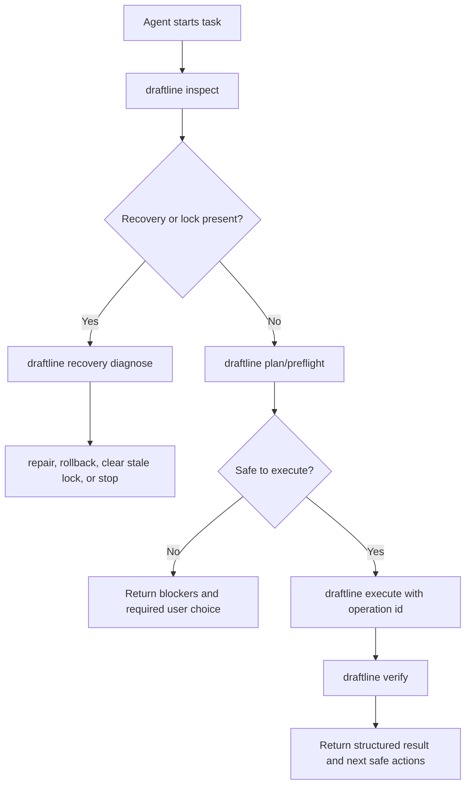
```mermaid
flowchart TD
    A[Agent starts task] --> B[draftline inspect]
    B --> C{Recovery or lock present?}
    C -- Yes --> D[draftline recovery diagnose]
    D --> E[repair, rollback, clear stale lock, or stop]
    C -- No --> F[draftline plan/preflight]
    F --> G{Safe to execute?}
    G -- No --> H[Return blockers and required user choice]
    G -- Yes --> I[draftline execute with operation id]
    I --> J[draftline verify]
    J --> K[Return structured result and next safe actions]
```

| Question | Answer |
|---|---|
| Covered today? | Not covered as an agent-oriented surface. |
| Current support | Draftline has Rust primitives for many operations, but the API is not organized as an agent-facing discover/preflight/execute/verify/repair protocol. |
| Safety behavior | Agent-facing APIs should make safe behavior easier than raw Git: every risky mutation should have a preflight, explicit blockers, an operation ID, recovery metadata, and a verification result. |
| Edge cases | Agents may need to operate without a human watching every step, so APIs must avoid ambiguous success, broad fallbacks, hidden force behavior, and prose-only errors. Long-running or interrupted operations need resumable status and repair paths. |
| Gap | Need a tool/CLI/API facade that exposes Draftline's safety model directly to agents and host automations. |

Recommended API shape:

| API shape | Why agents need it |
|---|---|
| `draftline inspect --json` | One call that returns workspace mode, current variation, dirty state, remotes, recovery state, operation lock state, content-policy diagnostics, support-ref summary, and safe next actions. |
| `draftline capabilities --json` | Lets an agent discover supported primitives and whether advanced operations such as support-ref sync, merge, purge, or stale-lock repair exist. |
| `draftline preflight <operation> --json` | Returns exact blockers, affected files/refs, target-tree collisions, remote expected OIDs, support refs to create, and whether user confirmation is required. |
| `draftline execute <operation> --operation-id <id> --json` | Runs a previously preflighted operation with idempotency, operation-lock integration, and structured success/failure output. |
| `draftline verify <operation-id|workspace> --json` | Confirms the intended postcondition: refs moved as expected, files match target, support refs exist, remote OID matches, recovery state is clear. |
| `draftline recovery diagnose --json` | Gives repairable recovery/lock state without requiring the agent to inspect `.git/draftline` manually. |
| `draftline repair|rollback|clear-stale-lock --json` | Provides explicit recovery actions with preflight and confirmation instead of raw file deletion. |
| `draftline explain-error <code> --json` | Maps stable error codes to safe next actions, user-facing copy, and whether retry is valid. |

Design requirements:

1. Results should be structured JSON with stable codes, not only display strings.
2. Every mutating call should have a dry-run/preflight equivalent.
3. Mutations should accept idempotency keys or operation IDs so retries are safe.
4. Errors should distinguish retryable, requires-user-choice, requires-repair, and unsafe states.
5. APIs should return opaque Draftline IDs, not ask agents to parse branch names or ref paths.
6. Remote operations should expose expected-OID/lease fields explicitly.
7. File-writing operations should expose target-tree collision reports.
8. Recovery actions should be first-class APIs; agents should not delete lock files or recovery files directly.
9. The API should offer both a Rust surface for app integrations and a CLI/tool surface for coding agents.
10. Human approval boundaries should be explicit for destructive, shared, purge, or history-replacement operations.

Agentic software may also want Draftline operations exposed as tools rather than a CLI. The same safety contract should apply:

| Tool | Purpose |
|---|---|
| `draftline.inspect` | Return workspace summary, sharing mode, dirty state, recovery/lock state, remotes, policy diagnostics, support-ref state, and safe next actions. |
| `draftline.preflight` | Analyze a proposed operation and return blockers, affected files/refs, required confirmations, target-tree collisions, and remote expected OIDs. |
| `draftline.execute` | Execute a preflighted operation by opaque operation ID or exact preflight token. |
| `draftline.verify` | Check that the workspace/remote/support refs satisfy the expected postcondition. |
| `draftline.recovery` | Diagnose, repair, roll back, or clear stale locks through explicit recovery actions. |
| `draftline.explain` | Convert stable error/result codes into safe next actions for the agent and host UX. |

Tool design rules:

1. Tools should be narrow and typed; avoid a generic "run Git command" escape hatch.
2. Tool calls that mutate state should require a preflight token generated from the current workspace state.
3. Tool results should include `safe_next_actions` so agents can recover without guessing.
4. Tools should distinguish local-only, shared-capable, and shared-remote operations.
5. Tools should encode approval requirements, especially for discard, purge, shared cleanup, history replacement, support-ref deletion, and stale-lock repair.
6. Tools should be usable by MCP-style servers, host-app plugins, and coding-agent sandboxes without giving the agent unrestricted repository control.

## Flow 2: configure what counts as business content

Business goal: "Only save the files that are real user content; leave app/runtime state alone."

Why this flow exists: business users should not accidentally version UI state, credentials, generated files, or private scratch data just because those files live beside their content.

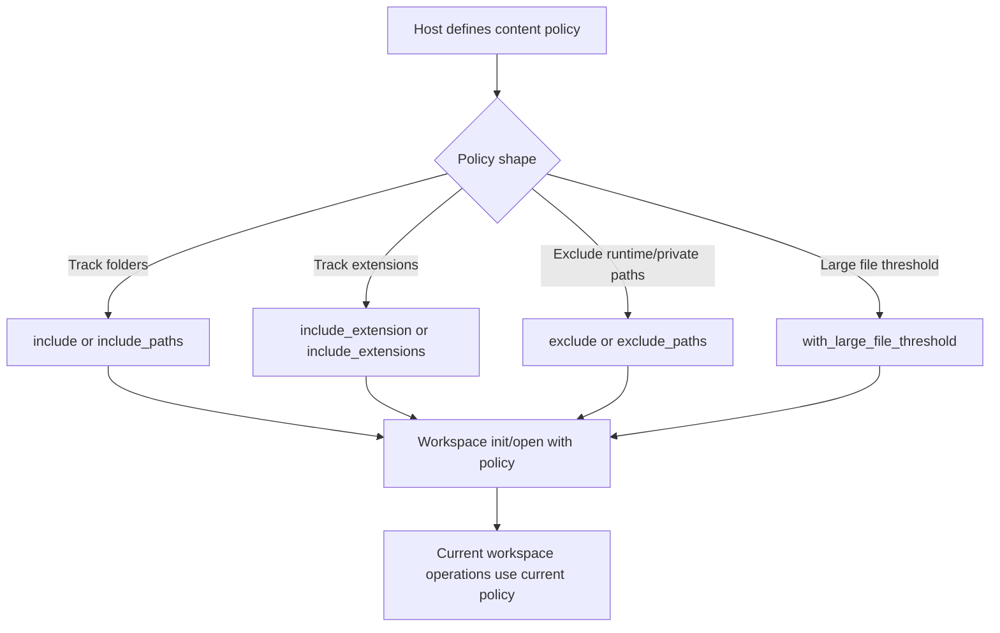
```mermaid
flowchart TD
    A[Host defines content policy] --> B{Policy shape}
    B -- Track folders --> C[include or include_paths]
    B -- Track extensions --> D[include_extension or include_extensions]
    B -- Exclude runtime/private paths --> E[exclude or exclude_paths]
    B -- Large file threshold --> F[with_large_file_threshold]
    C --> G[Workspace init/open with policy]
    D --> G
    E --> G
    F --> G
    G --> H[Current workspace operations use current policy]
```

| Question | Answer |
|---|---|
| Covered today? | Covered. |
| Correct primitive path | Build `ContentPolicy`, then use `init_with_policy`, `open_with_policy`, or clone-with-policy APIs. |
| Safety behavior | `.draftline` is excluded by default. Invalid policy paths/extensions are rejected. |
| Edge cases | The default policy tracks everything except `.draftline`; hosts that need app/runtime/privacy boundaries must provide an explicit policy. Current workspace operations use the current policy, but version-to-version history can still include content saved under earlier policy decisions. Empty policy paths, absolute paths, parent components, invalid extensions, and paths outside policy return explicit errors. Git ignore and attributes rules can still affect what Git reports as changed. |

## Flow 2a: change content policy after work exists

Business goal: "The app changed what counts as business content; make old and new saves line up with that rule."

Why this flow exists: policy changes can create a false sense of safety. Excluding a path today does not remove content that was already saved yesterday.

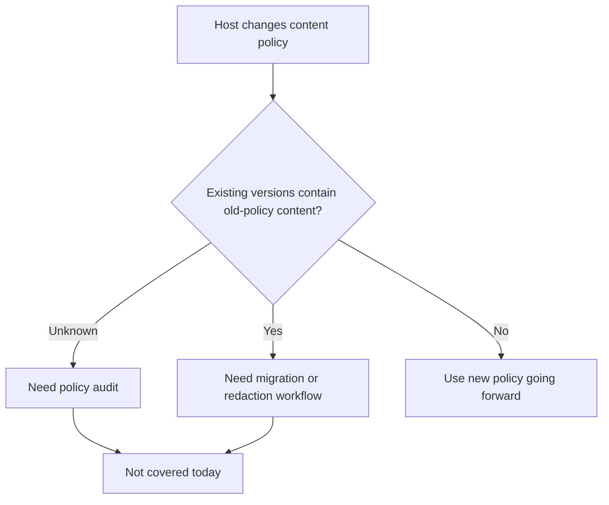
```mermaid
flowchart TD
    A[Host changes content policy] --> B{Existing versions contain old-policy content?}
    B -- Unknown --> C[Need policy audit]
    B -- Yes --> D[Need migration or redaction workflow]
    B -- No --> E[Use new policy going forward]
    C --> F[Not covered today]
    D --> F
```

| Question | Answer |
|---|---|
| Covered today? | Not covered. |
| Current support | `ContentPolicy` is provided when opening/initializing a workspace. It is not persisted as a versioned workspace rule and is not retroactive. |
| Safety behavior | New change detection, discard, and many workspace views use the current runtime policy, but old commits can still contain content saved under an earlier policy. |
| Gap | Need policy audit, migration, and redaction primitives if hosts need to remove or reclassify previously saved content. |

## Flow 2b: content policy conflicts with Git ignore or attributes

Business goal: "The app says this is business content, but Git is configured to ignore or transform it."

Why this flow exists: content policy is the product boundary, but Git ignore and attributes rules can affect status, save, diff, checkout, and normalization. A policy-tracked file that Git ignores can create a false "everything is saved" signal.

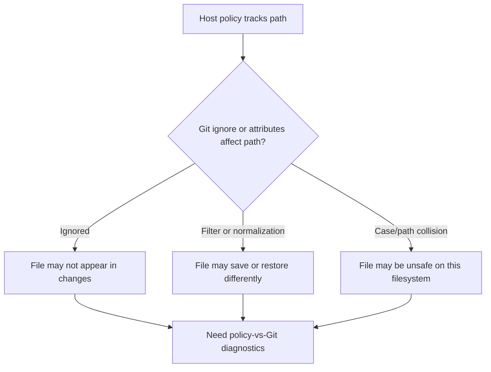
```mermaid
flowchart TD
    A[Host policy tracks path] --> B{Git ignore or attributes affect path?}
    B -- Ignored --> C[File may not appear in changes]
    B -- Filter or normalization --> D[File may save or restore differently]
    B -- Case/path collision --> E[File may be unsafe on this filesystem]
    C --> F[Need policy-vs-Git diagnostics]
    D --> F
    E --> F
```

| Question | Answer |
|---|---|
| Covered today? | Partially covered. |
| Current support | ContentPolicy validates product paths. Git status and checkout behavior still follow repository ignore, attributes, filters, and filesystem rules. |
| Safety behavior | A host should not claim all business content is saved unless policy-tracked-but-ignored files are detected or explicitly accepted. |
| Edge cases | Existing repos may include `.gitignore`, `.gitattributes`, LFS/filter drivers, autocrlf/line-ending rules, symlinks, submodules/gitlinks, case-colliding paths, Unicode-normalization collisions, or filemode-only changes. |
| Gap | Need policy/Git diagnostics in `changes`, adoption preflight, and file-writing preflights so ignored or transformed business content is visible before save, restore, switch, publish, or purge. |

## Flow 3: understand current state

Business goal: "Where am I, what changed, and what choices exist?"

Why this flow exists: users need one coherent dashboard before choosing an action, especially when local edits, remote updates, variations, or recovery state may change what is safe.

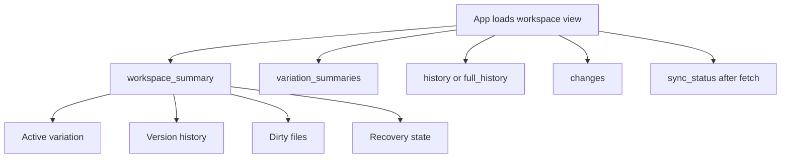
```mermaid
flowchart TD
    A[App loads workspace view] --> B[workspace_summary]
    B --> C[Active variation]
    B --> D[Version history]
    B --> E[Dirty files]
    B --> F[Recovery state]
    A --> G[variation_summaries]
    A --> H[history or full_history]
    A --> I[changes]
    A --> J[sync_status after fetch]
```

| Question | Answer |
|---|---|
| Covered today? | Covered. |
| Correct primitive path | `workspace_summary` for the dashboard, plus `variation_summaries`, `history`, `full_history`, `changes`, and `sync_status` for focused panels. |
| Safety behavior | Summary succeeds even with recovery state; most normal APIs block when recovery is pending. |
| Edge cases | Brand-new workspaces can have empty history. Detached or unborn Git states can surface `NoCurrentVariation`. |

## Flow 4: save business work

Business goal: "I finished a meaningful draft and want to save it."

Why this flow exists: a saved version is the durable, user-facing checkpoint that makes later review, restore, publish, and branching understandable.

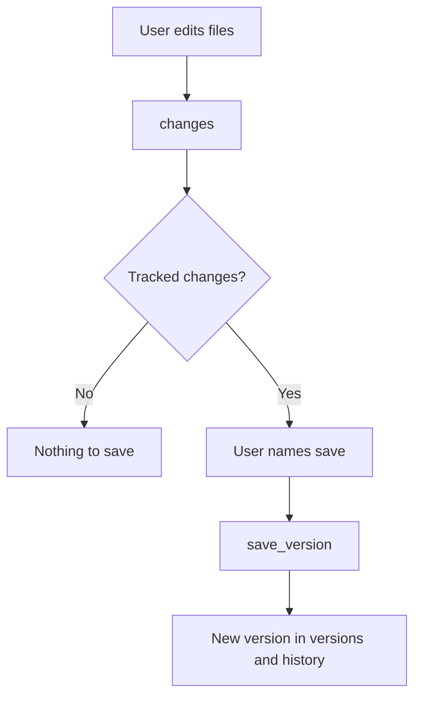
```mermaid
flowchart TD
    A[User edits files] --> B[changes]
    B --> C{Tracked changes?}
    C -- No --> D[Nothing to save]
    C -- Yes --> E[User names save]
    E --> F[save_version]
    F --> G[New version in versions and history]
```

| Question | Answer |
|---|---|
| Covered today? | Covered. |
| Correct primitive path | `changes` -> `save_version(label)`. |
| Safety behavior | Currently content-policy-tracked dirty files are staged for the save. Deleted tracked files are removed from the index. |
| Edge cases | This assumes the host is using a stable policy; changing policy after files were saved is not a redaction. Binary and large files are detected for preflight/reporting. Saving with no changes may still create an equivalent tree commit; host UX can decide whether to hide "save" when `changes().is_empty()`. |

## Flow 4a: save or shelve selected work

Business goal: "Save this ready piece, but keep my other edits unfinished."

Why this flow exists: business users often have mixed work in progress. All-or-nothing save and all-or-nothing shelve force users to either over-save unfinished work or manually move files around.

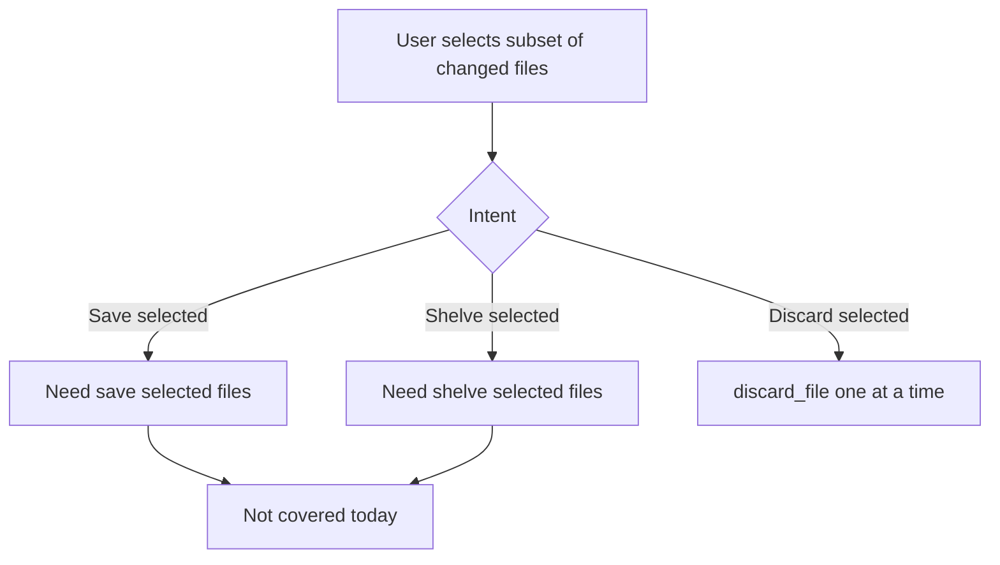
```mermaid
flowchart TD
    A[User selects subset of changed files] --> B{Intent}
    B -- Save selected --> C[Need save selected files]
    B -- Shelve selected --> D[Need shelve selected files]
    B -- Discard selected --> E[discard_file one at a time]
    C --> F[Not covered today]
    D --> F
```

| Question | Answer |
|---|---|
| Covered today? | Not covered for save/shelve; covered for one-file discard. |
| Current support | `save_version` saves all tracked dirty files. `SwitchPolicy::Shelve` shelves all tracked dirty files. `discard_file` supports one selected file. |
| Safety behavior | Current all-or-nothing behavior is simple and predictable, but not granular. Shelves should be local-only by default because they may contain personal unfinished work. |
| Gap | Need `preflight_save_files`, `save_files`, `shelve_files`, possibly batch `discard_files`, plus an explicit policy if shelved work can ever be shared. |

## Flow 5: abandon unsaved edits

Business goal: "I do not want these local edits anymore."

Why this flow exists: discarding can destroy local work, so it must be an explicit, scoped, policy-aware action rather than an accidental side effect of switching, publishing, or applying updates.

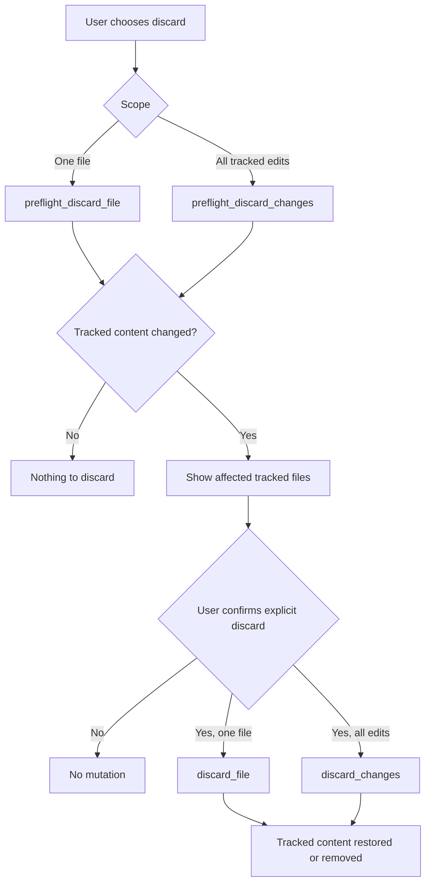
```mermaid
flowchart TD
    A[User chooses discard] --> B{Scope}
    B -- One file --> C[preflight_discard_file]
    B -- All tracked edits --> D[preflight_discard_changes]
    C --> E{Tracked content changed?}
    D --> E
    E -- No --> F[Nothing to discard]
    E -- Yes --> G[Show affected tracked files]
    G --> H{User confirms explicit discard}
    H -- No --> I[No mutation]
    H -- Yes, one file --> J[discard_file]
    H -- Yes, all edits --> K[discard_changes]
    J --> L[Tracked content restored or removed]
    K --> L
```

| Question | Answer |
|---|---|
| Covered today? | Covered. |
| Correct primitive path | `preflight_discard_file` -> `discard_file`, or `preflight_discard_changes` -> `discard_changes`. |
| Safety behavior | Discard is explicit and policy-aware. Excluded runtime files are preserved, and path-based discard rejects files outside tracked content. |
| Edge cases | Added tracked files are removed. Modified/deleted/renamed/type-changed/conflicted tracked files are restored from `HEAD`. If a requested file is unchanged, `discard_file` returns `None`. |

## Flow 6: try another direction

Business goal: "Let's try a different approach without losing the current one."

Why this flow exists: alternate directions are core creative workflow; they need stable names and history without exposing users to detached HEAD or raw branch mechanics.

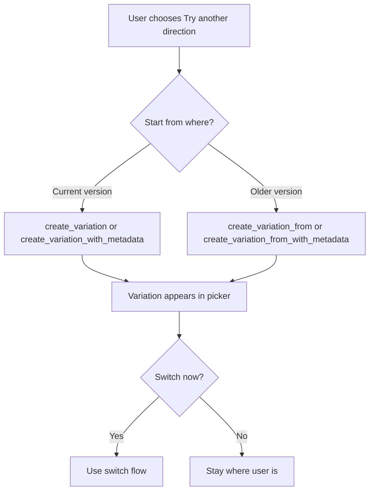
```mermaid
flowchart TD
    A[User chooses Try another direction] --> B{Start from where?}
    B -- Current version --> C[create_variation or create_variation_with_metadata]
    B -- Older version --> D[create_variation_from or create_variation_from_with_metadata]
    C --> E[Variation appears in picker]
    D --> E
    E --> F{Switch now?}
    F -- Yes --> G[Use switch flow]
    F -- No --> H[Stay where user is]
```

| Question | Answer |
|---|---|
| Covered today? | Covered. |
| Correct primitive path | `create_variation*` or `create_variation_from*`; optionally `set_variation_metadata`. |
| Safety behavior | Creating a variation does not require checking it out. Display metadata does not rename Git refs. |
| Edge cases | Invalid variation names are rejected. Duplicate branch names fail through Git. Creating from an unknown version returns `VersionNotFound`. |

## Flow 6a: rename or relabel a direction

Business goal: "Change how this option appears to users."

Why this flow exists: product labels, URLs, and routing metadata should be editable without rewriting the underlying branch/ref identity.

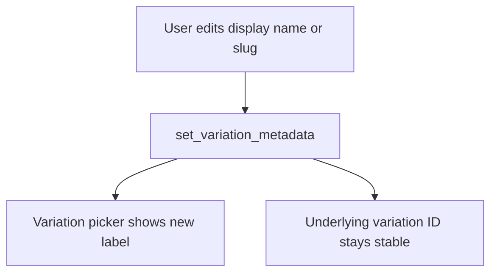
```mermaid
flowchart TD
    A[User edits display name or slug] --> B[set_variation_metadata]
    B --> C[Variation picker shows new label]
    B --> D[Underlying variation ID stays stable]
```

| Question | Answer |
|---|---|
| Covered today? | Covered for display metadata. |
| Correct primitive path | `set_variation_metadata`, `variation_metadata`, `Variation::display_label`. |
| Safety behavior | Metadata changes do not rename Git refs, so stored variation IDs continue to round-trip. |
| Gap | True ref rename is intentionally not exposed; if needed later, it should be separate from display metadata and should archive the old ref name. |

## Flow 7: move between directions

Business goal: "I want to switch options, but I may have unsaved work."

Why this flow exists: switching writes workspace files, so Draftline must force a clear decision for unsaved work before changing what the user sees on disk.

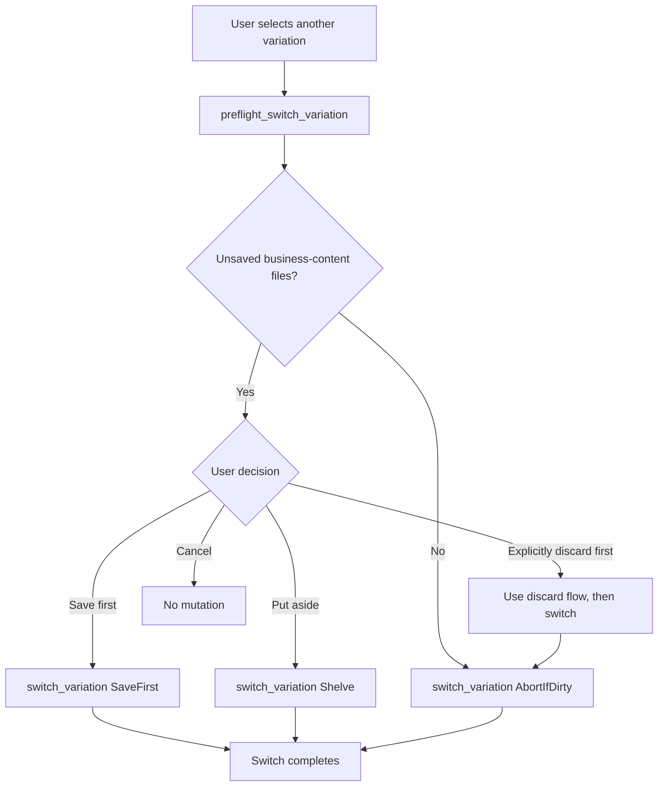
```mermaid
flowchart TD
    A[User selects another variation] --> B[preflight_switch_variation]
    B --> C{Unsaved business-content files?}
    C -- No --> D[switch_variation AbortIfDirty]
    C -- Yes --> E{User decision}
    E -- Save first --> F[switch_variation SaveFirst]
    E -- Put aside --> G[switch_variation Shelve]
    E -- Explicitly discard first --> H[Use discard flow, then switch]
    E -- Cancel --> I[No mutation]
    F --> J[Switch completes]
    G --> J
    H --> D
    D --> J
```

| Question | Answer |
|---|---|
| Covered today? | Covered for safe switching; partially covered for the full shelve lifecycle. |
| Correct primitive path | `preflight_switch_variation` -> `switch_variation` with `AbortIfDirty`, `SaveFirst`, or `Shelve`. |
| Safety behavior | `SwitchPolicy::Discard` remains unsupported. Dirty work must be saved, shelved, or explicitly discarded before checkout. Unsaved business-content files include modified tracked files and untracked files that match the current content policy. |
| Edge cases | `SaveFirst` should not be used with unresolved conflicts because it can commit conflict-marker content as the saved state. Switching writes recovery metadata and uses an operation lock. If checkout is interrupted, normal APIs block until recovery is addressed. Switching must also preflight target-tree collisions with untracked, ignored, or current-policy-excluded files before checkout. |

## Flow 8: review older work

Business goal: "Show me what changed or what an older version looked like."

Why this flow exists: history review should support confidence and decision-making without mutating the live workspace.

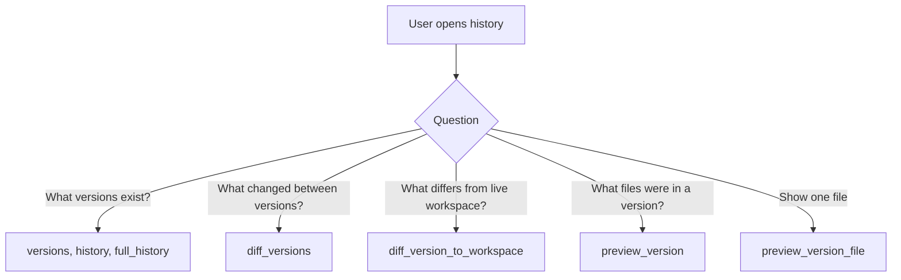
```mermaid
flowchart TD
    A[User opens history] --> B{Question}
    B -- What versions exist? --> C[versions, history, full_history]
    B -- What changed between versions? --> D[diff_versions]
    B -- What differs from live workspace? --> E[diff_version_to_workspace]
    B -- What files were in a version? --> F[preview_version]
    B -- Show one file --> G[preview_version_file]
```

| Question | Answer |
|---|---|
| Covered today? | Covered. |
| Correct primitive path | `versions`, `history`, `full_history`, `diff_versions`, `diff_version_to_workspace`, `preview_version`, `preview_version_file`. |
| Safety behavior | Preview and diff are read-only. Content policy filters preview and version-to-workspace diff file results; version-to-version diffs compare historical trees and are not policy-redaction tools. |
| Edge cases | Missing or excluded preview files return `None`. Binary preview content returns `content: None` with `is_binary: true`. Invalid version IDs return `VersionNotFound`. |

## Flow 9: restore older work

Business goal: "Bring back that older version, but do not erase history."

Why this flow exists: users often need to recover prior content, but a destructive reset would hide what happened and could erase newer work from the visible timeline.

```mermaid
flowchart TD
    A[User selects older version] --> B{Preview first?}
    B -- Yes --> C[preview_version or diff_versions]
    B -- No --> D[restore_version_as_new_save]
    C --> D
    D --> E[New version on current variation]
    E --> F[Workspace files match restored tree]
```

| Question | Answer |
|---|---|
| Covered today? | Partially covered. |
| Correct primitive path | `restore_version_as_new_save(version, label)`. |
| Safety behavior | Restore creates a new save on the current variation and does not reset or delete older versions. It must also respect the current content boundary when deciding which historical files are safe to materialize. |
| Edge cases | Dirty work blocks restore through preflight. Unknown version IDs return `VersionNotFound`. Interrupted restore is recorded in recovery metadata. Old versions may contain files that are now excluded by the current policy, and checkout can collide with untracked, ignored, generated, or policy-excluded local files. |
| Gap | Need restore preflight that reports exact historical-tree restore vs current-policy-filtered restore, old-policy content, and target-tree file collisions before writing workspace files. |

## Flow 9a: target tree collides with local non-versioned files

Business goal: "Do not overwrite local files just because they are not currently tracked by Draftline."

Why this flow exists: switching, restore, apply incoming, merge, and checkout-like operations write a target tree into the workspace. A clean content-policy status is not enough if the target tree would overwrite untracked, ignored, generated, or current-policy-excluded files.

```mermaid
flowchart TD
    A[File-writing operation has target tree] --> B[Scan all workspace paths]
    B --> C{Target path collides with local file?}
    C -- No --> D[Continue operation]
    C -- Yes --> E{File is tracked business content?}
    E -- Yes --> F[Use normal dirty-work preflight]
    E -- No --> G[Block or ask user to move/backup file]
```

| Question | Answer |
|---|---|
| Covered today? | Not covered as a complete scenario. |
| Current support | Some operations block on dirty tracked work, but the scenario contract needs all target-tree writes to check collisions beyond tracked dirty files. |
| Safety behavior | No operation should overwrite a local file merely because it is untracked, ignored, generated, or excluded by the current policy. |
| Edge cases | Case-insensitive filesystems, Unicode-normalization differences, symlinks, submodules, generated files, and old-policy paths can make collisions non-obvious. |
| Gap | Need shared target-tree collision preflight used by switch, restore, apply incoming, merge incoming, and any future checkout-like primitive. |

## Flow 10: publish my work to the team

Business goal: "Share my saved work with everyone else."

Why this flow exists: publishing is a collaborative operation; Draftline must verify the remote did not change before pushing so teammate work is not overwritten.

```mermaid
sequenceDiagram
    participant User
    participant App
    participant Draftline
    participant Remote

    User->>App: Publish
    App->>Draftline: changes
    alt unsaved changes exist
        App-->>User: Save or discard before publishing
    else workspace clean
        App->>Draftline: publish_changes
        Draftline->>Remote: fetch latest remote state
        alt remote has incoming or diverged work
            Draftline-->>App: SyncNeedsMerge
            App-->>User: Review teammate updates first
        else safe to publish
            Draftline->>Remote: push current variation
            Draftline-->>App: PublishResult
        end
    end
```

| Question | Answer |
|---|---|
| Covered today? | Partially covered. |
| Correct primitive path | `changes` -> `publish_changes` or `publish_changes_with_options`. |
| Safety behavior | `publish_changes` fetches first, checks `sync_status`, and refuses incoming or diverged remote state. Draftline does not force-push. Safe shared publishing should also bind the push to the expected remote OID or expected absence of the remote ref. |
| Edge cases | The library enforces a clean workspace before publish even though push itself does not write local files. `NoRemoteVersion` publishes the current variation as a new remote branch. Authentication is supplied by the host through `RemoteOptions`. `SyncNeedsMerge` can wrap either `IncomingAvailable` or `NeedsMerge`; hosts must inspect `SyncStatus.state` before deciding whether to apply incoming work or start merge. A remote branch can be deleted, recreated, or rewound after fetch but before push; first publish should be create-only. |
| Gap | Need explicit expected-OID/lease semantics and result types for remote branch disappeared, branch recreated, first-publish race, and remote rewind between fetch and push. |

## Flow 11: receive teammate updates

Business goal: "Bring in the latest work from the team."

Why this flow exists: applying remote work changes local files and refs, so it is safe only when the workspace is clean and the local variation can fast-forward.

```mermaid
flowchart TD
    A[User selects Get updates] --> B[fetch_remote]
    B --> C[preflight_apply_incoming]
    C --> D{Workspace clean?}
    D -- No --> E[Ask user to save, discard, or shelve]
    D -- Yes --> F{Remote state}
    F -- Incoming available and fast-forward --> G[apply_incoming]
    F -- Up to date --> H[Nothing to apply]
    F -- Local ahead --> I[Nothing incoming]
    F -- No remote version --> J[Nothing incoming]
    F -- Needs merge --> K[Conflict resolution flow needed]
```

| Question | Answer |
|---|---|
| Covered today? | Covered for fast-forward updates. |
| Correct primitive path | `fetch_remote` -> `preflight_apply_incoming` -> `apply_incoming`. |
| Safety behavior | Dirty work blocks apply. Diverged history returns `SyncNeedsMerge` instead of overwriting. Fast-forward ref updates roll back if checkout fails. Apply must also avoid target-tree collisions with untracked, ignored, generated, or policy-excluded files. |
| Edge cases | `preflight_apply_incoming` uses cached remote-tracking state; fetch before preflight for accurate reporting. `apply_incoming` fetches again before applying, so a clean preflight can still fail if the remote changed between preflight and apply. `UpToDate`, `LocalAhead`, and `NoRemoteVersion` return `applied_count: 0`. A remote branch can disappear or be recreated between fetch and apply. |

## Flow 11a: discover teammate-created directions

Business goal: "My teammate published a new option; I want to see and adopt it."

Why this flow exists: collaboration is not only updates to the current variation. Teammates can create new directions that should appear in a product variation picker.

```mermaid
flowchart TD
    A[Teammate publishes new variation] --> B[Local user fetches current variation]
    B --> C{New remote variation visible?}
    C -- No --> D[Not covered today]
    D --> E[Need remote variation listing]
    E --> F[Need adopt/import variation]
```

| Question | Answer |
|---|---|
| Covered today? | Not covered. |
| Current support | `fetch_remote` and `sync_status` operate on the current variation. `switch_variation` only switches to local variations. |
| Safety behavior | Current APIs avoid surprising local branch creation, but they also hide teammate-created branches. |
| Gap | Need `remote_variations`, `fetch_all_variations`, and `adopt_remote_variation` or equivalent. |

## Flow 11b: remote variation was deleted or renamed

Business goal: "A shared option disappeared or changed remotely; explain what happened."

Why this flow exists: stale remote-tracking refs can make deleted or renamed remote work look like it still exists locally.

```mermaid
flowchart TD
    A[Remote variation deleted or renamed] --> B[fetch_remote]
    B --> C{Stale local remote ref remains?}
    C -- Yes --> D[Need prune/stale diagnostic]
    C -- No --> E[Need product message]
```

| Question | Answer |
|---|---|
| Covered today? | Not covered as a business scenario. |
| Current support | Missing remote refs can be ignored during fetch; current APIs do not expose remote variation lifecycle diagnostics. |
| Safety behavior | Draftline does not delete local variations automatically. |
| Gap | Need prune semantics, stale-ref diagnostics, and user-facing "remote option removed" guidance. |

## Flow 11c: change or remove remote destination

Business goal: "Publish this workspace somewhere else, or stop publishing to this place."

Why this flow exists: changing a remote URL changes where business content is shared and backed up. That deserves explicit confirmation.

```mermaid
flowchart TD
    A[User edits sharing destination] --> B{Remote exists?}
    B -- No --> C[add_remote]
    B -- Yes --> D[add_remote updates URL]
    D --> E[Need confirmation/preflight]
    A --> F[Remove remote]
    F --> G[Not covered today]
```

| Question | Answer |
|---|---|
| Covered today? | Partially covered. |
| Current support | `add_remote` creates a remote or updates the URL of an existing one. `remotes` lists configured endpoints. |
| Safety behavior | Draftline does not push until `publish_changes`, but updating an existing remote URL is currently silent. |
| Gap | Need remote update preflight/confirmation and remove-remote APIs. |

## Flow 12: reconcile teammate changes

Business goal: "My teammate and I both saved changes. Help us reconcile them."

Why this flow exists: divergence is normal collaboration, but resolving it requires user-understandable content conflicts rather than hidden Git merge behavior.

```mermaid
flowchart TD
    A[User tries publish or apply] --> B[fetch_remote]
    B --> C[sync_status]
    C --> D{NeedsMerge?}
    D -- No --> E[Use publish or apply flow]
    D -- Yes --> F[Show incoming and local versions]
    F --> G[Run semantic merge preview]
    G --> H{Conflicts?}
    H -- No --> I[Create merged save]
    H -- Yes --> J[Business-readable conflict UI]
    J --> K[User chooses, edits, or combines]
    K --> I
```

| Question | Answer |
|---|---|
| Covered today? | Partially covered. |
| Current support | `sync_status` detects `NeedsMerge`; `SyncNeedsMerge` prevents unsafe publish/apply; `MergeOutcome`, `MergeConflict`, `ResolverRegistry`, `PlainTextResolver`, and `MarkdownResolver` model conflict results. |
| Safety behavior | Draftline blocks overwrite and routes the user into an explicit merge decision. |
| Gap | Need public primitives such as `preflight_merge_incoming` and `merge_incoming` that compute merge base, enumerate tree-level conflicts, handle binary/large-file conflicts, and create a safe merged version after conflicts are resolved. Because merge writes files and moves refs, it must use the operation lock, write recovery state, and reuse target-tree collision checks. |

## Flow 12a: apply shelved work

Business goal: "Bring my put-aside work back into the current workspace."

Why this flow exists: applying a shelf is not always a simple file copy. The workspace may have moved forward since the shelf was created, so applying shelved work can conflict with current files just like teammate changes can.

```mermaid
flowchart TD
    A[User chooses shelf] --> B[preview_shelf]
    B --> C[preflight_apply_shelf]
    C --> D{Conflicts or collisions?}
    D -- No --> E[apply_shelf]
    D -- Yes --> F[Use semantic conflict UI]
    F --> G[Create resolved save or keep shelf]
```

| Question | Answer |
|---|---|
| Covered today? | Not covered. |
| Current support | Shelf refs can be created internally by switch-with-shelve, but there are no public list, preview, apply, delete, or shelve-in-place APIs. |
| Safety behavior | Shelf application should be treated as a merge-like file-writing operation, not as a guaranteed safe pop. It should preserve the shelf until the apply succeeds or the user explicitly deletes it. |
| Edge cases | Shelf names must be unique/create-only. Applying a shelf can conflict with current tracked work or collide with untracked/ignored/excluded files. Re-shelving with the same name should produce a business-shaped collision result, not a raw Git failure after partial mutation. |
| Gap | Need `shelve_changes`, `list_shelves`, `preview_shelf`, `preflight_apply_shelf`, `apply_shelf`, and `delete_shelf`, plus conflict and naming contracts. |

## Flow 13: remove or clean up work

Business goal: "Hide old options and simplify the history without losing the ability to recover."

Why this flow exists: cleanup should reduce clutter while preserving a recoverable support ref to the old state before any visible ref is deleted or rewritten.

```mermaid
flowchart TD
    A[User chooses cleanup] --> B{Cleanup type}
    B -- Delete variation --> C[Read variation tip]
    C --> D[Archive under refs/draftline/deleted-variations]
    D --> E[Delete variation branch]

    B -- Squash recent versions --> F[Validate count and clean workspace]
    F --> G[Read current branch tip]
    G --> H[Archive under refs/draftline/rewrites/squash]
    H --> I[Move branch to squash commit]

    E --> J[Recovery possible from hidden support ref]
    I --> J
```

| Question | Answer |
|---|---|
| Covered today? | Partially covered. |
| Current support | `delete_variation` and `squash_versions` preserve old tips under local `refs/draftline/...` refs before destructive ref movement. |
| Safety behavior | The old commit remains named by a Draftline support ref locally, so it is not left only to reflog or garbage-collection timing on that machine. Cross-machine recovery still requires support-ref sync. |
| Edge cases | Deleting the current variation is rejected. Squash rejects dirty work, `count < 2`, and ranges without a parent outside the squash range. Squashing a published variation rewrites history, so normal `publish_changes` will reject it as diverged because Draftline does not force-push. |
| Gap | Need preflight APIs that explain what will be archived, support-ref sync to the shared remote, restore APIs that turn an archive ref back into a visible variation, and an explicit replace-remote-history workflow for shared squash. |

## Flow 13a: remove or rewrite shared work

Business goal: "Remove an old option or clean up history for everyone, not just on my machine."

Why this flow exists: local archive-before-delete is not enough for collaboration. If the visible variation was already published, Draftline must make the recovery point durable in the shared remote before deleting or replacing the shared visible ref.

```mermaid
flowchart TD
    A[User requests shared cleanup] --> B[Fetch visible refs and support refs]
    B --> C{Remote visible tip matches expected tip?}
    C -- No --> D[Stop and show teammate changed it]
    C -- Yes --> E[Create unique immutable support ref]
    E --> F[Publish support ref with create-only semantics]
    F --> G{Support ref durably published?}
    G -- No --> H[Stop; keep shared visible ref unchanged]
    G -- Yes --> I{Cleanup type}
    I -- Delete shared variation --> J[Delete remote visible ref with expected-OID lease]
    I -- Replace shared history --> K[Push replacement visible ref with force-with-lease]
    J --> L[Fetch/prune and report result]
    K --> L
```

| Question | Answer |
|---|---|
| Covered today? | Not covered. |
| Current support | `delete_variation` and `squash_versions` only operate on local refs and local archive refs. `publish_changes` refuses non-fast-forward history replacement. |
| Safety behavior | Shared cleanup must be archive-first, support-ref-publish-first, and visible-ref-delete-or-replace-last. The visible remote ref must only move if the old remote OID still matches the user's preflight. |
| Edge cases | Support-ref push can succeed while visible cleanup fails; that is safe but leaves an extra recovery point. Visible shared cleanup must not happen if support-ref publication fails. The user can still perform local-only cleanup, but not remote delete/replace, when shared recovery is unavailable. |
| Gap | Need `preflight_delete_remote_variation`, `delete_remote_variation`, `preflight_replace_remote_history`, and `replace_remote_history` or equivalent, with expected-OID/lease semantics and teammate-facing product copy. |

## Flow 13b: sync hidden recovery support refs

Business goal: "Make recovery points for shared work available from another machine without showing them as normal variations."

Why this flow exists: the shared remote represents shared work. Support refs should travel with that shared work so cleanup recovery does not depend on a specific machine, while still staying out of normal business views.

```mermaid
flowchart TD
    A[Draftline creates refs/draftline support ref] --> B[Publish support refs to shared remote]
    B --> C[Another machine fetches support refs]
    C --> D[Recovery/admin view lists support refs]
    D --> E[Restore selected support ref as visible variation]
```

| Question | Answer |
|---|---|
| Covered today? | Not covered. |
| Current support | Delete and squash create local support refs under `refs/draftline/...`. Publish/fetch currently use visible variation refs, not support refs. |
| Safety behavior | Recovery support refs are hidden from normal views but are part of the shared repository trust boundary once synced. They are not privacy or access-control boundaries. |
| Edge cases | Remote support refs must be uniquely named, append-only, and fetched without overwriting unsynced local support refs. Hosts must surface remotes that reject `refs/draftline/...` pushes. |
| Gap | Need `publish_support_refs`, `fetch_support_refs`, `list_archived_refs`, and `restore_archived_ref_as_variation` or equivalent. |

## Flow 13c: recover cleanup after clone or device loss

Business goal: "I deleted or squashed something on one machine and need it back elsewhere."

Why this flow exists: if support refs sync to the shared remote, recovery of shared work can follow the user across machines without adding a separate backup remote.

```mermaid
flowchart TD
    A[Fresh clone or second machine] --> B[fetch_support_refs]
    B --> C{Support ref exists?}
    C -- Yes --> D[list_archived_refs]
    D --> E[restore_archived_ref_as_variation]
    E --> F[Publish restored visible variation if desired]
    C -- No --> G[No shared recovery point available]
```

| Question | Answer |
|---|---|
| Covered today? | Not covered. |
| Current support | Local archive refs may exist on the machine where cleanup happened. They are not pushed/fetched today. |
| Safety behavior | The intended model is shared hidden support refs: recoverability travels with the shared remote, while normal views remain uncluttered. |
| Edge cases | Restoring an archived ref must create a new visible variation by default, require a non-conflicting name, fetch before publish, and never overwrite an existing local or remote variation without a separate explicit replace workflow. |
| Gap | Needs support-ref sync and archive restore APIs. |

## Flow 13d: permanently purge or redact content

Business goal: "I accidentally saved sensitive content; remove it permanently."

Why this flow exists: archive-first safety intentionally retains old content. If support refs are synced to the shared remote, purge/redaction must include every reachable ref namespace and clear limits about distributed clones.

```mermaid
flowchart TD
    A[User requests permanent removal] --> B{Normal cleanup?}
    B -- Delete or squash --> C[Content retained in archive refs]
    B -- True purge/redaction --> D[Not covered today]
    D --> E[Need explicit destructive workflow]
```

| Question | Answer |
|---|---|
| Covered today? | Not covered. |
| Current support | Cleanup preserves old tips by design. Planned support-ref sync would also preserve those tips on the shared remote. |
| Safety behavior | Draftline currently optimizes for recoverability, not permanent deletion. Purge must be a destructive, admin-permissioned, best-effort workflow over controlled remotes; Git cannot guarantee removal from existing clones, forks, backups, logs, caches, or offline devices that already fetched the objects. |
| Gap | Need an explicit purge/redaction model with confirmations, enumeration of visible refs, support refs, tags, notes, replace refs, stash refs, remote-tracking refs, reflogs, alternates, hosting caches, object reachability checks, remote GC coordination, post-purge verification, audit trail, and user copy that does not over-promise deletion from distributed copies. |

## Flow 13e: expire old support refs

Business goal: "Clean up old recovery points without pretending it is a sensitive-data purge."

Why this flow exists: shared support refs improve recovery but can grow indefinitely. Retention cleanup is a normal repository maintenance scenario, distinct from purge/redaction.

```mermaid
flowchart TD
    A[Admin opens support-ref retention view] --> B[List candidate support refs]
    B --> C[Show source operation, old tip, age, and restore impact]
    C --> D{Confirm expiration?}
    D -- No --> E[Keep support refs]
    D -- Yes --> F[Delete selected support refs]
    F --> G[Explain object GC and clone limitations]
```

| Question | Answer |
|---|---|
| Covered today? | Not covered. |
| Current support | No support-ref listing or deletion APIs. |
| Safety behavior | Retention cleanup may remove convenient recovery pointers but should not be framed as sensitive-content deletion. |
| Gap | Need `list_support_refs`, `preflight_expire_support_refs`, and `expire_support_refs` with permissions, audit, and remote GC guidance. |

## Flow 13f: large or binary business assets

Business goal: "Save and share images, videos, PDFs, or other heavy assets safely."

Why this flow exists: creative/business content often includes binary assets, but Git history can grow quickly and text merge/diff tools do not apply.

```mermaid
flowchart TD
    A[User adds asset] --> B[changed_files]
    B --> C{Binary or large?}
    C -- No --> D[Normal save/publish]
    C -- Yes --> E[Report binary_files or large_files]
    E --> F{Host policy}
    F -- Warn --> D
    F -- Block --> G[Ask user to externalize]
    F -- External storage --> H[Not covered today]
```

| Question | Answer |
|---|---|
| Covered today? | Partially covered. |
| Current support | Draftline detects binary and large current workspace files in change/preflight reports. Historical diffs do not preserve meaningful `is_large` data. |
| Safety behavior | Detection gives hosts a chance to warn or block, but Draftline does not enforce asset policy by itself. |
| Gap | Need a product policy for block/warn/stream/external storage/LFS-like behavior. |

## Flow 14: recover from interruption or unusual state

Business goal: "Something was interrupted or the workspace looks wrong. Help me get back safely."

Why this flow exists: interrupted ref-moving or file-writing operations can leave history, refs, and files temporarily inconsistent; the app should surface that state instead of continuing as if everything is normal.

```mermaid
flowchart TD
    A[App loads workspace] --> B[workspace_summary]
    B --> C{recovery present?}
    C -- No --> D[Normal workspace UI]
    C -- Yes --> E[Recovery prompt]
    E --> F{Operation type}
    F -- Switch variation --> G[Explain interrupted switch]
    F -- Restore version --> H[Explain interrupted restore]
    F -- Shelve changes --> I[Explain interrupted shelf]
    F -- Apply incoming --> J[Explain interrupted update]
    F -- Discard --> K[Explain interrupted discard]
    F -- Delete or squash --> L[Explain archived ref]
    G --> M[Acknowledge, repair, or rollback]
    H --> M
    I --> M
    J --> M
    K --> M
    L --> M
```

| Question | Answer |
|---|---|
| Covered today? | Partially covered. |
| Current support | Operation locks prevent concurrent risky operations. `RecoveryState` blocks normal APIs. `workspace_summary` can still surface recovery context. |
| Safety behavior | Draftline avoids pretending the workspace is coherent when an operation may have been interrupted. |
| Edge cases | `acknowledge_recovery` clears metadata but does not repair or roll back the Git state. Hosts should not present acknowledgment as repair; it can unblock normal APIs while refs and files remain inconsistent. Recovery state is single-slot because only one Draftline risky operation should hold the operation lock at a time. |
| Gap | Need operation-specific repair and rollback APIs. |

## Flow 14a: out-of-band Git mutation

Business goal: "Something changed outside the app; explain whether Draftline can continue safely."

Why this flow exists: users or tools may run Git directly, checkout detached commits, rewrite refs, resolve conflicts, or add commits outside Draftline.

```mermaid
flowchart TD
    A[External Git mutation] --> B[workspace_summary or current_variation]
    B --> C{Normal variation?}
    C -- Yes --> D[Continue with current state]
    C -- No --> E[NoCurrentVariation or Git error]
    E --> F[Need structured diagnostic and repair]
```

| Question | Answer |
|---|---|
| Covered today? | Partially covered. |
| Current support | Some states surface through `NoCurrentVariation`, status, or raw Git errors. |
| Safety behavior | Draftline refuses normal variation operations when HEAD is detached or no local variation can be identified. |
| Gap | Need a structured diagnostic report and repair flows for detached HEAD, raw Git branch changes, existing conflicted indexes, and non-Draftline history edits. |

## Flow 14b: stale or abandoned operation lock

Business goal: "The app crashed or was killed; help me unlock the workspace without corrupting it."

Why this flow exists: an operation lock protects against concurrent risky mutations, but a crashed process can leave an abandoned lock behind. Retrying forever is not a recovery strategy.

```mermaid
flowchart TD
    A[Mutating operation returns WorkspaceLocked] --> B{Lock owner still alive?}
    B -- Yes --> C[Wait or show operation in progress]
    B -- No or unknown --> D[Read recovery state and workspace diagnostics]
    D --> E{Safe stale-lock repair?}
    E -- Yes --> F[clear_stale_lock or repair_recovery]
    E -- No --> G[Block and ask for admin/manual intervention]
```

| Question | Answer |
|---|---|
| Covered today? | Not covered. |
| Current support | `WorkspaceLocked` blocks mutating operations. `RecoveryState` may also exist, but acknowledgment does not repair refs/files or clear an abandoned lock. |
| Safety behavior | A host must distinguish an active operation from a stale lock. Clearing a lock should be a guarded recovery action, not a blind retry loop or automatic delete. |
| Edge cases | A crash can leave both recovery metadata and an operation lock. Multiple host instances may race on the same workspace. Lock metadata needs owner, PID/process identity, timestamp, and enough context to decide stale vs active. |
| Gap | Need stale-lock detection and primitives such as `inspect_operation_lock`, `clear_stale_lock`, or integrated `repair_recovery` that handles lock and recovery state together. |

## Edge and error scenarios

| Scenario | Status | Primitive or signal | Expected host behavior |
|---|---|---|---|
| Invalid workspace-relative path | Covered | `AbsolutePath`, `PathEscapesWorkspace`, `resolve_path` | Show path validation error; do not retry with raw path. |
| Path outside content policy | Covered | `PathOutsideContentPolicy` | Explain that the file is app/runtime/private content, not tracked user content. |
| Invalid content policy path | Covered | `InvalidContentPolicyPath` | Fix host configuration. |
| Invalid content policy extension | Covered | `InvalidContentPolicyExtension` | Fix host configuration. |
| Invalid variation name | Covered | `InvalidVariationName` | Ask user for a different option name or generate a safe internal name. |
| Current variation delete requested | Covered | `CannotDeleteCurrentVariation` | Ask user to switch first or cancel. |
| Unknown version ID | Covered | `VersionNotFound` | Refresh history or report stale link. |
| Abbreviated or non-canonical version ID | Covered | `VersionId::from_canonical_string` | Require full lowercase canonical ID from app storage. |
| No current variation / detached state | Covered as signal | `NoCurrentVariation` | Show repair flow; do not run ref-moving operations. |
| Workspace locked | Covered as signal | `WorkspaceLocked` | Show active operation if known; if the lock may be stale, use the stale-lock recovery flow instead of retrying forever. |
| Stale operation lock | Not covered | `WorkspaceLocked` only | Distinguish active work from abandoned lock; do not retry forever. |
| Pending recovery | Covered as blocker | `RecoveryRequired` | Show recovery prompt instead of normal actions. |
| Dirty workspace before risky operation | Covered | `PreflightFailed` with `PreflightReport` | Ask user to save, discard, shelve, or cancel. |
| Target tree would overwrite non-versioned file | Not covered | Missing shared preflight | Block checkout-like operation or ask user to move/backup the file. |
| Git-ignored file matches content policy | Partially covered | Current status behavior | Warn that business content may be hidden from save/publish. |
| Binary or large files in preflight | Covered | `binary_files`, `large_files` | Warn before switching or risky operation if useful. |
| Remote has incoming work during publish | Covered as blocker | `SyncNeedsMerge` containing `SyncState::IncomingAvailable` | Ask user to apply incoming work before publishing. |
| Remote needs merge | Covered as blocker | `SyncNeedsMerge` containing `SyncState::NeedsMerge` | Start merge workflow; do not publish/apply. |
| Remote/auth failure | Covered as error propagation | `Git` errors, `RemoteOptions` callbacks | Host should surface auth or network error and offer retry. |
| Not enough versions to squash | Covered | `InvalidSquashCount`, `NotEnoughVersionsToSquash` | Disable or explain squash action. |
| Unsupported switch discard | Covered as blocker | `UnsupportedSwitchPolicy` | Direct user to explicit discard flow, then switch with `AbortIfDirty`. |

## Detailed primitive coverage

| Business action | Status | Primitive coverage | Notes |
|---|---|---|---|
| Open local workspace | Covered | `Workspace::open`, `Workspace::open_with_policy` | Discovers existing repository. |
| Adopt existing repo | Partially covered | `open`, `workspace_summary`, status/history/remote APIs | Needs setup preflight for non-Draftline repo shape, policy fit, remotes, and blockers. |
| Agent-safe API surface | Not covered | Rust primitives only | Needs JSON/CLI/tool facade with inspect, preflight, execute, verify, and recovery operations. |
| Create local workspace | Covered | `Workspace::init`, `Workspace::init_with_policy` | Creates folder/repository if needed. |
| Clone shared workspace | Covered | `Workspace::clone_workspace*` | Remote options allow host-provided credentials. |
| Configure content boundaries | Covered | `ContentPolicy` methods | Include/exclude roots, extensions, and large-file thresholds. |
| Resolve safe path | Covered | `resolve_path` | Rejects absolute and escaping paths. |
| Show dashboard | Covered | `workspace_summary` | Includes active variation, versions, dirty files, and recovery. |
| Show changes | Partially covered | `changed_files`, `changes`, `is_dirty` | Content policy filters non-user files; ignored policy-tracked files need diagnostics. |
| Save version | Partially covered | `save_version` | App supplies user-facing label; ignored policy-tracked files can be missed without policy/Git diagnostics. |
| Discard unsaved edits | Covered | `preflight_discard_changes`, `discard_changes`, `preflight_discard_file`, `discard_file` | Explicit and content-policy-aware. |
| Create option | Covered | `create_variation`, `create_variation_from` | Does not expose detached HEAD. |
| Label option | Covered | `VariationMetadata`, `set_variation_metadata`, `variation_metadata` | Display metadata does not rename Git refs. |
| List options | Covered | `variations`, `variation_summaries` | Summary avoids switching variations. |
| Switch option | Partially covered | `preflight_switch_variation`, `switch_variation` | Dirty-work policies are explicit; target-tree collision preflight needs broadening. |
| Put work aside | Partially covered | `SwitchPolicy::Shelve` | Shelf creation exists, but shelf management APIs are missing. |
| Preview old work | Covered | `preview_version`, `preview_version_file` | Read-only. |
| Compare versions | Covered | `diff_versions`, `diff_version_to_workspace` | Read-only; version-to-version diffs are historical tree comparisons, not policy redaction. |
| Restore old version | Partially covered | `restore_version_as_new_save` | Append-only restore; needs policy-aware restore and target-tree collision preflight. |
| Add/list remotes | Covered | `add_remote`, `remotes` | Host owns remote naming and URL UX. |
| Fetch remote state | Covered | `fetch_remote`, `fetch_remote_with_options` | Fetches current variation. |
| Show sync state | Covered | `sync_status` | Reports ahead/behind and incoming summaries. |
| Publish | Partially covered | `publish_changes`, `publish_changes_with_options` | Fetches before push and refuses unsafe states; needs expected-OID/lease semantics for remote races. |
| Get updates | Covered for fast-forward | `preflight_apply_incoming`, `apply_incoming` | Dirty or diverged states block; target-tree collision preflight needs broadening. |
| Sync recovery support refs | Not covered | Local `refs/draftline/...` only | Needs shared-remote support-ref refspecs, create-only pushes, and remote-tracking layout. |
| Merge teammate changes | Partially covered | `SyncNeedsMerge`, merge resolver model | Needs public merge workflow. |
| Apply shelved work | Not covered | Shelf refs only | Needs shelf preview/apply conflict workflow. |
| Delete local old option | Partially covered | `delete_variation` | Archives first; remote-safe delete and restore archive APIs missing. |
| Delete shared old option | Not covered | None | Needs archive-first support-ref publish and expected-OID remote ref deletion. |
| Squash local history | Partially covered | `squash_versions` | Archives first; preflight and restore archive APIs missing. |
| Replace shared history | Not covered | None | Needs explicit replace workflow; normal publish rejects non-fast-forward squashed history. |
| Recover interrupted operation | Partially covered | `RecoveryState`, `recovery_state`, `acknowledge_recovery` | Repair, rollback, stale-lock handling, and compound-operation recovery APIs missing. |

## Follow-up roadmap

| Priority | Gap | Why it matters | Candidate primitives |
|---|---|---|---|
| 1 | Stale lock and recovery repair | Acknowledge is not enough for interrupted ref-moving operations; abandoned locks can block all mutation after a crash. | `inspect_operation_lock`, `clear_stale_lock`, `repair_recovery`, `rollback_recovery` |
| 2 | Target-tree collision preflight | File-writing operations must not overwrite untracked, ignored, generated, or policy-excluded files. | Shared checkout/target-tree preflight used by switch, restore, apply, and merge |
| 3 | ContentPolicy and Git metadata diagnostics | Git ignore, attributes, filters, path normalization, and filesystem behavior can hide or transform business content. | Policy/Git audit in `changes`, `preflight_adopt_workspace`, and restore/switch preflights |
| 4 | Agent-safe API/tool surface | Coding agents need direct access to Draftline's safety model instead of falling back to raw Git. | `inspect`, `capabilities`, `preflight`, `execute`, `verify`, `recovery diagnose`, JSON result schema |
| 5 | Adoption/setup preflight | Existing Git repos may not align with Draftline's branch, remote, content-policy, identity, or workspace-state assumptions. | `preflight_adopt_workspace`, setup diagnostics |
| 6 | Publish and remote race leases | Fetch-then-push is not enough if the remote branch is deleted, recreated, or rewound after fetch. | Expected-OID push, create-only first publish, remote-race result types |
| 7 | Support-ref sync and archive recovery | Shared recovery is simpler if hidden `refs/draftline/...` support refs travel with the shared remote, but only if names are unique, immutable, and race-safe. | `publish_support_refs`, `fetch_support_refs`, `list_archived_refs`, `restore_archived_ref_as_variation` |
| 8 | Shared cleanup and history replacement | Local delete/squash does not remove or replace shared remote refs, and normal publish rejects rewritten shared history. | `preflight_delete_remote_variation`, `delete_remote_variation`, `preflight_replace_remote_history`, `replace_remote_history` |
| 9 | Diverged merge workflow | Collaboration cannot stop at "needs merge"; users need a safe resolution path. | `preflight_merge_incoming`, `merge_incoming`, `MergeResolution` |
| 10 | Shelf lifecycle and apply conflicts | Shelving is only half of the business promise without list, preview, apply, conflict handling, and delete. | `shelve_changes`, `list_shelves`, `preview_shelf`, `preflight_apply_shelf`, `apply_shelf`, `delete_shelf`, optional `share_shelf` |
| 11 | Remote variation lifecycle | Teammate-created, deleted, or renamed variations are invisible today. | `remote_variations`, `fetch_all_variations`, `adopt_remote_variation`, prune diagnostics |
| 12 | Purge/redaction across all refs | Support-ref sync improves recovery but increases retention; true deletion must enumerate all refs/reflogs and cannot guarantee deletion from existing clones. | Explicit destructive best-effort purge workflow |
| 13 | Content policy migration/redaction | Runtime policy changes do not remove or reclassify previously saved content. | `audit_policy`, `migrate_policy`, `redact_content` |
| 14 | Preflight delete and squash | Users should know what will be archived before cleanup. | `preflight_delete_variation`, `preflight_squash_versions` |
| 15 | Partial save and shelf | Users need to save or put aside selected work without forcing all dirty files into one action. | `preflight_save_files`, `save_files`, `shelve_files`, `discard_files` |
| 16 | Support-ref retention | Shared support refs can grow indefinitely, but expiration is not the same as sensitive-content purge. | `list_support_refs`, `preflight_expire_support_refs`, `expire_support_refs` |
| 17 | Large/binary asset policy | Detection alone does not prevent repo bloat or unsupported merge UX. | Asset policy, external storage, LFS-like integration |
| 18 | Actor identity and authorship | Commit attribution, audit copy, and support-ref naming need a clear actor/device source. | Identity diagnostics and host-provided actor/device metadata |
| 19 | Remote history replacement details | Lease-protected remote history replacement needs clearer business explanation. | Extended `SyncState` or `SyncStatus` diagnostics |
| 20 | Product diagnostics | Host apps need clearer guidance for unusual Git states. | Structured diagnostic report over raw `git2` errors |

## Product language mapping

| Product action | Git-backed implementation | User-facing framing |
|---|---|---|
| Save | Commit | Saved version |
| Set up existing repo | Read-only diagnostics plus explicit setup choices | Adopt workspace |
| Try another direction | Branch | Variation |
| Show older content | Tree preview | Preview version |
| Bring back older content | New commit from old tree | Restore as new save |
| Share | Push current variation | Publish changes |
| Get teammate updates | Fetch plus fast-forward | Apply incoming changes |
| Reconcile teammate changes | Three-way merge and conflict resolution | Resolve changes |
| Abandon edits | Policy-aware checkout/reset/removal | Discard changes |
| Put work aside | Local shelf support ref by default | Shelve changes |
| Remove option | Delete branch after archive | Delete variation |
| Remove shared option | Archive support ref, then expected-OID remote deletion | Remove variation for the team |
| Clean up local history | Rewrite branch after archive | Squash versions |
| Replace shared history | Archive support ref, then consented force-with-lease replacement | Replace shared history |
| Recover hidden support state | Fetch/list/restore `refs/draftline/...` | Recover archived work |
| Permanently delete sensitive content | Not yet exposed | Purge or redact content |
