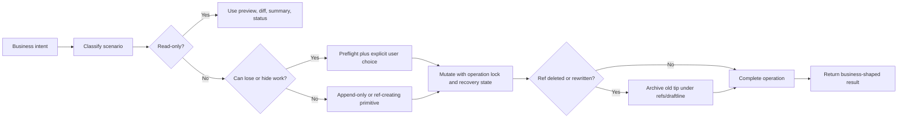
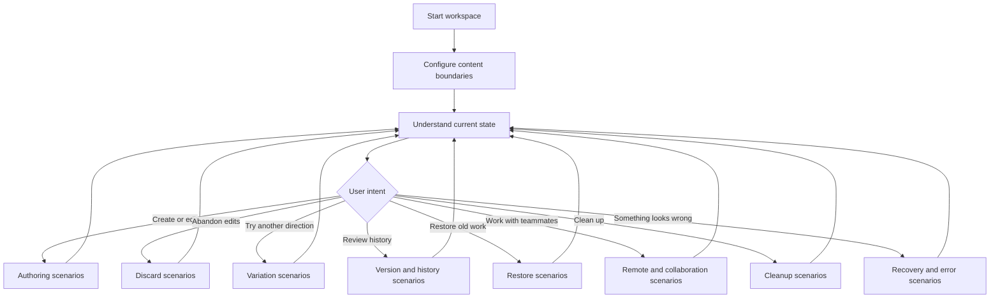

# Draftline scenarios

This document is the entry point for Draftline's product scenario contract. The detailed flows now live in focused files so each area can evolve without turning one document into a scroll-only artifact.

Draftline scenarios start from user intent, then call out why the scenario exists, how Draftline should execute it, which invariant protects the user, and whether the current crate covers the scenario.

See the [Draftline API plan](api-plan.md) for the roadmap from these scenarios to Rust APIs, CLI commands, and agent/tool surfaces. See the [implementation plan](implementation-plan.md) for the proposed engineering sequence.

## Scenario documents

| Document | Covers |
|---|---|
| [Workspace and agent setup](scenario-flows/workspace.md) | Start/open/adopt flows, sharing mode, remote bootstrap, and agent rules of engagement. |
| [Content policy](scenario-flows/content-policy.md) | Business-content boundaries, policy changes, and Git ignore/attributes hazards. |
| [Authoring and versions](scenario-flows/authoring.md) | Current state, saves, discard, variations, switching, preview, and restore. |
| [Collaboration](scenario-flows/collaboration.md) | Publish, apply incoming, remote variation lifecycle, remote destination changes, and merge. |
| [Recovery and cleanup](scenario-flows/recovery-cleanup.md) | Shelves, delete/squash, support refs, purge/redaction, binary assets, interruption, out-of-band mutation, and stale locks. |
| [Coverage and roadmap](coverage.md) | Executive coverage, primitive coverage, and follow-up priority gaps. |
| [Product language](product-language.md) | Mapping between product actions and Git-backed implementation. |

## Coverage legend

| Status | Meaning |
|---|---|
| Covered | Existing primitives support the scenario safely. |
| Covered for `<scope>` | Existing primitives support only the named scope. Anything outside that phrase is not covered unless another row says so. |
| Partially covered | The safe foundation exists, but the full business workflow still needs one or more primitives or UI steps. |
| Planning-only | Draftline exposes inspection, preflight, or verification shape, but does not execute the user-visible mutation. |
| Not covered | The scenario is identified, but Draftline does not yet expose the needed primitive. |
| Host concern | Draftline exposes the low-level signal; the embedding app owns product copy, UX, auth, or policy decisions. |

Use the narrowest truthful status. Prefer "Covered for all-work shelves" over "Covered" when selected-file shelves, sharing, or conflict-resolution apply are still outside the implementation.

## Business safety principles

1. Users should choose product actions, not Git commands.
2. "Look around" flows must be read-only.
3. "Keep this" flows should create a named version, variation, shelf, or archive ref.
4. "Move to something else" flows must preflight local unsaved work.
5. "Share or receive team work" flows must fetch latest remote state before deciding.
6. "We both changed it" flows require explicit merge or conflict resolution.
7. "Go back" creates a new save; it must not reset history.
8. "Abandon edits" must be explicit and content-policy-aware.
9. "Clean up" and "remove" flows must preserve old tips under `refs/draftline/...`, unless an explicit purge/redaction operation overrides recovery.
10. Interrupted operations should produce a recovery prompt before normal work resumes.
11. Content policy changes are not retroactive unless an explicit migration or redaction operation says so.
12. Archive retention and permanent deletion are separate business intents.
13. Remote state includes remote identity and branch existence, not only ahead/behind counts.
14. Every mutating operation should state whether it affects all tracked changes or a selected subset.
15. The shared remote is the trust boundary for shared work; Draftline recovery support refs are hidden from normal views, not private from collaborators.
16. Shared recovery requires explicit support-ref sync; local archive refs alone are not a cross-machine guarantee.
17. Publishing support refs must be append-only: never force-overwrite a recovery point.
18. Shelves are personal work-in-progress by default; sharing shelved work requires a separate explicit policy.
19. Workspaces have a sharing mode: local-only, local with a remote added later, or cloned from a remote. Flows must not assume `origin` exists.
20. Any operation that writes a target tree into the workspace must preflight collisions against tracked, untracked, ignored, and current-policy-excluded files.
21. Remote mutations must use expected remote identity, not just "fetch then decide"; branch deletion, recreation, or rewind after fetch is a first-class race.

## Principled support model

Every supported scenario should answer the same questions:

| Question | Purpose |
|---|---|
| What is the user trying to do? | Keeps the API anchored in business intent instead of Git vocabulary. |
| Why does this scenario exist? | Identifies the risk, collaboration need, or product promise behind the flow. |
| How does Draftline execute it? | Names the exact primitive sequence and which operations are read-only or mutating. |
| What invariant protects the user? | States the rule that prevents data loss, hidden overwrites, or confusing detached states. |
| What should the host show? | Separates library behavior from app-owned confirmation, copy, and recovery UX. |
| What is missing? | Makes partial coverage explicit instead of implying safety by omission. |

## Design rules by user intent

| User intent | Product action | Git-backed shape | Why this shape |
|---|---|---|---|
| Look around | Summary, preview, diff, status | Read trees, diffs, refs, and status only | Users should be able to inspect history without changing files. |
| Keep current work | Save version | Commit tracked content | A named save is the durable unit users understand. |
| Keep selected work | Save selected files | Not yet exposed | Mixed ready/unfinished edits need partial workflows. |
| Try another idea | Create variation | Create branch/ref | Alternatives need stable names without detached HEAD. |
| Rename an idea | Edit variation metadata | Config metadata, not ref rename | Product labels should change without rewriting Git branch identity. |
| Move to another idea | Switch variation | Preflight, optional save/shelve, checkout branch | Switching writes files, so dirty work needs an explicit plan first. |
| Put work aside | Shelve | Local support ref by default | Temporary work should be recoverable without silently publishing unfinished work. |
| Abandon edits | Discard | Policy-aware checkout/reset/removal | Destructive local cleanup must be explicit and scoped to tracked content. |
| Share work | Publish | Fetch, check ahead/behind, push current variation | Publishing must not overwrite teammate work. |
| Receive work | Apply incoming | Fetch, preflight, fast-forward only | Remote updates are safe only when local history can advance without merge. |
| Reconcile work | Merge incoming | Three-way merge with semantic conflict model | Divergence needs human-readable conflict decisions, not hidden Git merges. |
| Go back | Restore as new save | New commit from old tree | Restoring should preserve the audit trail instead of moving history backward. |
| Clean up | Compact, squash, or delete | Archive old tip as a support ref, then rewrite/delete visible ref | Cleanup should simplify UI while preserving a hidden recovery pointer and stale-version mapping. |
| Recover | Recovery prompt | Read ledger, block normal operations, repair/rollback/acknowledge | Interrupted operations should be visible and deliberate. |
| Permanently remove content | Purge/redact | Not yet exposed | True deletion conflicts with archive-first safety and needs a separate explicit workflow. |

## Visible work vs support refs

Draftline should distinguish normal business views from the hidden support refs that make recovery possible.

| Ref namespace | Product meaning | Normal UI visibility | Sync policy |
|---|---|---|---|
| `refs/heads/<variation>` | Visible team variations | Shown in normal variation/history views | Published/fetched as shared work. |
| `refs/draftline/shelves/...` | Work intentionally set aside | Hidden from normal views; shown in shelf/recovery views | Local-only by default; any sharing must be explicit and separately permissioned. |
| `refs/draftline/deleted-variations/...` | Recovery points for deleted variations | Hidden from normal views; shown in recovery/admin views | Published/fetched explicitly as shared support refs when the user shares cleanup recovery. |
| `refs/draftline/rewrites/...` | Recovery points for history rewrites such as squash or compaction | Hidden from normal views; shown in recovery/admin views | Published before shared history replacement and fetched with remote sync so incoming compaction can be recognized safely. |

Shared recovery support refs are **not private**. They live inside the same shared repository trust boundary as visible work. They are hidden because they are not primary business objects, not because they contain secret content. Git server ACLs and refspec policy, not naming, determine who can fetch them. If content must not be retained by collaborators, the right scenario is purge/redaction, not delete, squash, or shared recovery.

Shelves are different from cleanup archives. A shelf may contain unfinished or sensitive local work that the user never intended to publish, so shelf sync must be local-only by default or require an explicit "share shelved work" flow with clear warning copy and permissions.

Support-ref sync needs its own ref contract:

| Rule | Requirement |
|---|---|
| Unique names | Archive refs should include operation identity and source context, such as source ref, old tip OID, operation UUID, actor/device, and time. |
| Immutability | Once published, a recovery support ref must not be force-updated or reused for another old tip. |
| Race safety | Shared cleanup must push support refs with "create only" semantics and delete/rewrite visible refs only with expected-OID or lease checks. |
| Local/remote mapping | Fetched remote support refs should not overwrite unsynced local support refs; use a remote-tracking layout such as `refs/draftline/remotes/<remote>/...` or an equivalent indexed model. |
| Host permissions | Some Git servers may reject non-branch namespaces. Support-ref sync must surface that as a host/remote capability issue, not silently fall back to unsafe cleanup. |

## Scenario support checklist

Before adding or changing a primitive, verify the scenario can answer:

1. Is the operation read-only, append-only, ref-creating, file-writing, ref-moving, or ref-deleting?
2. If it writes files, does it have a preflight report or an explicit policy?
3. If it can overwrite unsaved work, does it require save, shelve, discard, or cancel?
4. If it talks to a remote, does it fetch before deciding and refuse unsafe divergence?
5. If it deletes or rewrites a ref, does it preserve the old tip under `refs/draftline/...`?
6. If it can be interrupted, does it write recovery state before mutation and clear it after completion?
7. If it returns an ID, does the ID round-trip without parsing business semantics?
8. If a path is provided, is it normalized, workspace-relative, and content-policy-aware where needed?
9. If it creates support refs, does the scenario state whether those refs are local-only today or synced to the shared remote?
10. If it syncs support refs, are naming, immutability, refspec mapping, permissions, and failure ordering defined?
11. If the scenario is only partially covered, is the missing primitive listed in the roadmap?

## Full business lifecycle

