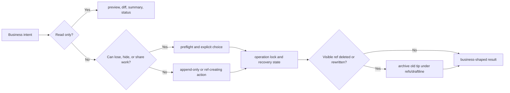

Draftline is a Rust library for apps that need safe version history for folders of creative content:
posts, docs, demo plans, AI writing workspaces, prompt files, assets, and other project-shaped work.

It uses Git as the storage layer, but its public model is shaped around product actions: **save a
version**, **try another direction**, **publish work**, **get updates**, **restore safely**, and
**clean up without losing recovery paths**.

## What Draftline gives apps

| Capability | What users experience |
|---|---|
| Business language first | Saves, variations, shelves, previews, restores, and recovery prompts instead of raw Git commands. |
| Preflight before risk | Dirty work, remote races, collisions, and recovery state are reported before files or refs move. |
| Recovery by design | Cleanup archives old tips under Draftline support refs unless an explicit purge/redaction workflow is chosen. |
| Host-app ready | The Rust crate is built for embedding in Tauri and desktop apps that own their product-specific UX. |

## Why Draftline exists

Creative apps often need version history, alternate directions, collaboration, and cleanup. Git can
store that model beautifully, but raw Git concepts expose too many footguns to business users:
detached states, force pushes, destructive resets, hidden ignored files, stale remote refs, and
unclear recovery promises.

Draftline keeps the Git power but shifts the interface to safer product intent.

## Start with scenarios

The scenario docs are Draftline's product contract. Each flow starts from user intent, names the
safe primitive path, and calls out current coverage or gaps.

| Scenario doc | Covers |
|---|---|
| [Workspace setup](/docs/scenarios/workspace/) | Start, open, clone, adopt, share, and guide agents in a managed workspace. |
| [Content policy](/docs/scenarios/content-policy/) | Decide which files count as business content and detect policy-vs-Git hazards. |
| [Authoring and versions](/docs/scenarios/authoring/) | Save, discard, branch, switch, preview, diff, and restore work safely. |
| [Collaboration](/docs/scenarios/collaboration/) | Publish, receive updates, discover teammate variations, and reconcile divergence. |
| [Recovery and cleanup](/docs/scenarios/recovery-cleanup/) | Shelve, compact, archive, sync support refs, plan purge, and recover unusual states. |
