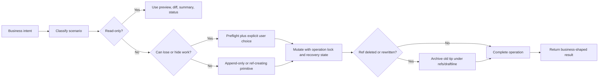

Draftline scenarios start from user intent, then call out why the scenario exists, how Draftline
should execute it, which invariant protects the user, and whether the current crate covers the
scenario.

> **How to read this map:** "Covered" means the current primitive path supports the scenario safely.
> "Partially covered" is intentionally narrow; it means Draftline has a safe foundation but the full
> business workflow still needs more primitive or host UX work.

## Scenario documents

| Document | Covers |
|---|---|
| [Workspace setup](/docs/scenarios/workspace/) | Start/open/adopt flows, sharing mode, remote bootstrap, and agent rules of engagement. |
| [Content policy](/docs/scenarios/content-policy/) | Business-content boundaries, policy changes, and Git ignore/attributes hazards. |
| [Authoring and versions](/docs/scenarios/authoring/) | Current state, saves, discard, variations, switching, preview, and restore. |
| [Collaboration](/docs/scenarios/collaboration/) | Publish, apply incoming, remote variation lifecycle, remote destination changes, and merge. |
| [Recovery and cleanup](/docs/scenarios/recovery-cleanup/) | Shelves, delete/squash, support refs, purge/redaction, binary assets, interruption, out-of-band mutation, and stale locks. |

## Coverage legend

| Status | Meaning |
|---|---|
| Covered | Existing primitives support the scenario safely. |
| Covered for `<scope>` | Existing primitives support only the named scope. Anything outside that phrase is not covered unless another row says so. |
| Partially covered | The safe foundation exists, but the full business workflow still needs one or more primitives or UI steps. |
| Planning-only | Draftline exposes inspection, preflight, or verification shape, but does not execute the user-visible mutation. |
| Not covered | The scenario is identified, but Draftline does not yet expose the needed primitive. |
| Host concern | Draftline exposes the low-level signal; the embedding app owns product copy, UX, auth, or policy decisions. |

## Business safety principles

1. Users should choose product actions, not Git commands.
2. "Look around" flows must be read-only.
3. "Keep this" flows should create a named version, variation, shelf, or archive ref.
4. "Move to something else" flows must preflight local unsaved work.
5. "Share or receive team work" flows must fetch latest remote state before deciding.
6. "We both changed it" flows require explicit merge or conflict resolution.
7. "Go back" creates a new save; it must not reset history.
8. "Abandon edits" must be explicit and content-policy-aware.
9. "Clean up" and "remove" flows must preserve old tips under `refs/draftline/...`, unless an explicit purge/redaction operation overrides recovery.
10. Interrupted operations should produce a recovery prompt before normal work resumes.
11. Content policy changes are not retroactive unless an explicit migration or redaction operation says so.
12. Archive retention and permanent deletion are separate business intents.
13. Remote state includes remote identity and branch existence, not only ahead/behind counts.
14. Every mutating operation should state whether it affects all tracked changes or a selected subset.
15. The shared remote is the trust boundary for shared work; Draftline recovery support refs are hidden from normal views, not private from collaborators.
16. Shared recovery requires explicit support-ref sync; local archive refs alone are not a cross-machine guarantee.
17. Publishing support refs must be append-only: never force-overwrite a recovery point.
18. Shelves are personal work-in-progress by default; sharing shelved work requires a separate explicit policy.
19. Workspaces have a sharing mode: local-only, local with a remote added later, or cloned from a remote. Flows must not assume `origin` exists.
20. Any operation that writes a target tree into the workspace must preflight collisions against tracked, untracked, ignored, and current-policy-excluded files.
21. Remote mutations must use expected remote identity, not just "fetch then decide"; branch deletion, recreation, or rewind after fetch is a first-class race.

