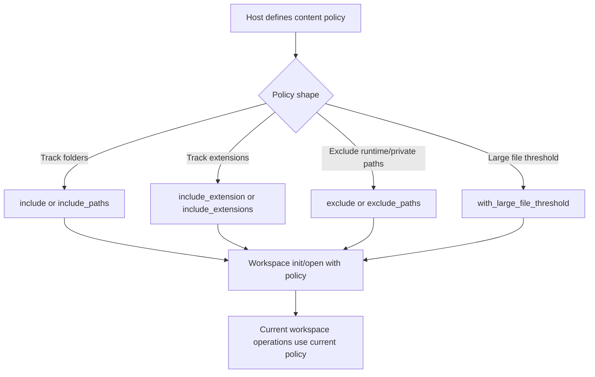
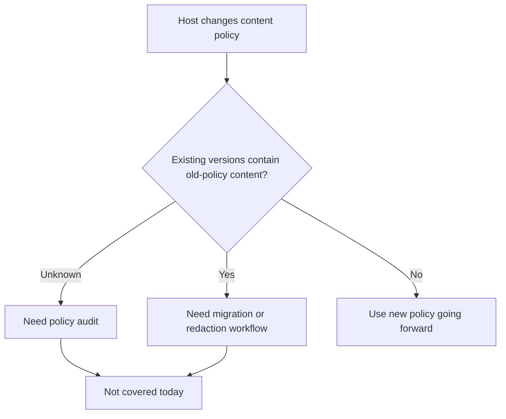
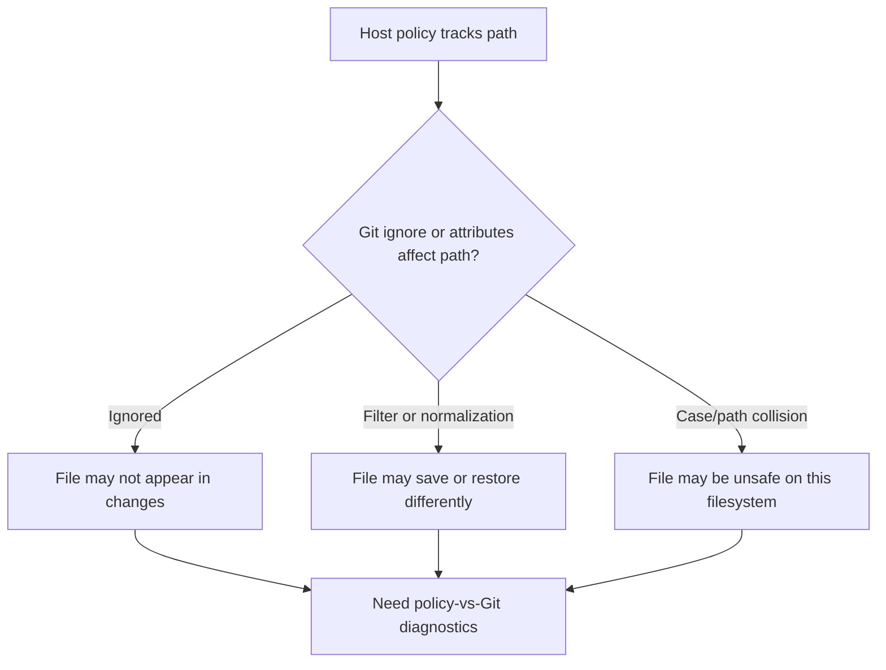

> **Scenario lens:** These flows keep app/runtime state, generated files, credentials, and private scratch data out of user-facing saves.

## Flow 2: configure what counts as business content

Business goal: "Only save the files that are real user content; leave app/runtime state alone."

Why this flow exists: business users should not accidentally version UI state, credentials, generated files, or private scratch data just because those files live beside their content.

| Question | Answer |
|---|---|
| Covered today? | Covered. |
| Correct primitive path | Build `ContentPolicy`, then use `init_with_policy`, `open_with_policy`, or clone-with-policy APIs. |
| Safety behavior | `.draftline` is excluded by default. Invalid policy paths/extensions are rejected. |
| Edge cases | The default policy tracks everything except `.draftline`; hosts that need app/runtime/privacy boundaries must provide an explicit policy. Current workspace operations use the current policy, but version-to-version history can still include content saved under earlier policy decisions. Empty policy paths, absolute paths, parent components, invalid extensions, and paths outside policy return explicit errors. Git ignore and attributes rules can still affect what Git reports as changed. |

## Flow 2a: change content policy after work exists

Business goal: "The app changed what counts as business content; make old and new saves line up with that rule."

Why this flow exists: policy changes can create a false sense of safety. Excluding a path today does not remove content that was already saved yesterday.

| Question | Answer |
|---|---|
| Covered today? | Partially covered. |
| Current support | `ContentPolicy` is provided when opening/initializing a workspace. `audit_content_policy` reports current diagnostics and reserves a historical out-of-policy field, but historical migration/redaction is not implemented. The policy is not persisted as a versioned workspace rule and is not retroactive. |
| Safety behavior | New change detection, discard, and many workspace views use the current runtime policy, but old commits can still contain content saved under an earlier policy. |
| Gap | Need historical policy audit, migration, and redaction primitives if hosts need to remove or reclassify previously saved content. |

## Flow 2b: content policy conflicts with Git ignore or attributes

Business goal: "The app says this is business content, but Git is configured to ignore or transform it."

Why this flow exists: content policy is the product boundary, but Git ignore and attributes rules can affect status, save, diff, checkout, and normalization. A policy-tracked file that Git ignores can create a false "everything is saved" signal.

| Question | Answer |
|---|---|
| Covered today? | Partially covered. |
| Current support | ContentPolicy validates product paths. `policy_git_diagnostics` and `audit_content_policy` warn when current policy-tracked files are hidden by Git ignore rules. Git attributes, filters, path normalization, and broader filesystem behavior still need deeper diagnostics. |
| Safety behavior | A host should not claim all business content is saved unless policy-tracked-but-ignored files are detected or explicitly accepted. |
| Edge cases | Existing repos may include `.gitignore`, `.gitattributes`, LFS/filter drivers, autocrlf/line-ending rules, symlinks, submodules/gitlinks, case-colliding paths, Unicode-normalization collisions, or filemode-only changes. |
| Gap | Need broader policy/Git diagnostics in `changes`, adoption preflight, and file-writing preflights so attributes, filters, normalization, and transformed business content are visible before save, restore, switch, publish, or purge. |

